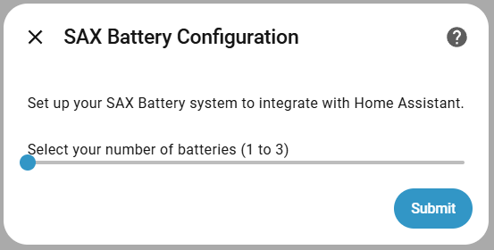
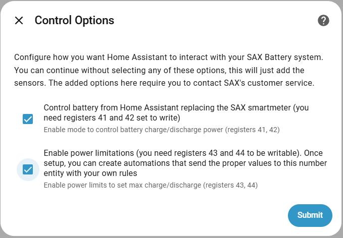
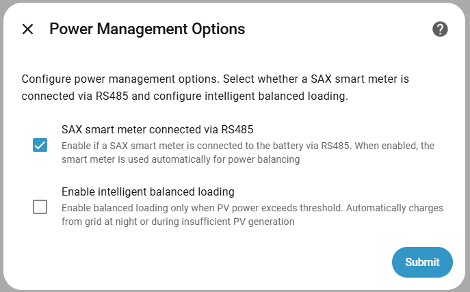
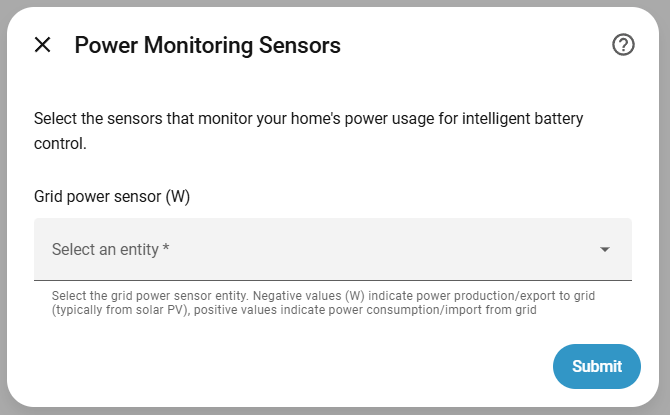
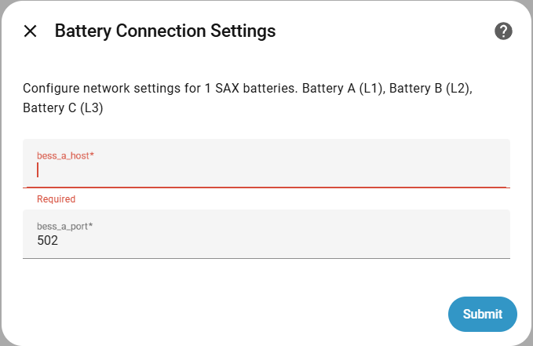
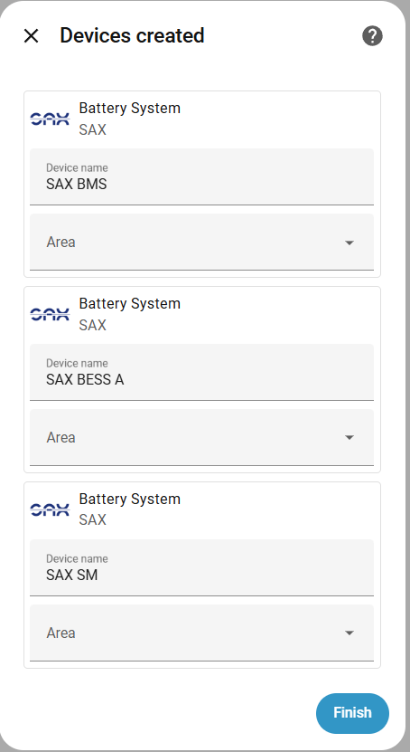
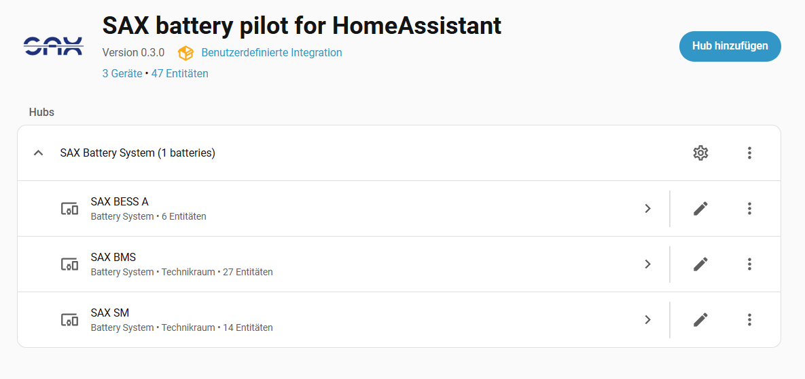
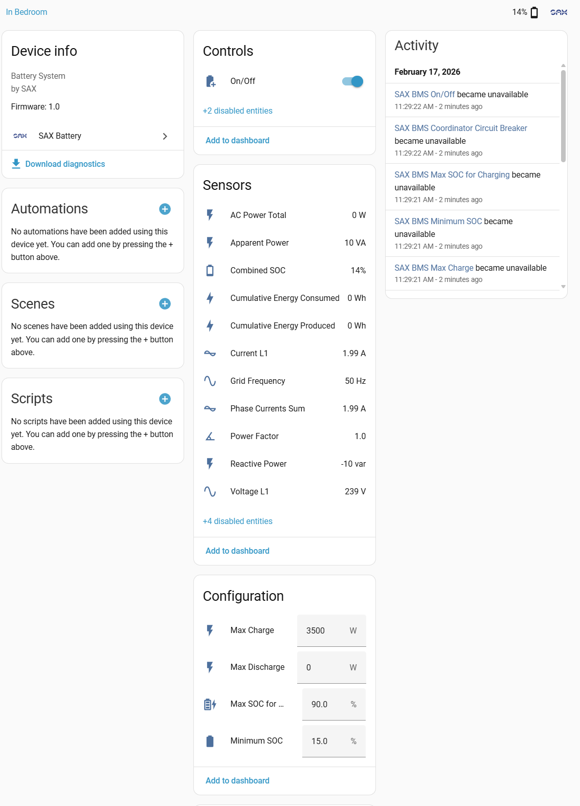
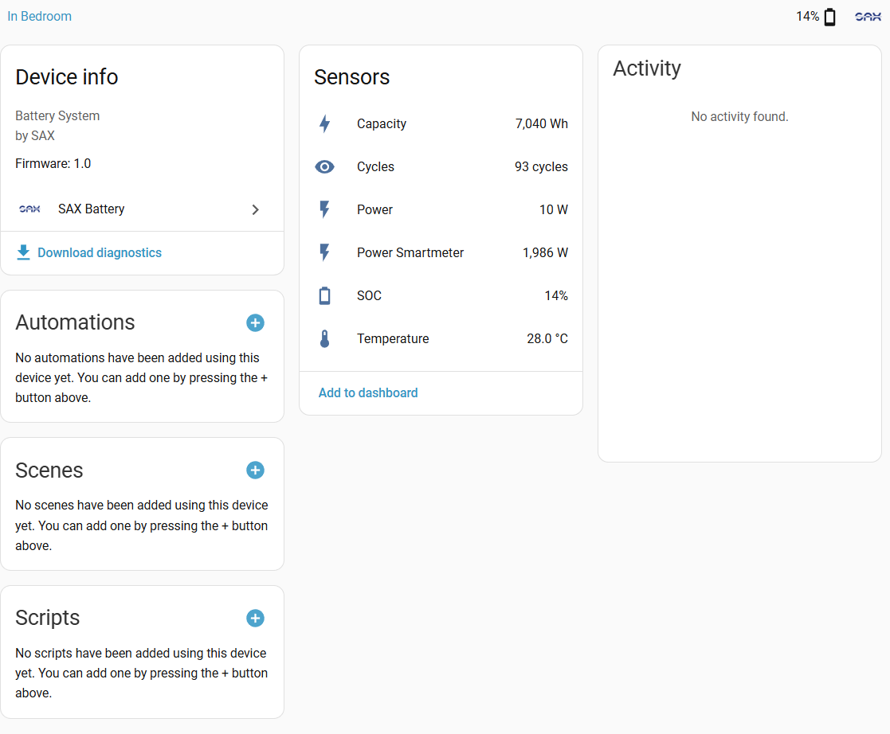
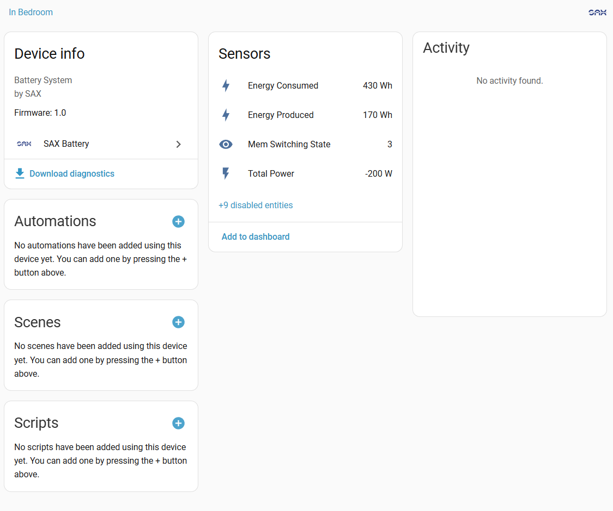

# Home Assistant integration for SAX-power batteries

[![GitHub Release][releases-shield]][releases]
[![HACS][hacs-shield]][hacs]
[![License][license-shield]](LICENSE)

A Home Assistant add-on that helps you monitor and control your SAX-power home battery system. Get real-time information about your battery's charge level, power usage, and control how it charges and discharges - all from your Home Assistant dashboard.

## Key Features

- **Multi-Battery Support**: Control up to three batteries working together across your home's three electrical phases
- **Real-Time Monitoring**: See your battery's charge level, temperature, and power flow updated every 15-30 seconds
- **Smart Power Management**: Automatically protect your battery from over-discharge by setting minimum charge levels
- **Solar Charging Control**: Choose when your battery charges from your solar panels
- **Priority Device Support**: Prevent your battery from powering specific devices (like EV chargers) - save battery power for what matters
- **Comprehensive Diagnostics**: Check connection health and troubleshoot issues easily
- **Private & Local**: All data stays on your home network - no cloud connection required
- **Easy Setup**: Configure everything through Home Assistant's friendly interface

> [!IMPORTANT]  
**Currently Being Improved**  
The battery control features are being actively enhanced. Some advanced control features require additional permissions to be enabled in your SAX-power online account settings. Check the SAX-power documentation or contact their support to learn how to enable these features.

## Supported Devices

This integration supports SAX-power battery energy storage systems with:

- **Communication**: Modbus TCP/IP (Ethernet) and Modbus RTU (RS485)
- **Battery Models**: SAX-power BESS (Battery Energy Storage System)
- **Smart Meters**: SAX-compatible smart meters with RS485 connection
- **Firmware**: Tested with SAX Battery Management System (BMS) current firmware version

**For Homes with Multiple Batteries:**

- Battery A (connected to Phase 1): Main controller - reads your electricity meter and coordinates the system
- Battery B (connected to Phase 2): Secondary battery - follows main controller's instructions
- Battery C (connected to Phase 3): Secondary battery - follows main controller's instructions

*Note: Most homes have three-phase electricity (Phase 1, 2, and 3). Your SAX batteries can be distributed across these phases for balanced power distribution.*

## Supported Functions

### Monitoring (Read-Only)

- State of Charge (SOC) - individual and combined
- Battery voltage, current, and temperature
- Power flow (charge/discharge)
- Energy statistics (daily, monthly, lifetime)
- Grid power measurements (per phase and total)
- Smart meter data (voltage, current, frequency, power factor)
- Connection status and diagnostics

### Control Features (Requires SAX Account Settings to be Enabled)

> These features let you tell your battery what to do. To use them, you need to enable 'Remote Control' in your SAX-power online account first. Contact SAX-power support if you need help with this.

- **Max Discharge Power**: Limit how much power the battery can provide to your home (0-4600W per battery)
- **Max Charge Power**: Limit how fast the battery charges (0-3500W per battery)
- **Pilot Control**: Direct control over battery power with smart adjustments
- **Solar Charging**: Turn solar charging on or off independently from grid charging
- **Manual Mode**: Override automatic controls for testing purposes
- **Minimum Charge Protection**: Prevent the battery from discharging completely by setting a minimum charge level

### Automation Features

- SOC-based discharge limiting
- Priority device detection and battery protection
- Time-based power management (via Home Assistant automations)
- Grid power monitoring and response

## How Often Data Updates

Your battery information refreshes automatically:

- **Main Battery (Phase 1)**:
  - Electricity meter data: Every 15 seconds
  - Battery status: Every 30 seconds
- **Additional Batteries (Phases 2 & 3)**:
  - Battery status: Every 30 seconds

This means you'll see near real-time information without overloading your network.

**Technical Details:**

- Uses efficient communication to minimize network traffic
- Automatically retries if connection is lost
- Pauses for 5 minutes after repeated connection errors to protect your network
- Works entirely on your local network - no internet connection needed

## Quick Start (5 Minutes)

**Just want to see your battery data quickly?**

1. Install the integration through HACS (see Installation section below)
2. Go to Settings → Devices & Services → Add Integration
3. Search for "SAX battery"
4. Enter your battery's network address (IP address) - see "How to Find Your Battery's IP Address" below
5. Click Finish

That's it! Within a minute, you'll see your battery charge level, power usage, and status in Home Assistant.

*For advanced features like automations and control, continue reading the full guide below.*

---

## Installation

### Via HACS (Recommended)

1. **Add Custom Repository**
   - Open HACS in Home Assistant
   - Go to `HACS > Integrations > ⋮ > Custom repositories`
   - Add repository URL: `https://github.com/matfroh/sax_battery_ha`
   - Select category: **Integration**
   - Click **Add**

2. **Install Integration**
   - Search for "SAX battery" in HACS
   - Click **Download**
   - Restart Home Assistant

### Manual Installation

1. **Download Files**
   - Download the latest release from [GitHub releases][releases]
   - Extract the `custom_components/sax_battery` folder

2. **Copy Files**
   - Copy the `sax_battery` folder to your Home Assistant `custom_components` directory
   - Path: `<config_dir>/custom_components/sax_battery/`

3. **Restart Home Assistant**
   - Restart Home Assistant to load the integration

## Configuration

### Prerequisites

Before you begin:

- [ ] Your SAX battery is connected to your home Wi-Fi or network (check the battery display)
- [ ] You know your battery's network address (IP address) - *See "How to Find Your Battery's IP Address" below*
- [ ] Your battery's network communication is working (this is automatic for most setups)
- [ ] (Optional) Remote control features are enabled in your [SAX-power online account for advanced control](https://app.sax-power.net/settings)

**How to Find Your Battery's IP Address:**

1. **Option 1 - Check Your Router:**
   - Log into your Wi-Fi router's admin page
   - Look for "Connected Devices" or "DHCP Clients"
   - Find a device named "SAX" or similar
   - Write down the IP address shown (looks like: 192.168.1.100)

2. **Option 2 - Check Battery Display:**
   - Some SAX battery models show the IP address on their display screen
   - Look in the network settings menu

3. **Option 3 - Contact Support:**
   - If you're not comfortable with the above steps, SAX-power support can help you find this information

### Configuration Steps

1. **Add the Integration**
   - Navigate to **Settings** → **Devices & Services**
   - Click **+ Add Integration**
   - Search for **SAX battery**
   - Click to start configuration

2. **Select Number of Batteries**

   Choose how many batteries you want to configure (1–3).

   

3. **Select Control Options**

   Choose control features based on your write register permissions:
   - **Pilot from Home Assistant**: Direct power control (requires registers 43-44)
   - **Limit Power**: Set max charge/discharge limits (requires registers 41-42)

   

   > [!IMPORTANT]
   > Write registers must be enabled in SAX-power portal settings before these options work.

4. **Select power management options** (41,42)
  
   - Disable SAX default smart meter setup (ADL400/C, ADW220)
   - Enable balanced or manual loading

   

5. **Configure Grid Sensors** *(if power management enabled)*

   Select Home Assistant sensors for:
   - **Power monitor sensor**: Total household power consumption (Watt)

   

6. **Enter Battery Network Information**

   For each battery, you'll need:
   - **IP Address**: Your battery's network address (from the steps above)
   - **Port**: Leave as 502 (this is the standard setting)

   **Important:** If you have multiple batteries, configure your **Main Battery (Battery A)** first. You can identify it by looking at the battery display - it will show "A".

   

7. **Finish Setup**

   Add location area and click **FINISH**.

   

### After Setup is Complete

Once you finish the setup wizard:

- Your battery information should appear within a minute
- If you have multiple batteries, you can turn on additional sensors for Phase 2 and Phase 3 in the device settings
- New features will appear within 30 seconds of turning them on
- If upgrading from an older version, you may need to refresh your browser (press Ctrl+F5 or Cmd+Shift+R)

## Integration Overview

Once configured, the SAX Battery integration provides three main devices:

### SAX-power Integration



### SAX-BMS Device (Battery Management System)

Provides control entities for battery operation:

- Manual control switches
- Solar charging control
- Pilot power settings
- Maximum charge/discharge limits
- Configuration numbers (min SOC, pilot power)



### SAX-BESS Device (Battery Energy Storage System)

Monitors battery status and performance:

- State of Charge (SOC) - individual and combined
- Voltage, current, temperature per battery
- Power metrics (charge/discharge rates)
- Energy statistics (daily, monthly, lifetime)
- Battery health indicators



### SAX-Smartmeter Device

Tracks grid measurements:

- Grid power per phase (L1, L2, L3)
- Total grid power
- Voltage and current per phase
- Power factor and frequency
- Energy flow direction



> [!NOTE]
> By default, single-battery entities are enabled. For multi-battery setups, enable additional L2/L3 entities in device settings (available within 30 seconds).

## Use Cases

### 1. Solar Self-Consumption Optimization

**What This Does:** When your solar panels produce more power than your home needs, this automatically charges your battery instead of sending excess power back to the grid. This maximizes your use of free solar energy.

**What You Need:**

- Enable **Pilot from Home Assistant** (in integration settings)
- Enable **Solar Charging** (in integration settings)
- Set minimum charge level to 15-20% (protects battery health)
- Tell the system which sensor measures your home's power usage

**Example Automation Code:**

```yaml
automation:
  - alias: "Battery: Charge from excess solar"
    trigger:
      - platform: numeric_state
        entity_id: sensor.grid_power
        below: -500  # 500W excess going to grid
    condition:
      - condition: numeric_state
        entity_id: sensor.sax_combined_soc
        below: 95  # Don't overcharge
    action:
      - service: number.set_value
        target:
          entity_id: number.sax_max_charge
        data:
          value: 3000  # Allow 3kW charging
```

### 2. Peak Shaving / Time-of-Use Optimization

**What This Does:** Save money on electricity bills by using your battery during expensive peak hours instead of buying power from the grid. The battery charges during cheap off-peak hours and powers your home during expensive peak hours.

**Example Automation Code:**

```yaml
automation:
  - alias: "Battery: Discharge during peak hours"
    trigger:
      - platform: time
        at: "17:00:00"  # Peak tariff starts
    condition:
      - condition: numeric_state
        entity_id: sensor.sax_combined_soc
        above: 30  # Ensure sufficient charge
    action:
      - service: number.set_value
        target:
          entity_id: number.sax_max_discharge
        data:
          value: 3000  # Allow 3kW discharge
  
  - alias: "Battery: Stop discharge after peak"
    trigger:
      - platform: time
        at: "21:00:00"  # Peak tariff ends
    action:
      - service: number.set_value
        target:
          entity_id: number.sax_max_discharge
        data:
          value: 0  # Stop discharge
```

### 3. Backup Power Reserve

**What This Does:** Keep your battery charged enough to provide emergency power during outages. The system automatically prevents the battery from discharging below your set level.

**What You Need:**

- Set **Minimum Charge Level** to 30% or higher (in integration settings)
- The system automatically protects this reserve

**Example Notification Code:**

```yaml
automation:
  - alias: "Battery: Low SOC alert"
    trigger:
      - platform: numeric_state
        entity_id: sensor.sax_combined_soc
        below: 25
    action:
      - service: notify.mobile_app
        data:
          message: "Battery SOC below 25% - backup reserve declining"
          title: "Battery Warning"
```

### 4. EV Charging Protection

**What This Does:** When charging your electric vehicle, use power from the grid instead of draining your home battery. This saves your battery power for running your house.

**What You Need:**

- Add your EV charger to the **Priority Devices** list during setup
- The battery will automatically stop providing power when your EV is charging

**Example Manual Control Code:**

```yaml
automation:
  - alias: "Battery: Disable discharge during EV charging"
    trigger:
      - platform: state
        entity_id: switch.ev_charger
        to: "on"
    action:
      - service: number.set_value
        target:
          entity_id: number.sax_max_discharge
        data:
          value: 0
```

### 5. Grid Outage Detection

**What This Does:** Get notified if your battery starts providing unusually high power during off-hours, which might indicate a power outage.

**Example Automation Code:**

```yaml
automation:
  - alias: "Battery: Grid outage detection"
    trigger:
      - platform: numeric_state
        entity_id: sensor.sax_battery_power
        above: 2000
        for:
          minutes: 5
    condition:
      - condition: time
        after: "22:00:00"
        before: "06:00:00"
    action:
      - service: notify.mobile_app
        data:
          message: "Unusual battery discharge detected - possible grid outage"
```

## Things to Know About Your Battery System

### How the Battery Hardware Works

- **Some Settings Can't Be Read Back**: When you set max charge/discharge limits, the battery doesn't report these values back
  - The integration remembers your settings and restores them after Home Assistant restarts
  - After a restart, it may briefly show maximum values until settings are restored (within 30 seconds)
- **Only Main Battery Reads Electricity Meter**: The main battery (Battery A) reads your electricity meter and shares this data with the other batteries
- **Batteries Work Together**: All batteries are coordinated by the main battery - you can't control each one completely independently
- **Technical Note**: The battery hardware has a minor communication quirk that the integration works around automatically

### Integration Features

- **Manual Control Mode**: When you turn on manual control, automatic battery protections are turned off - be careful not to over-discharge
- **Priority Device Detection**: Only works with devices already in Home Assistant - can't detect devices not connected to Home Assistant
- **Battery Count**: You need to tell the integration how many batteries you have during setup - it can't discover this automatically
- **Configuration Changes**: Some setting changes may require restarting Home Assistant to take effect

### Network Requirements

- **Local Network Only**: You can only access your battery data when connected to your home network (unless you set up VPN remote access)
- **Network Speed**: If your home network is slow, you might see occasional connection issues
- **One Connection at a Time**: Only one application can talk to the battery at once - close other SAX apps when using Home Assistant
- **Security Note**: Communication between Home Assistant and your battery is not encrypted - ensure your home network is password-protected

### System Performance

- **Network Traffic**: Multiple batteries will use more network bandwidth (usually not noticeable)
- **Number of Sensors**: Systems with three batteries might show 100+ different sensors and controls
- **Startup Time**: When Home Assistant starts, it may take 30-60 seconds for all battery data to appear
- **Storage**: Battery statistics are stored in your Home Assistant database - normal database cleanup handles this automatically

## Troubleshooting

### Connection Issues

#### Problem: "Cannot connect to battery" error during setup

**Before trying technical solutions:**

1. Is your battery powered on? (Check the battery display)
2. Is Home Assistant on the same Wi-Fi network as your battery?
3. Try restarting your battery (power off, wait 30 seconds, power on)
4. Try restarting Home Assistant
5. Can you access your battery through the SAX-power app? (If yes, your battery is online)
6. Double-check the IP address you entered - even one wrong number will cause this error

**Technical Solutions** (For advanced users or when working with SAX support):

1. Test if the battery responds to network requests:

   ```bash
   ping <battery_ip>
   ```

   (Replace `<battery_ip>` with your battery's IP address, like: ping 192.168.1.100)

2. Check if the communication port is accessible:

   ```bash
   telnet <battery_ip> 502
   ```

3. Verify your firewall isn't blocking port 502
4. Ensure the battery and Home Assistant are on the same network (not separated by VLANs)
5. Check if the SAX-power app or other software is connected (only one connection allowed at a time)

#### Problem: Battery information shows "Unavailable" after working for hours

**What's Happening**: The connection to your battery is dropping temporarily, then recovering

**Simple Solutions**:

1. Check if your Wi-Fi router is rebooting or having issues
2. Move your battery or router closer together if signal is weak
3. Restart your Wi-Fi router
4. Check for firmware updates for your router
5. Update to the latest version of this integration (Settings → HACS → SAX Battery → Update)

**Advanced Troubleshooting** (If simple solutions don't help):

1. Check Home Assistant logs for error details:
   - Go to Settings → System → Logs
   - Look for "sax_battery" entries

2. Test network stability by running this command in Home Assistant Terminal:

   ```bash
   ping -c 100 <battery_ip>
   ```

   (Should show 0% packet loss if network is stable)

3. Check the circuit breaker diagnostics page to see connection error rates
4. Contact SAX-power support if issues persist

### Data Issues

#### Problem: Battery charge level shows 0% or wrong values

**Solutions**:

1. Wait 30-60 seconds - initial data takes a moment to load
2. Check if your battery is in sleep/standby mode (check the battery display)
3. Look at the integration diagnostics to verify communication is working
4. Try reloading the integration:
   - Go to Settings → Devices & Services
   - Find "SAX Battery"
   - Click the three dots (⋮) → Reload

#### Problem: Power limit sliders show maximum values after restarting Home Assistant

**This is Normal**: The battery hardware doesn't report these settings back, so they briefly show maximum values until the integration restores your saved settings (within 30 seconds)

**What to Do**:

1. Wait 30 seconds - the integration will automatically restore your previous settings
2. If after 30 seconds values haven't restored, you can manually adjust the sliders back to your preferred settings
3. The integration will remember the new settings for next time

### Control Issues

#### Problem: Changing power limits doesn't affect the battery

**Checklist**:

1. Have you enabled remote control in your SAX-power online account? (This must be done first)
2. Is your battery charge level below the minimum you set? (Protection prevents discharge when charge is too low)
3. Is manual control mode turned on when you don't want it to be?
4. Check Home Assistant logs (Settings → System → Logs) for error messages
5. Verify your battery firmware is up to date (contact SAX-power support)

#### Problem: Battery keeps stopping discharge even though I set it to discharge

**This is a Safety Feature**: The integration automatically protects your battery from over-discharge when the charge level gets too low

**What's Happening**: Your battery charge level has dropped below the minimum level you set, so the system stops discharge to protect battery health

**Solutions**:

1. Check your battery's current charge level - if it's below your minimum setting, this is correct behavior
2. If the minimum is too high for your needs, lower it:
   - Go to your SAX Battery device
   - Find "Minimum Charge Level" (sax_min_soc)
   - Set it to a lower percentage
3. Charge your battery above the minimum level
4. **Not Recommended**: You can disable this protection in advanced settings, but this may damage your battery

### Configuration Issues

#### Problem: Battery still discharges when priority devices (like EV charger) are running

**Checklist**:

1. Did you select the correct devices during setup? (You can reconfigure if needed)
2. Are the device sensors working in Home Assistant? (Check they show current values)
3. Is the device actually showing power usage or "on" status in Home Assistant?
4. Check the power manager diagnostics to see if it's detecting your priority devices
5. Look at the device's history graph to make sure it's reporting activity when you expect it to

#### Problem: Multiple batteries are assigned to wrong electrical phases

**Solution**:

1. Verify you selected the correct main battery during setup (the one marked "A" on its display)
2. Check that your battery connections match what you configured:
   - Battery A → Phase 1 (Main Controller)
   - Battery B → Phase 2 (Secondary)
   - Battery C → Phase 3 (Secondary)
3. If they don't match, you'll need to remove and reconfigure the integration with the correct settings

### Diagnostic Tools

#### Enable Debug Logging

Add to `configuration.yaml`:

```yaml
logger:
  default: info
  logs:
    custom_components.sax_battery: debug
    pymodbus: debug
```

Restart Home Assistant and check logs under **Settings → System → Logs**.

#### Check Integration Diagnostics

1. Navigate to **Settings → Devices & Services**
2. Find **SAX Battery** integration
3. Click **⋮ → Download diagnostics**
4. Share diagnostics when reporting issues (remove sensitive data first)

#### Monitor Circuit Breaker

Circuit breaker diagnostics show connection health:

- **Closed**: Normal operation
- **Open**: Too many errors, connection paused (5min cooldown)
- **Half-Open**: Testing connection recovery

### Getting Help

If troubleshooting doesn't resolve your issue:

1. **Search existing issues**: [GitHub Issues][issues]
2. **Create new issue**: Include:
   - Home Assistant version
   - Integration version
   - Battery model/firmware
   - Diagnostic download
   - Relevant log excerpt (debug mode)
   - Steps to reproduce
3. **Community forum**: [Home Assistant Community][community]

## Glossary (Technical Terms Explained)

This guide uses some technical terms. Here's what they mean in plain English:

- **IP Address**: Your battery's unique number on your home network (like a house address for devices). Looks like: 192.168.1.100
- **Modbus**: The communication language your battery uses to talk to Home Assistant
- **SOC (State of Charge)**: How full your battery is, shown as a percentage (0-100%). Just like your phone's battery indicator
- **Phase (L1, L2, L3 or Phase 1, 2, 3)**: The three electrical circuits in your home's power system. Most homes have three-phase power
- **W (Watt)**: A measure of power at this moment. 1000W (1kW) is about as much as a small space heater uses
- **kW (Kilowatt)**: 1000 Watts. A typical home might use 1-3kW normally
- **kWh (Kilowatt-hour)**: Energy used over time. Your electricity bill measures this
- **Grid**: Your home's connection to the main electricity supply from your power company
- **Entity**: A piece of information or control in Home Assistant (like battery percentage, temperature sensor, or power switches)
- **Modbus TCP/IP**: The technical name for how Home Assistant talks to your battery over your network
- **Port 502**: A specific "door" on your network that the battery uses to communicate (like different channels on a radio)
- **HACS**: Home Assistant Community Store - an add-on store for Home Assistant
- **Integration**: An add-on that connects Home Assistant to devices (like this SAX Battery integration)
- **Coordinator**: The part of the integration that fetches data from your battery
- **Register**: A specific piece of information stored in the battery (like a memory address)

---

## Removal Instructions

### Remove Integration

1. **Remove Configuration Entry**
   - Navigate to **Settings → Devices & Services**
   - Find **SAX Battery** integration
   - Click **⋮ → Delete**
   - Confirm deletion

2. **Restart Home Assistant** (recommended)
   - Ensures all entities and devices are properly removed

### Uninstall Integration Files

#### Via HACS

1. Open **HACS → Integrations**
2. Find **SAX battery**
3. Click **⋮ → Remove**
4. Restart Home Assistant

#### Manual Uninstall

1. Delete folder: `<config_dir>/custom_components/sax_battery/`
2. Restart Home Assistant

### Clean Up (Optional)

If you want to remove all traces:

1. **Remove entity history** (optional):
   - Navigate to **Developer Tools → Statistics**
   - Search for `sax_`
   - Delete individual statistics if desired

2. **Clear cached data**:

   ```bash
   # SSH into Home Assistant
   rm -rf /config/.storage/core.entity_registry
   # Only affects entities, will be regenerated
   ```

> [!WARNING]
> Deleting entity registry removes ALL entity customizations (not just SAX Battery). Only do this if you're certain.

## Contributing

Contributions are welcome! Please:

1. Fork the repository
2. Create a feature branch
3. Follow code style guidelines (Ruff, MyPy)
4. Add tests for new features
5. Submit a pull request

See [CONTRIBUTING.md](CONTRIBUTING.md) for detailed guidelines.

## License

This project is licensed under the MIT License - see the [LICENSE](LICENSE) file for details.

## Credits

- **Developer**: [@matfroh](https://github.com/matfroh)
- **SAX-power**: [SAX Power GmbH](https://www.sax-power.com/)
- **Home Assistant**: [Home Assistant](https://www.home-assistant.io/)

## Support

- **Issues**: [GitHub Issues][issues]
- **Discussions**: [GitHub Discussions](https://github.com/matfroh/sax_battery_ha/discussions)
- **Community**: [Home Assistant Community][community]

---

**Star this repo** ⭐ if you find it useful!

[releases-shield]: https://img.shields.io/github/v/release/matfroh/sax_battery_ha?style=flat-square
[releases]: https://github.com/matfroh/sax_battery_ha/releases
[hacs-shield]: https://img.shields.io/badge/HACS-Custom-orange.svg?style=flat-square
[hacs]: https://github.com/hacs/integration
[license-shield]: https://img.shields.io/github/license/matfroh/sax_battery_ha?style=flat-square
[issues]: https://github.com/matfroh/sax_battery_ha/issues
[community]: https://community.home-assistant.io/
