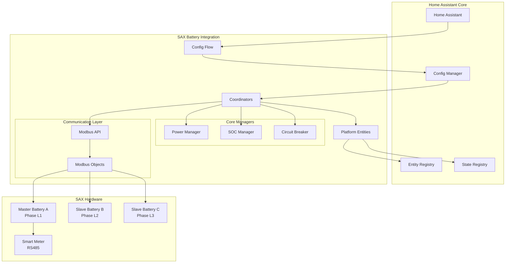

# SAX Battery Integration Architecture Overview

This document provides a comprehensive overview of the SAX Battery Home Assistant integration architecture, designed to help both new contributors and maintainers understand the system design and technical decisions.

## 🏗️ System Architecture

The SAX Battery integration is a custom Home Assistant component that enables monitoring and control of SAX-power energy storage systems through Modbus TCP/IP communication. It supports multi-battery configurations with master/slave coordination across three-phase power systems.

### Key Design Principles

1. **Security-First**: OWASP-compliant input validation, specific exception handling, and resource protection
2. **Performance-Optimized**: Efficient data polling, circuit breaker patterns, and minimize resource usage  
3. **Modular Design**: Clear separation of concerns with dedicated managers for different functionalities
4. **Testable Code**: Comprehensive test coverage with proper mocking and fixtures
5. **Type Safety**: Full type annotations and MyPy compliance

## 📊 High-Level Architecture

## 🔧 Core Components

| Component | Purpose | File Location |
|-----------|---------|---------------|
| [Config Flow](components.md#config-flow) | Integration setup and configuration | `config_flow.py` |
| [Coordinator](coordinator-pattern.md) | Data polling and state management | `coordinator.py` |
| [Entity Platforms](entity-architecture.md) | Sensor, number, and switch entities | `sensor.py`, `number.py`, `switch.py` |
| [Power Manager](power-management.md) | Battery charge/discharge control | `power_manager.py` |
| [SOC Manager](soc-constraints.md) | Battery protection via SOC limits | `soc_manager.py` |
| [Circuit Breaker](../decisions/003-circuit-breaker.md) | Fault tolerance and recovery | `circuit_breaker.py` |
| [Modbus Communication](modbus-communication.md) | Hardware communication layer | `modbusobject.py` |

## 🔄 Data Flow Overview

Data flows through the system in a structured hierarchy:

1. **Configuration**: User sets up integration via config flow
2. **Initialization**: Coordinators created per battery, master/slave roles assigned
3. **Polling**: Coordinators poll battery data via Modbus TCP/IP
4. **Processing**: Data processed through various managers (SOC, Power)
5. **Entity Updates**: Processed data updates Home Assistant entities
6. **User Interaction**: Users control battery via number/switch entities
7. **Hardware Commands**: Entity changes trigger Modbus writes to battery

See [Data Flow Diagrams](data-flow.md) for detailed sequence diagrams.

## 🏛️ Multi-Battery System Design

The integration supports 1-3 batteries connected to different grid phases:

- **Master Battery** (Phase L1): Handles smart meter polling, system coordination
- **Slave Batteries** (Phase L2/L3): Individual monitoring, follow master instructions  
- **Phase Mapping**: Battery A (L1=Master), Battery B (L2=Slave), Battery C (L3=Slave)

See [Multi-Battery Architecture](multi-battery-system.md) for complete details.

## 🛡️ Security & Protection

Security is built into every layer:

- **Input Validation**: All user inputs validated according to OWASP guidelines
- **SOC Protection**: Automatic discharge limits prevent battery damage
- **Circuit Breaker**: Fault tolerance with automatic recovery
- **Access Control**: Master-only operations for system coordination
- **Error Handling**: Specific exceptions prevent information leakage

## 📈 Performance Features

- **Efficient Polling**: Different intervals for master (5s) vs slave (30s) batteries
- **Circuit Breaker**: Prevents cascade failures during communication errors  
- **Connection Pooling**: Reuses Modbus connections for efficiency
- **Debounced Updates**: Grid sensor monitoring with configurable intervals
- **Async Operations**: Non-blocking I/O for all external communication

## 🧪 Testing Strategy

- **95%+ Code Coverage**: Comprehensive test suite with pytest
- **Mock External Dependencies**: No real network calls in tests
- **Fixture Centralization**: Reusable fixtures in `conftest.py`
- **Integration Tests**: Config flow, coordinator, and entity testing
- **Type Safety**: MyPy and Pylint validation in CI/CD

## 📋 Version History

- **v0.1.x**: Initial Modbus communication and basic entities
- **v0.2.x**: Multi-battery support and coordinator pattern
- **v0.3.0**: Power Manager system, SOC protection, circuit breaker
- **Current**: Architecture documentation and stability improvements

## 🔗 Related Documentation

- [Component Details](components.md) - Detailed component descriptions
- [Entity Architecture](entity-architecture.md) - Entity design patterns and inheritance
- [Decision Records (ADRs)](decisions/) - Architecture decisions and rationale
- [Data Flow](data-flow.md) - Complete data flow diagrams and sequences

---

**Last Updated**: February 2026  
**Maintainers**: SAX Battery Integration Team  
**Status**: ✅ Complete and Current
