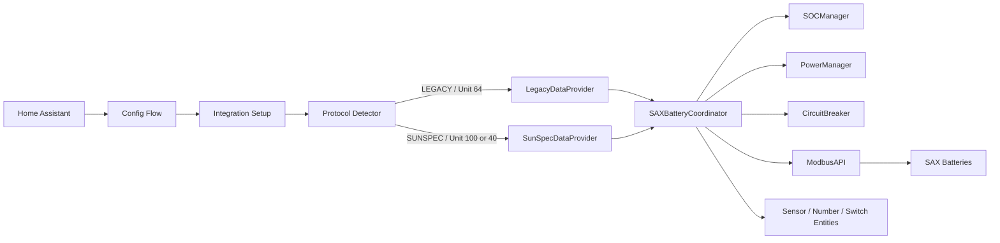

# SAX Battery Integration Architecture

This section documents the architecture that is currently implemented in this repository.

The integration supports two protocol paths:

- Legacy Modbus register polling (default fallback)
- SunSpec block-oriented polling with protocol auto-detection

## Current Architecture Summary

## Key Implemented Behaviors

- Protocol detection probes Unit-ID 100 first, then Unit-ID 40, then falls back to Unit-ID 64.
- SunSpec uses documented block reads only for realtime data paths.
- The SunSpec smart meter block is optional and does not degrade required block health.
- Metadata block values are loaded during setup and seeded into coordinator state.
- Control block values are refreshed:
  - immediately after successful writes
  - periodically on the limit refresh cadence
- Diagnostics expose per-block status and aggregate health flags.

## SunSpec Block Policy (Implemented)

| Block | Range | Required | Primary Use |
| --- | --- | --- | --- |
| device_metadata | 40000-40014 | Yes | startup and reload metadata |
| battery_sensor_data | 40015-40046 | Yes | battery telemetry |
| battery_controls | 40047-40053 | Yes | control state and setpoints |
| smartmeter_data | 40054-40094 | No | smart meter telemetry |
| battery_states | 40095-40114 | Yes | state and status metrics |

## Core Documents

- [components.md](components.md)
- [coordinator-pattern.md](coordinator-pattern.md)
- [data-flow.md](data-flow.md)
- [entity-architecture.md](entity-architecture.md)
- [modbus-communication.md](modbus-communication.md)
- [multi-battery-system.md](multi-battery-system.md)
- [power-management.md](power-management.md)
- [soc-constraints.md](soc-constraints.md)
- [decisions/](decisions/)

## Runtime Quality and Observability

- Coordinator statistics track cycle timing and failures.
- Circuit breaker protects polling loops from repeated failures.
- Diagnostics include protocol detection path and reason per battery.
- SunSpec provider diagnostics include:
  - `required_blocks_failed`
  - `optional_blocks_failed`
  - `session_degraded`
  - `smartmeter_unavailable`

Last updated: 2026-08-08
