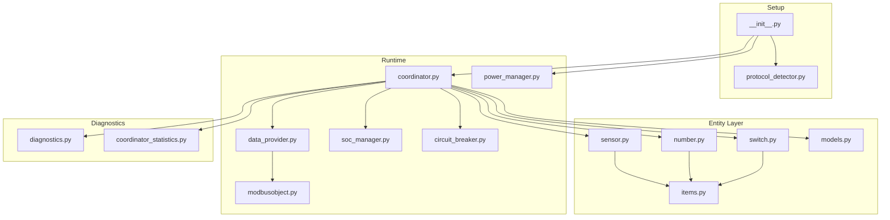

# Component Architecture

This document describes the integration components and their current responsibilities.

## Component Map

## Startup and Setup

- [custom_components/sax_battery/__init__.py](../../custom_components/sax_battery/__init__.py)
  - builds battery coordinators
  - runs protocol detection per battery
  - initializes SunSpec metadata for SunSpec coordinators
  - starts power manager for master coordinator when enabled

- [custom_components/sax_battery/protocol_detector.py](../../custom_components/sax_battery/protocol_detector.py)
  - detects `LEGACY` or `SUNSPEC`
  - returns detected unit id plus detection path and reason

## Coordinator and Providers

- [custom_components/sax_battery/coordinator.py](../../custom_components/sax_battery/coordinator.py)
  - central poll/update loop
  - write queue serialization
  - SunSpec cadence tracking per logical block
  - periodic control-block refresh telemetry

- [custom_components/sax_battery/data_provider.py](../../custom_components/sax_battery/data_provider.py)
  - `LegacyDataProvider`: item-based reads
  - `SunSpecDataProvider`: block-based reads and decode
  - provider diagnostics with aggregate health fields

## Control and Safety

- [custom_components/sax_battery/power_manager.py](../../custom_components/sax_battery/power_manager.py)
  - PV/grid charging orchestration
  - smart meter and balanced loading logic
  - coordinator-centric writes for nominal power/factor

- [custom_components/sax_battery/soc_manager.py](../../custom_components/sax_battery/soc_manager.py)
  - minimum SOC protection
  - master-only enforcement path
  - entity-registry lookup for max discharge control write

- [custom_components/sax_battery/circuit_breaker.py](../../custom_components/sax_battery/circuit_breaker.py)
  - protects against repeated communication failures

## Entity and Model Layer

- [custom_components/sax_battery/items.py](../../custom_components/sax_battery/items.py)
  - `SAXItem` for virtual/calculated entities
  - `ModbusItem` for hardware-backed entities

- [custom_components/sax_battery/models.py](../../custom_components/sax_battery/models.py)
  - item inventory
  - canonical unique-id and entity-id helpers
  - SunSpec canonical mapping merge behavior

## Diagnostics and Telemetry

- [custom_components/sax_battery/diagnostics.py](../../custom_components/sax_battery/diagnostics.py)
  - redacted entry diagnostics
  - per-coordinator diagnostics
  - protocol detection and SunSpec provider details

Last updated: 2026-08-08
