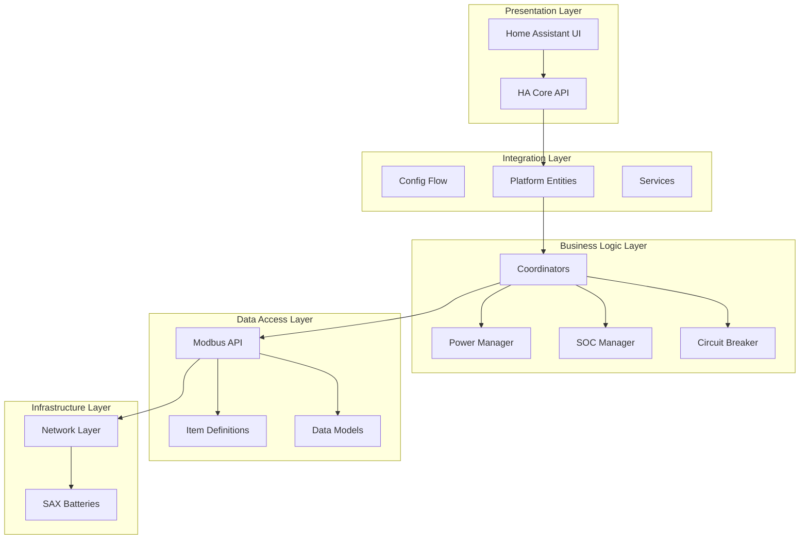
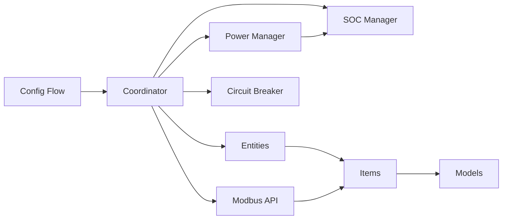

# Component Architecture

This document provides detailed descriptions of all major components in the SAX Battery integration, their responsibilities, and how they interact with each other.

## 🏗️ Component Overview

The SAX Battery integration follows a layered architecture with clear separation of concerns:



## 📁 Core Components

### Config Flow (`config_flow.py`)

**Purpose**: Handles integration setup and configuration management through Home Assistant's config flow system.

**Key Responsibilities**:

- User-guided integration setup with validation
- Multi-step configuration for battery count, control options, and network settings
- Connection testing and error handling
- Unique ID management to prevent duplicates

**Security Features**:

- Input validation for IP addresses and ports (OWASP A03)
- Timeout protection for network operations
- Secure credential handling

**Key Classes**:

```python
class SAXBatteryConfigFlow(ConfigFlowHandler):
    """Handle config flow for SAX Battery integration."""
    
    async def async_step_user(self, user_input=None)
    async def async_step_battery_options(self, user_input=None) 
    async def async_step_pilot_options(self, user_input=None)
    async def async_step_sensors(self, user_input=None)
    async def async_step_battery_config(self, user_input=None)
```

**Configuration Flow Steps**:

1. **Battery Count**: Select number of batteries (1-3)
2. **Control Options**: Enable pilot mode and power limits
3. **Pilot Options**: Configure SOC protection and update intervals  
4. **Sensors**: Select grid power sensor for PowerManager
5. **Battery Config**: Enter IP addresses and ports for each battery
6. **Review**: Confirm settings and create config entry

### Coordinator (`coordinator.py`)

**Purpose**: Central data management using Home Assistant's DataUpdateCoordinator pattern for efficient polling and state management.

**Key Responsibilities**:

- Periodic data polling from SAX batteries via Modbus
- Data validation and processing
- Entity state coordination and updates
- Error handling and recovery with circuit breaker integration
- Performance monitoring and statistics

**Architecture Pattern**:
Uses the [Coordinated Single API Poll pattern](https://developers.home-assistant.io/docs/integration_fetching_data/#coordinated-single-api-poll-for-data-for-all-entities) recommended by Home Assistant Core.

**Key Classes**:

```python
class SAXBatteryCoordinator(DataUpdateCoordinator):
    """Coordinates data updates for SAX Battery."""
    
    def __init__(self, hass, client, config_entry)
    async def _async_update_data(self) -> dict[str, Any]
    async def async_write_register_value(self, item, value)
    async def async_write_number_value(self, item, value)
```

**Polling Strategy**:

- **Master Battery**: 15 seconds (handles smart meter data)
- **Slave Batteries**: 30 seconds (individual battery data only)
- **Error Conditions**: Circuit breaker pattern with exponential backoff

### Platform Entities

#### Sensor Platform (`sensor.py`)

**Purpose**: Exposes battery and smart meter data as Home Assistant sensor entities.

**Key Features**:

- Real-time monitoring of SOC, power, voltage, current, temperature
- Energy statistics (produced/consumed)
- Smart meter data (grid power, voltage, frequency)
- Calculated/aggregate sensors (combined SOC, total energy)

**Entity Types**:

- **Hardware Sensors**: Direct Modbus register readings (`ModbusItem`)
- **Calculated Sensors**: Computed values spanning multiple batteries (`SAXItem`)

#### Number Platform (`number.py`)

**Purpose**: Provides numeric controls for battery power limits and configuration settings.

**Key Features**:

- Power control (charge/discharge limits, pilot power)
- SOC protection settings (minimum SOC threshold)
- Write-only register support with local caching
- Input validation and constraint enforcement

**Entity Categories**:

- **Hardware Numbers**: Direct Modbus register controls (`SAXBatteryModbusNumber`)
- **Config Numbers**: Virtual configuration settings (`SAXBatteryConfigNumber`)

#### Switch Platform (`switch.py`)

**Purpose**: Provides binary controls for battery modes and features.

**Key Features**:

- Control mode switching (solar charging, manual control)
- Mutual exclusivity between control modes
- Virtual switches for coordinator logic control

### Business Logic Managers

#### Power Manager (`power_manager.py`)

**Purpose**: Modern state-based power management replacing legacy pilot functionality.

**Key Responsibilities**:

- **Solar Charging Mode**: Automatically adjusts battery power based on grid sensor readings
- **Manual Control Mode**: Allows direct power setpoint control
- **Mode Management**: Ensures mutual exclusivity between control modes
- **SOC Integration**: Coordinates with SOC Manager for battery protection

**Control Modes**:

```python
SOLAR_CHARGING_MODE = "solar_charging"
MANUAL_CONTROL_MODE = "manual_control"
```

**Key Classes**:

```python  
class PowerManager:
    """Manages battery power control modes."""
    
    async def enable_solar_charging(self) -> bool
    async def enable_manual_control(self) -> bool  
    async def disable_all_modes(self) -> bool
    async def update_solar_charging(self) -> None
```

#### SOC Manager (`soc_manager.py`)

**Purpose**: Battery protection system that prevents damage from over-discharge.

**Key Responsibilities**:

- **Constraint Enforcement**: Automatically limits discharge power when SOC is low
- **Multi-Battery Protection**: Uses combined SOC for system-wide protection
- **Hardware Integration**: Writes directly to `SAX_MAX_DISCHARGE` register
- **Silent Operation**: Applies constraints without user errors

**Protection Algorithm**:

1. Monitor combined SOC from all batteries
2. When SOC < minimum threshold: Set max discharge to 0W
3. When SOC ≥ threshold: Restore user-configured limits
4. Log warnings for user awareness

**Key Classes**:

```python
class SOCManager:
    """Manages SOC-based battery protection constraints."""
    
    async def check_discharge_allowed(self, power: float) -> ConstraintResult
    async def check_and_enforce_discharge_limit(self) -> bool
```

#### Circuit Breaker (`circuit_breaker.py`)

**Purpose**: Implements fault tolerance with automatic recovery for network communication.

**Key Responsibilities**:

- **Failure Detection**: Monitors consecutive communication failures
- **State Management**: Tracks circuit states (CLOSED, OPEN, HALF_OPEN)
- **Automatic Recovery**: Tests connectivity during cooldown periods
- **Performance Protection**: Prevents cascade failures during outages

**Circuit States**:

- **CLOSED**: Normal operation, requests allowed
- **OPEN**: Failure threshold exceeded, requests blocked  
- **HALF_OPEN**: Testing recovery, limited requests allowed

**Configuration**:

```python
CIRCUIT_BREAKER_FAILURE_THRESHOLD = 5  # Failures before opening
CIRCUIT_BREAKER_COOLDOWN_SECONDS = 60  # Recovery attempt interval
```

### Data Access Layer

#### Modbus API (`modbusobject.py`)

**Purpose**: Abstraction layer for Modbus TCP/IP communication with SAX batteries.

**Key Responsibilities**:

- **Connection Management**: Establishes and maintains TCP connections
- **Protocol Handling**: Implements Modbus register read/write operations  
- **Data Conversion**: Handles UINT16/INT16 conversion with scaling factors
- **Error Handling**: Specific exception types for debugging and recovery

**Key Classes**:

```python
class ModbusAPI:
    """Modbus TCP/IP communication for SAX Battery."""
    
    async def connect(self) -> bool
    async def read_holding_registers(self, count, modbus_item=None)
    async def write_registers(self, address, values, device_id=1)
    async def read_value(self, modbus_item: ModbusItem) -> float | None
```

#### Item Definitions (`items.py`)

**Purpose**: Defines structured representations of battery registers and calculated entities.

**Key Classes**:

```python
class SAXItem:
    """Base class for all entities (virtual and hardware-backed)."""
    name: str
    mtype: TypeConstants  
    device: DeviceConstants
    entitydescription: EntityDescription
    
class ModbusItem(SAXItem):
    """Hardware-backed entities with Modbus registers."""
    address: int
    battery_device_id: int
    data_type: ModbusClientMixin.DATATYPE
    factor: float
```

#### Data Models (`models.py`)

**Purpose**: Structured data containers for integration configuration and runtime state.

**Key Classes**:

```python
class SAXBatteryData:
    """Central data model for SAX Battery integration."""
    
    def get_items(self, filter_condition) -> list[ModbusItem | SAXItem]
    def get_unique_id_for_item(self, item, battery_id=None) -> str | None
    def get_device_info(self, battery_id: str) -> DeviceInfo
```

## 🔄 Component Interactions

### Startup Sequence

1. **Setup**: Config flow creates config entry with user settings
2. **Initialization**: `async_setup_entry` creates coordinators per battery
3. **Connection**: Modbus API establishes connections to batteries
4. **Discovery**: Item definitions loaded based on configuration
5. **Entity Creation**: Platform entities created and registered
6. **Manager Setup**: Power Manager and SOC Manager initialized (if enabled)
7. **Polling Start**: Coordinators begin data polling cycles

### Data Flow Cycle

1. **Poll Trigger**: Coordinator timer triggers `_async_update_data()`
2. **Data Fetch**: Modbus API reads registers from battery hardware
3. **Data Processing**: Raw values converted using item scaling factors
4. **Manager Updates**: SOC Manager checks constraints, Power Manager processes grid data
5. **Entity State**: Processed data updates entity states in Home Assistant
6. **User Interface**: New states displayed in Home Assistant frontend

### Control Flow (User Actions)

1. **User Input**: User changes number entity value or toggle switch
2. **Validation**: Entity validates input against constraints and ranges
3. **Manager Processing**: SOC Manager checks discharge constraints
4. **Hardware Write**: Modbus API writes validated value to battery register
5. **State Update**: Entity state updated to reflect successful write
6. **Loop Closure**: Next coordinatorr poll verifies hardware state

## 📊 Component Dependencies



## 🧪 Testing Strategy per Component

- **Config Flow**: Mock network operations, test all setup paths
- **Coordinator**: Mock Modbus API, test polling cycles and error handling  
- **Entities**: Mock coordinator, test state updates and user actions
- **Managers**: Mock dependencies, test business logic and constraints
- **Modbus API**: Mock pymodbus client, test protocol operations
- **Models**: Unit tests for data validation and transformations

## ⚡ Performance Considerations

- **Async Operations**: All I/O operations are non-blocking
- **Connection Pooling**: Modbus connections reused across polling cycles
- **Circuit Breaker**: Prevents resource waste during outages
- **Efficient Polling**: Master batteries poll smart meter, slaves poll individual data
- **Debounced Updates**: Grid sensor monitoring avoids excessive polling

---

**Next**: [Data Flow Diagrams](data-flow.md)  
**See Also**: [Entity Architecture](entity-architecture.md), [ADRs](decisions/)
