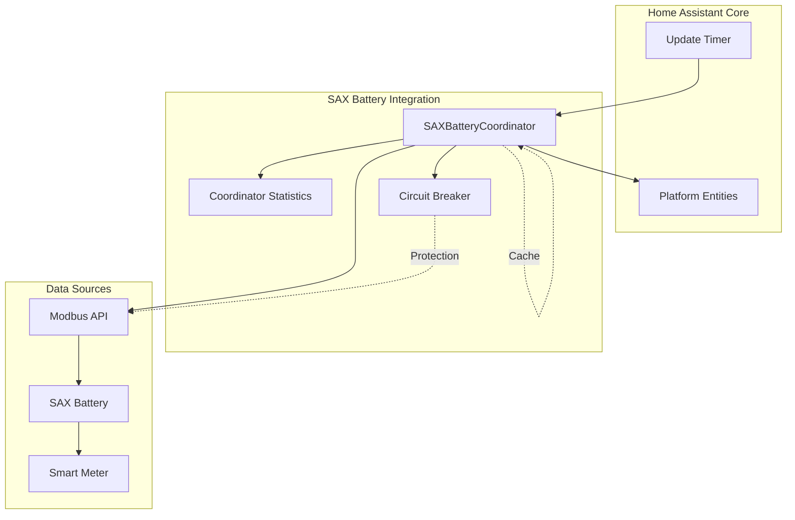

# Coordinator Pattern Architecture

This document describes the implementation of Home Assistant's DataUpdateCoordinator pattern within the SAX Battery integration, including polling strategies, error handling, and performance optimizations.

## 📊 Overview

The SAX Battery integration uses Home Assistant's recommended [Coordinated Single API Poll pattern](https://developers.home-assistant.io/docs/integration_fetching_data/#coordinated-single-api-poll-for-data-for-all-entities) to efficiently manage data polling from multiple SAX batteries while minimizing resource usage and network overhead.

### Coordinator Architecture



## 🏗️ Coordinator Implementation

### Base Coordinator Structure

```python
class SAXBatteryCoordinator(DataUpdateCoordinator):
    """Coordinates data updates for SAX Battery systems."""
    
    def __init__(
        self,
        hass: HomeAssistant,
        modbus_api: ModbusAPI,
        config_entry: ConfigEntry,
        battery_id: str,
        is_master: bool = False,
    ) -> None:
        """Initialize coordinator with role-specific configuration."""
        
        # Role-specific update intervals
        if is_master: 
            update_interval = timedelta(seconds=BATTERY_POLL_INTERVAL)  # 15s
        else:
            update_interval = timedelta(seconds=BATTERY_POLL_SLAVE_INTERVAL)  # 30s
            
        super().__init__(
            hass,
            logger=_LOGGER,
            name=f"{DOMAIN}_{battery_id}",
            update_interval=update_interval,
            config_entry=config_entry,  # ✅ Recommended by HA Core
        )
        
        # SAX-specific attributes
        self.battery_id = battery_id
        self.is_master = is_master
        self.modbus_api = modbus_api
        self.sax_data = SAXBatteryData(config_entry)
        
        # Performance monitoring
        self.statistics = CoordinatorStatistics()
        self.circuit_breaker = CircuitBreaker(
            failure_threshold=CIRCUIT_BREAKER_FAILURE_THRESHOLD,
            cooldown_seconds=CIRCUIT_BREAKER_COOLDOWN_SECONDS,
        )
        
        # Managers (initialized after first refresh)
        self.soc_manager: SOCManager | None = None 
        self.power_manager: PowerManager | None = None
```

### Core Update Method

```python
async def _async_update_data(self) -> dict[str, Any]:
    """Fetch and process data according to coordinator role."""
    
    start_time = time.time()
    
    try:
        # Circuit breaker protection
        async def _poll_operation():
            return await self._poll_device_data()
            
        data = await self.circuit_breaker.call(_poll_operation)
        
        # Record successful cycle
        cycle_time = time.time() - start_time
        self.statistics.record_successful_update(cycle_time)
        
        return data
        
    except CircuitBreakerError as err:
        self.statistics.record_circuit_breaker_open()
        raise UpdateFailed(f"Circuit breaker open for {self.battery_id}: {err}") from err
        
    except (ModbusException, OSError, TimeoutError) as err:
        self.statistics.record_failed_update(err)
        raise UpdateFailed(f"Communication error for {self.battery_id}: {err}") from err
        
    except Exception as err:
        self.statistics.record_unexpected_error(err)
        _LOGGER.exception("Unexpected error in coordinator %s", self.battery_id)
        raise UpdateFailed(f"Unexpected error for {self.battery_id}: {err}") from err
```

### Role-Specific Data Polling

#### Master Coordinator Implementation

```python
async def _poll_device_data(self) -> dict[str, Any]:
    """Poll device data according to coordinator role."""
    
    data = {}
    
    # 1. Poll battery-specific data (all coordinators)
    battery_data = await self._poll_battery_registers()
    data.update(battery_data)
    
    # 2. Poll smart meter data (master only)
    if self.is_master:
        smart_meter_data = await self._poll_smart_meter_registers()
        data.update(smart_meter_data)
        
        # 3. Calculate system aggregates (master only)
        calculated_data = await self._calculate_system_values(data)
        data.update(calculated_data)
        
    return data

async def _poll_battery_registers(self) -> dict[str, Any]:
    """Poll individual battery BMS registers."""
    data = {}
    
    battery_items = self.sax_data.get_items(
        lambda item: (
            isinstance(item, ModbusItem) 
            and item.device == DeviceConstants.BESS
            and item.battery_device_id == 1  # SAX battery device ID
        )
    )
    
    for item in battery_items:
        try:
            value = await self.modbus_api.read_value(item)
            if value is not None:
                data[item.name] = value
                _LOGGER.debug("Read %s: %s", item.name, value)
        except ModbusException as err:
            _LOGGER.warning("Failed to read %s: %s", item.name, err)
            # Continue with other registers
            
    return data

async def _poll_smart_meter_registers(self) -> dict[str, Any]:
    """Poll smart meter data via master battery RS485."""
    data = {}
    
    smart_meter_items = self.sax_data.get_items(
        lambda item: (
            isinstance(item, ModbusItem) 
            and item.device == DeviceConstants.SM
        )
    )
    
    for item in smart_meter_items:
        try:
            value = await self.modbus_api.read_value(item)
            if value is not None:
                data[item.name] = value
        except ModbusException as err:
            _LOGGER.warning("Failed to read smart meter %s: %s", item.name, err)
            
    return data
```

#### Slave Coordinator Implementation

```python
async def _poll_device_data(self) -> dict[str, Any]:
    """Slave coordinators only poll battery data."""
    
    # Slaves only poll individual battery data - no smart meter access
    return await self._poll_battery_registers()
```

## ⚡ Performance Optimizations

### Polling Intervals

Different coordinators use different polling intervals based on role and data importance:

```python
# Polling interval constants
BATTERY_POLL_INTERVAL = 15  # Master battery (includes smart meter)
BATTERY_POLL_SLAVE_INTERVAL = 30  # Slave batteries (battery data only)

# Dynamic interval adjustment based on circuit breaker state
async def _adjust_polling_interval(self) -> None:
    """Adjust polling interval based on circuit breaker state."""
    
    if self.circuit_breaker.state == CircuitState.OPEN:
        # Reduce polling frequency during failures
        self.update_interval = timedelta(seconds=self.update_interval.seconds * 2)
    elif self.circuit_breaker.state == CircuitState.CLOSED:
        # Restore normal polling
        if self.is_master:
            self.update_interval = timedelta(seconds=BATTERY_POLL_INTERVAL)
        else:
            self.update_interval = timedelta(seconds=BATTERY_POLL_SLAVE_INTERVAL)
```

### Batch Register Reading

```python
async def _poll_device_batch(self, device: DeviceConstants, items: list[ModbusItem]) -> dict[str, Any]:
    """Read multiple registers efficiently in batches."""
    
    # Group contiguous registers for batch reading
    register_groups = self._group_contiguous_registers(items)
    
    data = {}
    for group_start, group_items in register_groups.items():
        try:
            # Read entire group in single Modbus call
            count = len(group_items)
            raw_values = await self.modbus_api.read_holding_registers(
                count=count,
                modbus_item=group_items[0]  # Use first item for address/device_id
            )
            
            if raw_values:
                # Process each register in the batch
                for i, item in enumerate(group_items):
                    if i < len(raw_values):
                        scaled_value = self._apply_scaling(raw_values[i], item)
                        data[item.name] = scaled_value
                        
        except ModbusException as err:
            _LOGGER.warning("Batch read failed for group starting at %s: %s", 
                          group_start, err)
            # Fall back to individual reads
            data.update(await self._poll_individual_registers(group_items))
            
    return data
```

### Connection Pooling

```python
class SAXBatteryCoordinator(DataUpdateCoordinator):
    """Coordinator with optimized connection management."""
    
    async def _ensure_connection(self) -> bool:
        """Ensure Modbus connection is established and healthy."""
        
        if not self.modbus_api.is_connected():
            try:
                success = await self.modbus_api.connect()
                if success:
                    _LOGGER.debug("Reconnected to battery %s", self.battery_id)
                    self.circuit_breaker.record_success()  # Reset circuit breaker
                    return True
                else:
                    return False
            except Exception as err:
                _LOGGER.error("Failed to reconnect to battery %s: %s", 
                            self.battery_id, err)
                return False
        
        return True
```

## 🛡️ Error Handling Strategy

### Specific Exception Handling

Following SAX Battery security guidelines (OWASP A03), the coordinator uses specific exception types:

```python
async def _async_update_data(self) -> dict[str, Any]:
    """Error handling with specific exception types."""
    
    try:
        return await self._poll_device_data()
        
    # Modbus protocol errors
    except ModbusException as err:
        self.statistics.record_modbus_error(err)
        raise UpdateFailed(f"Modbus error for {self.battery_id}: {err}") from err
        
    # Network connectivity errors  
    except OSError as err:
        self.statistics.record_network_error(err)
        raise UpdateFailed(f"Network error for {self.battery_id}: {err}") from err
        
    # Timeout errors
    except TimeoutError as err:
        self.statistics.record_timeout_error(err) 
        raise UpdateFailed(f"Timeout error for {self.battery_id}: {err}") from err
        
    # Circuit breaker errors
    except CircuitBreakerError as err:
        self.statistics.record_circuit_breaker_open()
        raise UpdateFailed(f"Circuit breaker open for {self.battery_id}: {err}") from err
        
    # Unexpected errors (should not happen in production)
    except Exception as err:
        self.statistics.record_unexpected_error(err)
        _LOGGER.exception("Unexpected coordinator error for %s", self.battery_id)
        raise UpdateFailed(f"Unexpected error for {self.battery_id}: {err}") from err
```

### Graceful Degradation

```python
async def _poll_device_data(self) -> dict[str, Any]:
    """Data polling with graceful degradation."""
    
    data = {}
    critical_registers = []  # Essential registers (SOC, status)
    optional_registers = []  # Nice-to-have registers (temperature, etc.)
    
    # Always try to get critical data first
    for item in critical_registers:
        try:
            value = await self.modbus_api.read_value(item)
            if value is not None:
                data[item.name] = value
        except Exception as err:
            _LOGGER.error("Failed to read critical register %s: %s", item.name, err)
            # Critical failure - re-raise to trigger UpdateFailed
            raise
    
    # Best-effort for optional data
    for item in optional_registers:
        try:
            value = await self.modbus_api.read_value(item)
            if value is not None:
                data[item.name] = value
        except Exception as err:
            _LOGGER.debug("Failed to read optional register %s: %s", item.name, err)
            # Continue without this register
            
    return data
```

## 📈 Performance Monitoring

### Coordinator Statistics

```python
@dataclass
class CoordinatorStatistics:
    """Track coordinator performance metrics."""
    
    # Update cycle metrics
    successful_updates: int = 0
    failed_updates: int = 0
    total_updates: int = 0
    
    # Timing metrics
    avg_cycle_time: float = 0.0
    max_cycle_time: float = 0.0
    min_cycle_time: float = float('inf')
    cycle_time_history: deque = field(default_factory=lambda: deque(maxlen=100))
    
    # Error tracking
    modbus_errors: int = 0
    network_errors: int = 0
    timeout_errors: int = 0
    circuit_breaker_opens: int = 0
    last_error_time: datetime | None = None
    
    def record_successful_update(self, cycle_time: float) -> None:
        """Record successful update cycle."""
        self.successful_updates += 1
        self.total_updates += 1
        
        # Update timing statistics
        self.cycle_time_history.append(cycle_time)
        self.avg_cycle_time = sum(self.cycle_time_history) / len(self.cycle_time_history)
        self.max_cycle_time = max(self.max_cycle_time, cycle_time)
        self.min_cycle_time = min(self.min_cycle_time, cycle_time)
    
    @property
    def success_rate(self) -> float:
        """Calculate success rate percentage."""
        if self.total_updates == 0:
            return 0.0
        return (self.successful_updates / self.total_updates) * 100.0
        
    def get_diagnostic_info(self) -> dict[str, Any]:
        """Return diagnostic information."""
        return {
            "success_rate": round(self.success_rate, 2),
            "total_updates": self.total_updates,
            "avg_cycle_time": round(self.avg_cycle_time, 3),
            "max_cycle_time": round(self.max_cycle_time, 3),
            "error_counts": {
                "modbus": self.modbus_errors,
                "network": self.network_errors,  
                "timeout": self.timeout_errors,
                "circuit_breaker": self.circuit_breaker_opens,
            },
            "last_error": self.last_error_time.isoformat() if self.last_error_time else None,
        }
```

## 🔧 Write Operations

### Number Entity Integration

```python
async def async_write_number_value(self, modbus_item: ModbusItem, value: float) -> bool:
    """Write number entity value to Modbus register."""
    
    try:
        # Validate input range
        if not 0 <= value <= 65535:
            raise ValueError(f"Value {value} out of UINT16 range")
            
        # Convert float to integer for Modbus
        int_value = int(value / modbus_item.factor)
        
        # Write to hardware with circuit breaker protection
        async def _write_operation():
            return await self.modbus_api.write_registers(
                address=modbus_item.address,
                values=[int_value],
                device_id=modbus_item.battery_device_id,
            )
            
        success = await self.circuit_breaker.call(_write_operation)
        
        if success:
            _LOGGER.debug("Wrote %s = %s to register %s", 
                        modbus_item.name, value, modbus_item.address)
            self.statistics.record_successful_write()
            return True
        else:
            _LOGGER.error("Failed to write %s to register %s", 
                        modbus_item.name, modbus_item.address)
            self.statistics.record_failed_write()
            return False
            
    except Exception as err:
        _LOGGER.error("Write error for %s: %s", modbus_item.name, err)
        self.statistics.record_failed_write()
        return False
```

## 🔄 Lifecycle Management

### Coordinator Setup

```python
async def async_setup_coordinator(self) -> bool:
    """Set up coordinator with proper initialization sequence."""
    
    # 1. Establish Modbus connection
    if not await self.modbus_api.connect():
        raise ConfigEntryNotReady(f"Cannot connect to battery {self.battery_id}")
        
    # 2. Perform initial data refresh
    await self.async_config_entry_first_refresh()
    
    # 3. Initialize managers (master only)
    if self.is_master:
        await self._setup_managers()
        
    # 4. Start background tasks
    await self._start_background_tasks()
    
    _LOGGER.info("Coordinator setup complete for battery %s", self.battery_id)
    return True

async def _setup_managers(self) -> None:
    """Initialize managers for master coordinator."""
    
    # SOC Manager setup
    if self.config_entry.data.get(CONF_PILOT_FROM_HA):
        min_soc = self.config_entry.data.get(CONF_MIN_SOC, DEFAULT_MIN_SOC)
        self.soc_manager = SOCManager(
            coordinator=self,
            min_soc=min_soc,
            enabled=True,
        )
        
        # Power Manager setup
        self.power_manager = PowerManager(
            coordinator=self,
            grid_sensor=self.config_entry.data.get(CONF_GRID_POWER_SENSOR),
        )
```

### Coordinator Shutdown

```python
async def async_shutdown(self) -> None:
    """Clean shutdown of coordinator resources."""
    
    try:
        # Stop background tasks
        await self._stop_background_tasks()
        
        # Shutdown managers
        if self.soc_manager:
            await self.soc_manager.async_shutdown()
            
        if self.power_manager:
            await self.power_manager.async_shutdown()
            
        # Disconnect Modbus
        await self.modbus_api.disconnect()
        
        _LOGGER.info("Coordinator shutdown complete for battery %s", self.battery_id)
        
    except Exception as err:
        _LOGGER.error("Error during coordinator shutdown: %s", err)
```

---

**Next**: [Power Management](power-management.md)  
**See Also**: [Components](components.md), [Circuit Breaker ADR](decisions/003-circuit-breaker.md)
