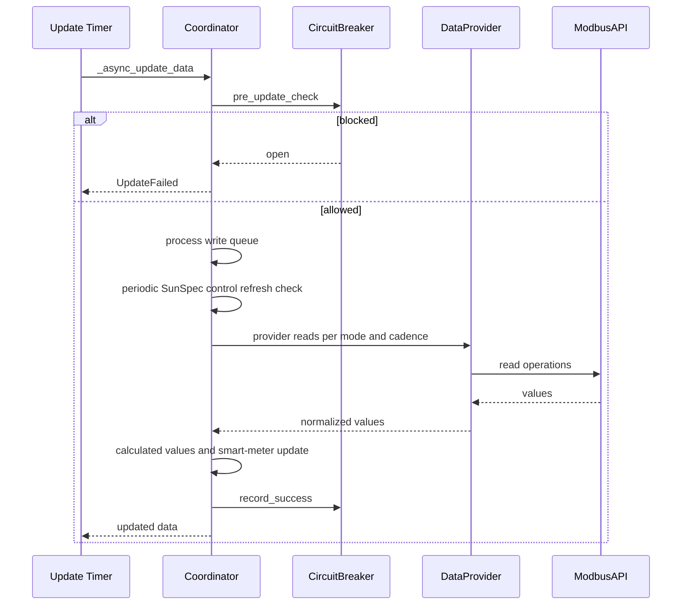

# Coordinator Pattern

The integration uses `DataUpdateCoordinator` as the runtime control plane for each configured battery.

## Coordinator Responsibilities

- Poll hardware data and update coordinator cache.
- Serialize write operations with a write queue.
- Apply circuit-breaker pre-check and failure recording.
- Route data reads through provider abstraction.
- Trigger SOC enforcement checks for master coordinator.

## Role-Based Cadence

- Master coordinator update interval: 15s
- Slave coordinator update interval: 30s

## SunSpec Coordinator Behavior

In SunSpec mode, the coordinator does not perform entity-by-entity realtime register fallback reads.

Implemented cadence logic:

- `device_metadata` loaded once on setup/reload path via `async_initialize_sunspec_metadata`
- `battery_sensor_data` and `battery_states` fetched each update cycle through provider
- `smartmeter_data` fetched when due using slave interval gate
- `battery_controls` refreshed:
  - immediately after successful writes
  - periodically using `LIMIT_REFRESH_INTERVAL`

## Update Loop (Current Flow)

## Provider Routing

- Legacy mode: `LegacyDataProvider.get_realtime_values`
- SunSpec mode: `_poll_sunspec_blocks_by_cadence` and block-group provider methods

## Failure Handling

- Communication failures: `ModbusException`, `OSError`, `TimeoutError` -> `UpdateFailed`
- All-device-batch failure increments breaker failure state
- Unexpected exceptions are logged and surfaced as `UpdateFailed`

## Diagnostics Exposed by Coordinator

- protocol mode and detection path
- last success timestamp and update counters
- cycle statistics summary
- SunSpec control refresh telemetry:
  - attempt count
  - skipped-not-due count
  - last success / failure

Last updated: 2026-08-08
