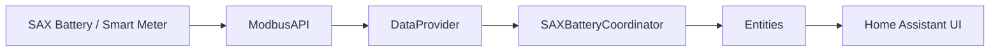
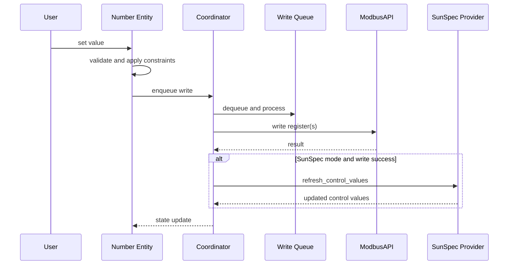
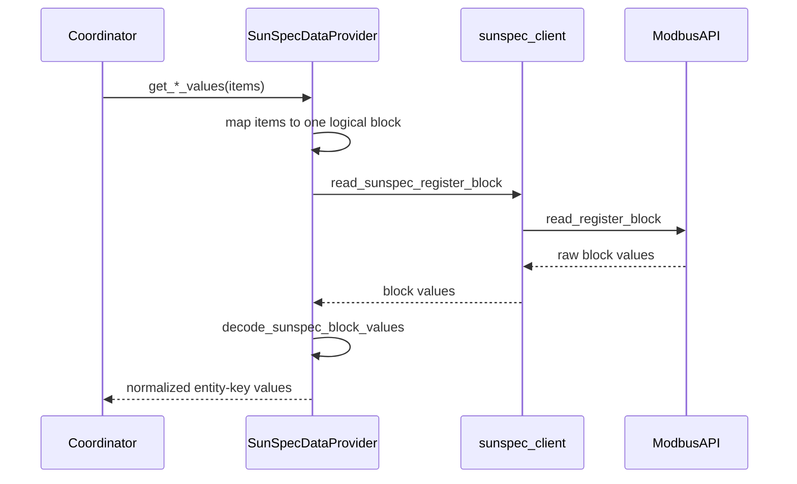
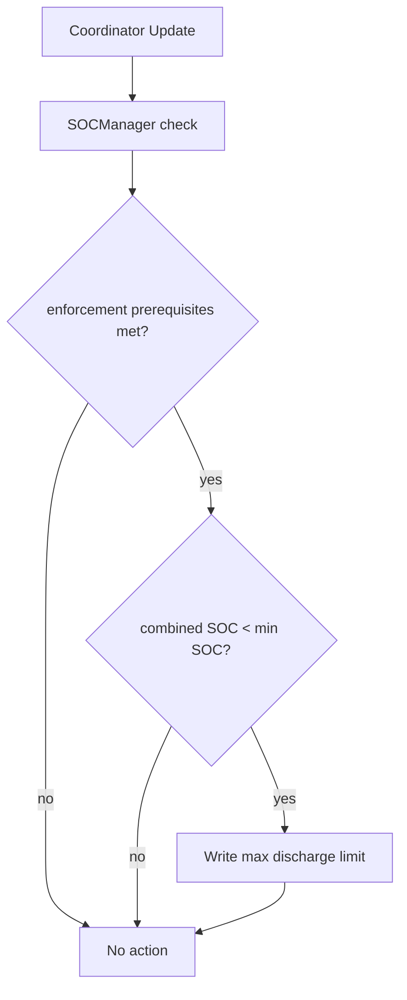

# Data Flow

This document describes current runtime flows for monitoring, control writes, and safety enforcement.

## Monitoring Flow

### Notes

- Legacy mode reads item values directly through item read path.
- SunSpec mode reads documented blocks and maps values back to stable entity keys.

## Control Write Flow

## SunSpec Block Read Flow

## SOC Protection Flow

## Diagnostics Flow

- Coordinator exposes provider diagnostics via diagnostics endpoint.
- SunSpec provider diagnostics include per-block and aggregate health.
- Optional smart meter block failures are tracked without declaring required session degradation.

Last updated: 2026-08-08
