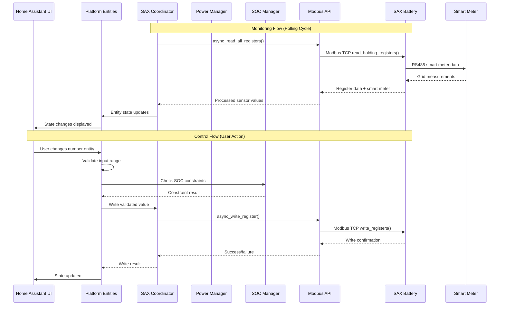
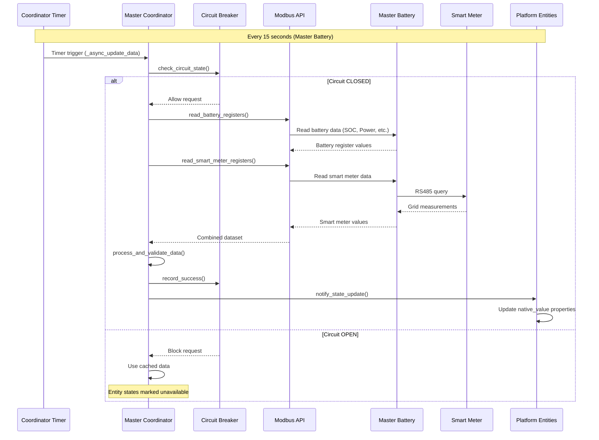
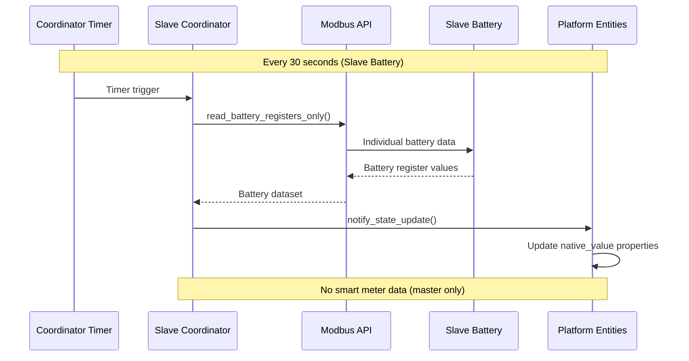
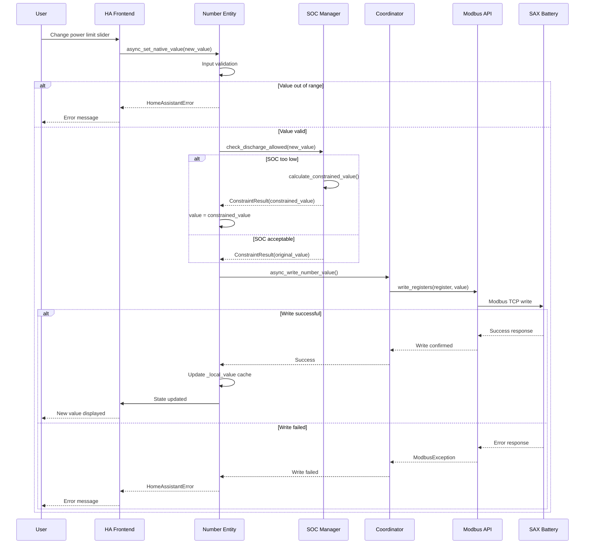
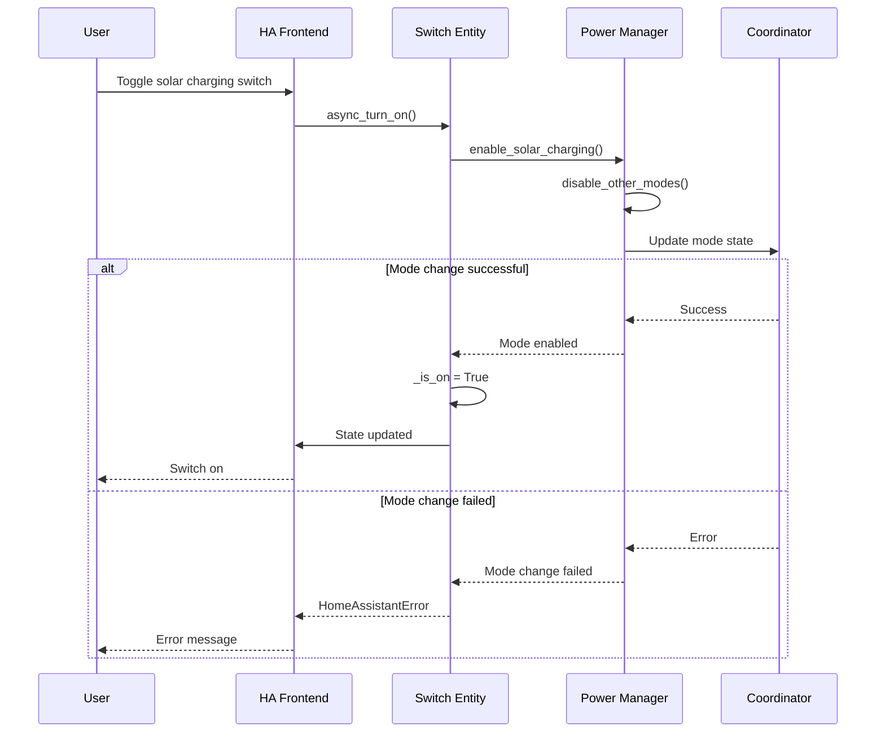
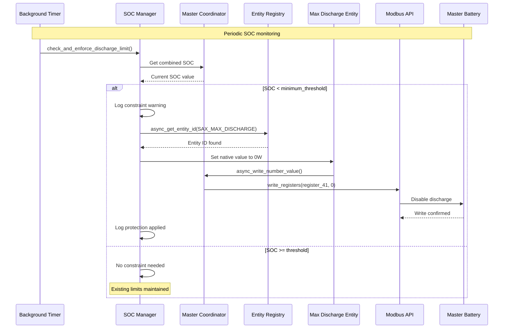
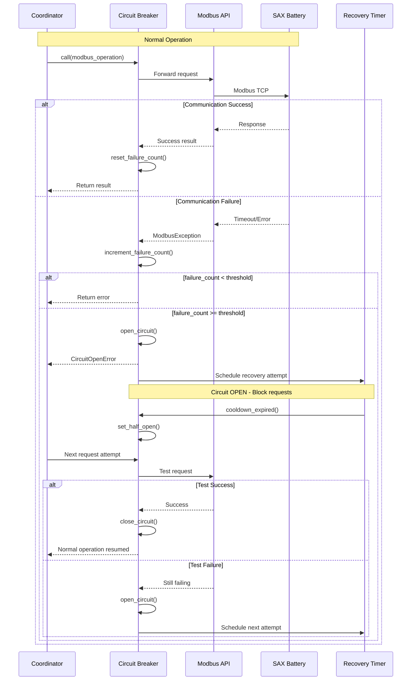
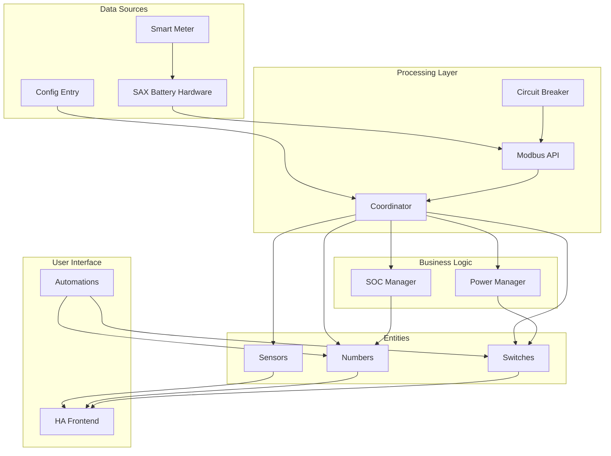
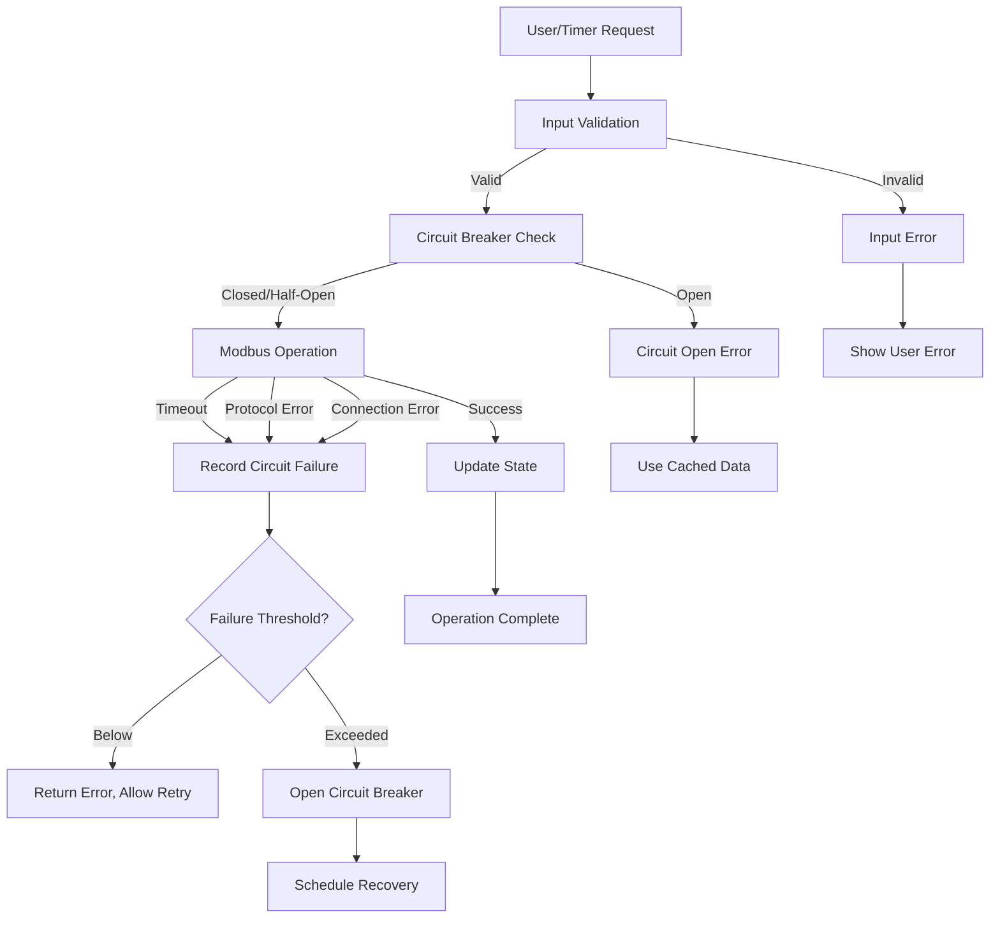

# Data Flow Architecture

This document describes how data flows through the SAX Battery integration, from hardware polling to user interface updates and user actions back to hardware control.

## 🔄 Overview

Data flows through the SAX Battery integration in several distinct patterns:

1. **Monitoring Flow**: Hardware → Coordinator → Entities → UI
2. **Control Flow**: UI → Entities → Managers → Hardware  
3. **Protection Flow**: Managers → Constraint Checks → Hardware Limits
4. **Configuration Flow**: Config Flow → Storage → Runtime Initialization

## 📊 System Data Flow



## 🏗️ Detailed Data Flows

### 1. Monitoring Data Flow

#### Master Battery Polling Sequence



#### Slave Battery Polling Sequence



### 2. Control Data Flow

#### Number Entity Value Change



#### Switch Entity Toggle



### 3. Protection Data Flow

#### SOC Constraint Enforcement



### 4. Circuit Breaker Flow

#### Failure Detection and Recovery



## 📈 Data Processing Pipeline

### 1. Raw Data Acquisition

```python
# Coordinator polling cycle
async def _async_update_data(self) -> dict[str, Any]:
    """Fetch and process sensor data from SAX Battery."""
    
    # 1. Read raw register values
    raw_data = {}
    for item in self.modbus_items:
        raw_value = await self.modbus_api.read_value(item)
        raw_data[item.address] = raw_value
    
    # 2. Apply scaling factors and conversions
    processed_data = {}
    for item in self.modbus_items:
        if raw_data[item.address] is not None:
            processed_data[item.name] = raw_data[item.address] * item.factor
    
    # 3. Calculate derived values
    if SAX_SOC in processed_data:
        processed_data[SAX_COMBINED_SOC] = self._calculate_combined_soc()
    
    return processed_data
```

### 2. Entity State Updates

```python
# Entity value retrieval  
@property
def native_value(self) -> float | None:
    """Get current sensor value from coordinator data."""
    if self.coordinator.data is None:
        return None
    
    # Direct register value for hardware entities
    if isinstance(self._item, ModbusItem):
        return self.coordinator.data.get(self._item.name)
    
    # Calculated value for virtual entities
    elif isinstance(self._item, SAXItem):
        return self._calculate_value(self.coordinator.data)
```

### 3. User Input Processing

```python
# Number entity value setting
async def async_set_native_value(self, value: float) -> None:
    """Process user input with validation and constraints."""
    
    # Step 1: Input validation
    if not self._validate_range(value):
        raise HomeAssistantError(f"Value {value} out of range")
    
    # Step 2: Apply SOC constraints
    if self.coordinator.soc_manager:
        constraint_result = await self.coordinator.soc_manager.check_discharge_allowed(value)
        if not constraint_result.allowed:
            _LOGGER.warning("Power limited by SOC: %sW -> %sW", value, constraint_result.constrained_value)
            value = constraint_result.constrained_value
    
    # Step 3: Write to hardware
    await self.coordinator.async_write_number_value(self._modbus_item, value)
    
    # Step 4: Cache for write-only registers
    self._local_value = value
    self.async_write_ha_state()
```

## 🔗 Data Dependencies

### Inter-Component Data Flow



### Data Synchronization Points

1. **Coordinator Timer**: Periodic data refresh from hardware
2. **Entity Updates**: State synchronization when coordinator data changes
3. **User Actions**: Immediate validation and hardware writes
4. **Constraint Enforcement**: Background SOC monitoring and limit application
5. **Circuit Breaker**: Failure detection and recovery coordination

## ⚡ Performance Characteristics

### Polling Intervals

- **Master Battery**: 15 seconds (includes smart meter data)
- **Slave Batteries**: 30 seconds (battery data only)  
- **SOC Monitoring**: Every coordinator update cycle
- **Circuit Breaker Recovery**: 60 seconds during outages

### Data Caching Strategy

- **Coordinator Data**: Cached between polling cycles
- **Write-Only Values**: Locally cached in entities with state restoration
- **Circuit Breaker**: Cached decisions to avoid redundant calls
- **Entity Registry**: Cached lookups for performance

### Error Handling Flow



---

**Next**: [Modbus Communication](modbus-communication.md)  
**See Also**: [Components](components.md), [Multi-Battery System](multi-battery-system.md)
