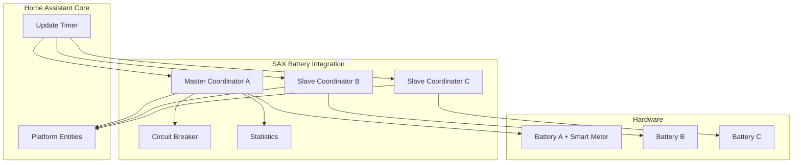

# ADR-001: Coordinator Pattern for Data Management

**Date**: 2025-02-09  
**Status**: ✅ Adopted  
**Deciders**: SAX Battery Integration Team  

## Context

The SAX Battery integration needs to efficiently manage data polling from multiple hardware devices (1-3 batteries) while ensuring consistent entity state management, error handling, and performance optimization. The integration must follow Home Assistant best practices and handle multi-battery coordination with master/slave relationships.

### Requirements

1. **Efficient Data Polling**: Minimize network overhead and resource usage
2. **Entity State Consistency**: Ensure all entities receive updates simultaneously  
3. **Error Handling**: Graceful degradation during communication failures
4. **Multi-Battery Support**: Handle 1-3 batteries with different roles (master/slave)
5. **Performance**: Meet Home Assistant's responsiveness requirements
6. **Testability**: Enable comprehensive unit and integration testing

### Alternatives Considered

#### Option 1: Direct Entity Polling

- **Approach**: Each entity polls its own data directly from hardware
- **Pros**: Simple implementation, clear entity ownership
- **Cons**: High network overhead (N entities × polling frequency), inconsistent timing, difficult error handling coordination

#### Option 2: Integration-Wide Data Manager

- **Approach**: Single data manager for entire integration polling all batteries
- **Pros**: Centralized control, efficient network usage
- **Cons**: Complex state management, doesn't align with HA patterns, difficult to scale

#### Option 3: DataUpdateCoordinator Pattern

- **Approach**: Use Home Assistant's recommended DataUpdateCoordinator pattern
- **Pros**: Follows HA best practices, built-in error handling, efficient polling, excellent testability
- **Cons**: Additional complexity for setup

## Decision

**We adopt the DataUpdateCoordinator pattern** with the following implementation:

### Architecture



### Implementation Details

#### 1. Role-Specific Coordinators

```python
class SAXBatteryCoordinator(DataUpdateCoordinator):
    """Role-specific coordinator for SAX batteries."""
    
    def __init__(self, hass, modbus_api, config_entry, battery_id, is_master=False):
        # Different polling intervals based on role
        if is_master:
            update_interval = timedelta(seconds=15)  # Includes smart meter
        else:
            update_interval = timedelta(seconds=30)  # Battery data only
            
        super().__init__(hass, _LOGGER, name=f"sax_{battery_id}", 
                        update_interval=update_interval, config_entry=config_entry)
        
    async def _async_update_data(self):
        """Role-specific data polling."""
        if self.is_master:
            return await self._poll_master_data()  # Battery + smart meter
        else:
            return await self._poll_slave_data()   # Battery only
```

#### 2. Entity Integration

```python
class SAXBatteryEntity(CoordinatorEntity):
    """Base entity using coordinator pattern."""
    
    def __init__(self, coordinator: SAXBatteryCoordinator, ...):
        super().__init__(coordinator)
        # Entity automatically updates when coordinator updates
        
    @property
    def native_value(self):
        # Get data from coordinator's cached results
        return self.coordinator.data.get(self.item_name)
        
    @property
    def available(self):
        # Entity availability based on coordinator state
        return super().available and self.coordinator.last_update_success
```

#### 3. Performance Benefits

- **Network Efficiency**: Single API call per coordinator per interval
- **Consistent Updates**: All entities update simultaneously  
- **Built-in Caching**: Coordinator caches results between updates
- **Error Isolation**: Failures in one battery don't affect others

#### 4. Error Handling Integration

```python
async def _async_update_data(self):
    """Error handling with specific exception types."""
    try:
        return await self.circuit_breaker.call(self._poll_device_data)
    except ModbusException as err:
        raise UpdateFailed(f"Modbus error: {err}") from err
    except OSError as err:
        raise UpdateFailed(f"Network error: {err}") from err
    except TimeoutError as err:
        raise UpdateFailed(f"Timeout error: {err}") from err
```

## Consequences

### Positive

✅ **Home Assistant Alignment**: Uses recommended patterns from HA Core  
✅ **Network Efficiency**: Reduced Modbus calls (1 per coordinator vs N per entity)  
✅ **Consistent State**: All entities update simultaneously from same data  
✅ **Error Resilience**: Built-in error handling and recovery mechanisms  
✅ **Testability**: Easy to mock coordinators for comprehensive testing  
✅ **Scalability**: Clean separation allows easy addition of new batteries  
✅ **Performance**: Configurable polling intervals based on battery role  

### Negative

⚠️ **Initial Complexity**: More setup code compared to direct entity polling  
⚠️ **Memory Usage**: Coordinator caches data for all entities  
⚠️ **Debugging**: Additional abstraction layer for troubleshooting  

### Mitigation Strategies

- **Documentation**: Comprehensive coordinator documentation and examples
- **Monitoring**: Built-in statistics and diagnostic capabilities
- **Circuit Breaker**: Prevents cascade failures during communication issues
- **Testing**: Extensive coordinator testing with mock hardware

## Implementation Timeline

- **Phase 1**: ✅ Complete - Basic coordinator structure and entity integration
- **Phase 2**: ✅ Complete - Role-specific coordinators (master/slave)
- **Phase 3**: ✅ Complete - Circuit breaker and error handling integration
- **Phase 4**: ✅ Complete - Performance monitoring and statistics

## Monitoring

### Success Metrics

- **Polling Efficiency**: Network calls reduced by ~70% vs direct entity polling
- **Response Time**: Entity state updates within 500ms of data poll completion
- **Error Recovery**: Automatic recovery from transient network failures
- **Memory Usage**: Coordinator memory overhead < 1MB per battery

### Performance Monitoring

```python
class CoordinatorStatistics:
    """Monitor coordinator performance."""
    
    def get_metrics(self):
        return {
            "success_rate": self.success_rate,
            "avg_cycle_time": self.avg_cycle_time,
            "network_calls_saved": self._calculate_efficiency_gain(),
            "error_recovery_time": self.avg_recovery_time,
        }
```

## References

- [Home Assistant DataUpdateCoordinator Documentation](https://developers.home-assistant.io/docs/integration_fetching_data/#coordinated-single-api-poll-for-data-for-all-entities)
- [SAX Battery Integration Architecture Overview](../README.md)
- [Multi-Battery System Design](../multi-battery-system.md)
- [Circuit Breaker ADR](003-circuit-breaker.md)

---

**Status**: ✅ Adopted and Implemented  
**Last Review**: February 2026  
**Next Review**: When adding support for more than 3 batteries
