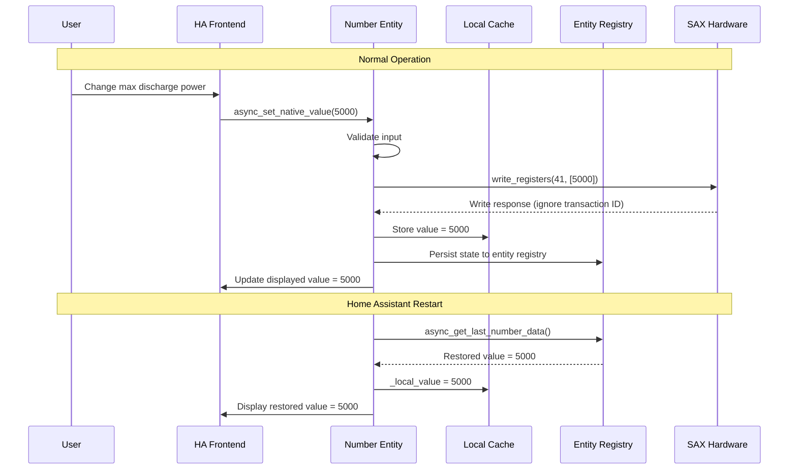

# ADR-002: Write-Only Register Handling Strategy

**Date**: 2025-02-09  
**Status**: ✅ Adopted  
**Deciders**: SAX Battery Integration Team  

## Context

SAX Battery hardware has a design limitation where certain control registers (41-44) are write-only and cannot be read back to verify written values. Additionally, the hardware has a known bug where write operations may return incorrect Modbus transaction IDs, making write verification unreliable.

### Problem Statement

**Hardware Limitations**:

- Registers 41-44 (max discharge, max charge, pilot power, pilot factor) are write-only
- No way to read back written values for verification via Modbus protocol
- Write responses may have incorrect transaction IDs (SAX hardware bug)
- User interface needs to display current values for these controls

**User Experience Requirements**:

- Number entities must show current setpoint values in Home Assistant UI
- Values must persist across Home Assistant restarts  
- Users need immediate feedback when changing values
- Entity states must remain consistent with last written values

### Technical Constraints

1. **No Read Verification**: Cannot confirm written values via Modbus reads
2. **Unreliable Write Responses**: Transaction ID bug makes write confirmation unreliable  
3. **State Persistence**: Entity states must survive HA restarts without hardware reads
4. **UI Consistency**: Displayed values must match user intentions, not unknown hardware state

### Alternatives Considered

#### Option 1: Hide Write-Only Controls

- **Approach**: Only expose read-only sensors, hide write controls
- **Pros**: Simple implementation, no state management issues
- **Cons**: Major functionality loss, no battery control capabilities

#### Option 2: Optimistic Write with Warning

- **Approach**: Write values but warn users that verification is impossible
- **Pros**: Maintains functionality, honest about limitations
- **Cons**: Poor user experience, confusing UI behavior

#### Option 3: Local Caching with State Restoration

- **Approach**: Cache written values locally and restore from entity registry
- **Pros**: Consistent UI behavior, values persist across restarts
- **Cons**: Potential drift between displayed and actual hardware values

#### Option 4: Periodic Full System Restart

- **Approach**: Restart integration periodically to reset to known state
- **Pros**: Guarantees sync with hardware defaults
- **Cons**: Major service disruption, doesn't solve fundamental issue

## Decision

**We adopt Option 3: Local Caching with State Restoration** with the following implementation:

### Architecture



### Implementation Details

#### 1. Entity Base Class with Caching

```python
class SAXBatteryModbusNumber(CoordinatorEntity, NumberEntity, RestoreNumber):
    """Number entity with write-only register support."""
    
    def __init__(self, coordinator, battery_id, modbus_item):
        super().__init__(coordinator)
        self._modbus_item = modbus_item
        self._battery_id = battery_id
        self._local_value: float | None = None  # Cache for write-only registers
        
    def _is_write_only_register(self) -> bool:
        """Check if this is a write-only register."""
        return self._modbus_item.address in [41, 42, 43, 44]  # SAX write-only registers
        
    @property
    def native_value(self) -> float | None:
        """Return value from appropriate source."""
        if self._is_write_only_register():
            # Use cached value for write-only registers
            return self._local_value
        else:
            # Use coordinator data for readable registers
            return self.coordinator.data.get(self._modbus_item.name)
```

#### 2. Write Operation with Caching

```python
async def async_set_native_value(self, value: float) -> None:
    """Set value with local caching for write-only registers."""
    
    # Input validation
    if not self._validate_input_range(value):
        raise HomeAssistantError(f"Value {value} out of valid range")
    
    # Apply SOC constraints if applicable
    final_value = await self._apply_constraints(value)
    
    # Write to hardware
    try:
        success = await self.coordinator.async_write_number_value(self._modbus_item, final_value)
        
        if success:
            # Cache locally for write-only registers
            if self._is_write_only_register():
                self._local_value = final_value
                _LOGGER.debug("Cached write-only value: %s = %.1f", 
                            self._modbus_item.name, final_value)
            
            # Persist state for restoration
            self.async_write_ha_state()
            
        else:
            raise HomeAssistantError("Failed to write value to hardware")
            
    except Exception as err:
        _LOGGER.error("Write operation failed: %s", err)
        raise HomeAssistantError(f"Hardware write failed: {err}") from err
```

#### 3. State Restoration

```python
async def async_added_to_hass(self) -> None:
    """Restore write-only register values on startup."""
    await super().async_added_to_hass()
    
    # Restore from entity registry for write-only registers
    if self._is_write_only_register():
        if (restored := await self.async_get_last_number_data()):
            self._local_value = restored.native_value
            _LOGGER.debug("Restored write-only value: %s = %.1f", 
                        self._modbus_item.name, self._local_value)
        else:
            # Default value if no restoration data
            self._local_value = self._modbus_item.default_value
            _LOGGER.debug("Using default value: %s = %.1f", 
                        self._modbus_item.name, self._local_value)
```

#### 4. Integration-Wide State Restoration

```python
async def _restore_write_only_register_values(
    hass: HomeAssistant, 
    entry: ConfigEntry
) -> None:
    """Restore write-only register values after HA restart."""
    
    # This runs after coordinators are set up and first refresh is complete
    await hass.bus.async_fire(EVENT_HOMEASSISTANT_STARTED)
    
    for battery_id, coordinator in entry.runtime_data.items():
        # Get SOC for constraint checking
        combined_soc = coordinator.data.get(SAX_COMBINED_SOC)
        
        if combined_soc is not None and coordinator.soc_manager:
            # Check if SOC constraints need enforcement
            constraint_needed = await coordinator.soc_manager.check_and_enforce_discharge_limit()
            if constraint_needed:
                _LOGGER.info("SOC constraints applied during startup for %s", battery_id)
```

### Constraint Integration

#### SOC Constraint Enforcement During Restoration

```python
@hass.bus.async_listen_once(EVENT_HOMEASSISTANT_STARTED) 
async def _handle_homeassistant_started(event: Event) -> None:
    """Handle startup constraint enforcement."""
    
    # Wait for all coordinators to complete first refresh
    await asyncio.gather(
        *[coordinator.async_config_entry_first_refresh() 
          for coordinator in entry.runtime_data.values()],
        return_exceptions=True
    )
    
    # Apply SOC constraints to restored values
    for coordinator in entry.runtime_data.values():
        if coordinator.soc_manager and coordinator.is_master:
            await coordinator.soc_manager.check_and_enforce_discharge_limit()
```

## Consequences

### Positive

✅ **Consistent UI**: Users see expected values in Home Assistant interface  
✅ **State Persistence**: Values survive HA restarts without entity recreation  
✅ **Immediate Feedback**: UI updates immediately after successful writes  
✅ **Constraint Integration**: SOC protection works with cached values  
✅ **Error Handling**: Failed writes don't corrupt cached state  
✅ **Debugging**: Clear logging of cached vs hardware values  

### Negative

⚠️ **State Drift Risk**: Displayed values may differ from actual hardware state  
⚠️ **Memory Usage**: Additional local storage for each write-only entity  
⚠️ **Complexity**: More complex state management than simple read/write  
⚠️ **Trust Model**: Users must trust cached values reflect hardware state  

### Mitigation Strategies

#### 1. State Drift Prevention

```python
# Periodic validation warnings (not implemented - would require read capability)
async def _validate_cached_state(self) -> None:
    """Log warnings about potential state drift."""
    if self._local_value and time.time() - self._last_write_time > 3600:  # 1 hour
        _LOGGER.warning(
            "Write-only register %s: cached value is %d minutes old, "
            "may not reflect current hardware state",
            self._modbus_item.name,
            (time.time() - self._last_write_time) / 60
        )
```

#### 2. User Education

- Clear documentation about write-only register limitations
- Entity descriptions indicating cached values  
- Diagnostic information showing last write times

#### 3. Default Value Management

```python
# Conservative defaults for write-only registers
WRITE_ONLY_DEFAULTS = {
    SAX_MAX_DISCHARGE: 0.0,     # Safe: no discharge
    SAX_MAX_CHARGE: 0.0,        # Safe: no charge  
    SAX_NOMINAL_POWER: 0.0,     # Safe: no pilot control
    SAX_NOMINAL_FACTOR: 100.0,  # Safe: full power factor
}
```

## Implementation Timeline

- **Phase 1**: ✅ Complete - Basic local caching for write-only registers
- **Phase 2**: ✅ Complete - State restoration integration with RestoreNumber mixin
- **Phase 3**: ✅ Complete - SOC constraint integration with cached values
- **Phase 4**: ✅ Complete - Diagnostic information and monitoring

## Monitoring and Diagnostics

### Cache State Tracking

```python
@property  
def extra_state_attributes(self) -> dict[str, Any]:
    """Extended attributes for write-only registers."""
    attrs = super().extra_state_attributes or {}
    
    if self._is_write_only_register():
        attrs.update({
            "cached_value": self._local_value,
            "is_write_only": True,
            "last_write_time": self._last_write_time.isoformat() if self._last_write_time else None,
            "restoration_source": "entity_registry",
        })
    
    return attrs
```

### Diagnostic Information

```python
async def get_write_only_diagnostics(coordinator: SAXBatteryCoordinator) -> dict[str, Any]:
    """Get diagnostic info for write-only registers."""
    
    diagnostics = {}
    for item in MODBUS_BATTERY_POWER_CONTROL_ITEMS:
        if item.address in [41, 42, 43, 44]:
            unique_id = coordinator.sax_data.get_unique_id_for_item(item, coordinator.battery_id)
            entity_id = ent_reg.async_get_entity_id("number", DOMAIN, unique_id)
            
            if entity_id:
                entity = coordinator.hass.states.get(entity_id)
                diagnostics[item.name] = {
                    "cached_value": entity.state if entity else None,
                    "attributes": entity.attributes if entity else {},
                    "last_updated": entity.last_updated.isoformat() if entity else None,
                    "register_address": item.address,
                }
    
    return diagnostics
```

## Testing Strategy

### Unit Tests for Caching Logic

```python
async def test_write_only_register_caching():
    """Test local value caching for write-only registers."""
    entity = SAXBatteryModbusNumber(coordinator, "battery_a", SAX_MAX_DISCHARGE)
    
    # Set value triggers caching
    await entity.async_set_native_value(5000.0)
    assert entity.native_value == 5000.0
    assert entity._local_value == 5000.0

async def test_state_restoration():
    """Test restoration of cached values after restart."""
    # Mock entity registry data
    mock_restore_data = NumberData(native_value=3000.0)
    
    with patch.object(entity, 'async_get_last_number_data', return_value=mock_restore_data):
        await entity.async_added_to_hass()
        
    assert entity.native_value == 3000.0
    assert entity._local_value == 3000.0
```

## References

- [Home Assistant RestoreNumber Documentation](https://developers.home-assistant.io/docs/core/entity/number/#restoring-number-entity-data)
- [SAX Battery Modbus Protocol Documentation](../modbus-communication.md)
- [SOC Constraints Integration](../soc-constraints.md)
- [Entity Architecture Overview](../entity-architecture.md)

---

**Status**: ✅ Adopted and Implemented  
**Last Review**: February 2026  
**Next Review**: If SAX hardware adds read capability for control registers
