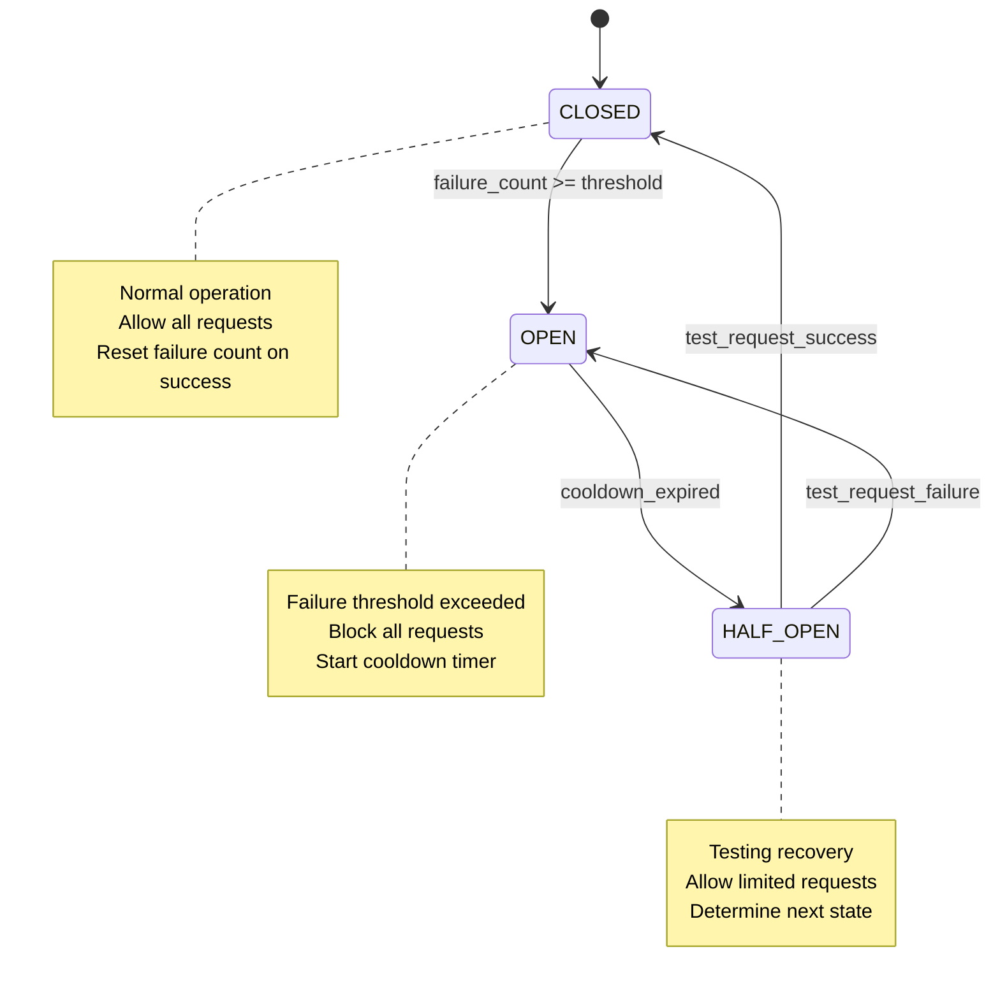
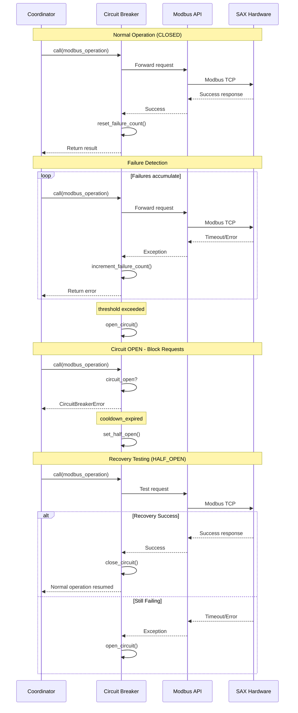

# ADR-003: Circuit Breaker Pattern for Fault Tolerance

**Date**: 2025-02-09  
**Status**: ✅ Adopted  
**Deciders**: SAX Battery Integration Team  

## Context

The SAX Battery integration communicates with hardware devices over Modbus TCP/IP, which is susceptible to network failures, device reboots, and temporary connectivity issues. Without proper fault tolerance, communication failures can cascade and overwhelm both the Home Assistant system and the battery hardware.

### Problem Statement

**Communication Failure Scenarios**:

- Network connectivity issues (WiFi, Ethernet cable, switch failures)
- SAX battery controller reboots or firmware updates
- Modbus TCP server overload on battery hardware
- Temporary power outages affecting network infrastructure
- Router/firewall configuration changes blocking Modbus traffic

**Impact Without Protection**:

- Coordinator polling failures triggering entity unavailability
- Repeated connection attempts overwhelming battery hardware
- Home Assistant performance degradation from blocked async operations
- Integration becomes unresponsive during network outages  
- Difficult recovery requiring manual integration restart

### Requirements

1. **Automatic Failure Detection**: Identify communication failures quickly
2. **Cascade Prevention**: Stop repeated failed attempts to protect resources
3. **Graceful Degradation**: Maintain partial functionality during outages
4. **Automatic Recovery**: Test and restore connectivity without manual intervention
5. **Performance Protection**: Ensure failures don't block Home Assistant core operations

### Alternatives Considered

#### Option 1: Simple Retry with Backoff

- **Approach**: Retry failed operations with exponential backoff
- **Pros**: Simple to implement, gradually reduces load
- **Cons**: Still sends requests during extended outages, no automatic recovery testing

#### Option 2: Manual Fault Isolation

- **Approach**: Require manual integration restart after failures
- **Pros**: User control over recovery, clear failure state
- **Cons**: Poor user experience, no automation, requires user intervention

#### Option 3: Circuit Breaker Pattern

- **Approach**: Implement circuit breaker pattern with automatic failure detection and recovery testing
- **Pros**: Industry standard pattern, automatic protection and recovery, resource preservation  
- **Cons**: More implementation complexity, requires state management

#### Option 4: Health Check Monitoring

- **Approach**: Separate health check system monitoring device availability  
- **Pros**: Proactive monitoring, detailed health information
- **Cons**: Additional complexity, doesn't prevent failed operations

## Decision

**We adopt the Circuit Breaker Pattern** with the following implementation:

### Circuit Breaker States



### Architecture Integration



## Implementation

### Core Circuit Breaker Class

```python
@dataclass
class CircuitBreakerConfig:
    """Circuit breaker configuration parameters."""
    
    failure_threshold: int = 5          # Failures before opening circuit
    cooldown_seconds: int = 60          # Time before recovery testing  
    half_open_max_calls: int = 3        # Max calls in half-open state
    success_threshold: int = 2          # Successes needed to close circuit

class CircuitState(Enum):
    """Circuit breaker states."""
    CLOSED = "closed"       # Normal operation
    OPEN = "open"          # Blocking requests
    HALF_OPEN = "half_open" # Testing recovery

class CircuitBreakerError(Exception):
    """Raised when circuit breaker is open."""
    pass

class CircuitBreaker:
    """Circuit breaker implementation for SAX Battery communication."""
    
    def __init__(self, config: CircuitBreakerConfig):
        self.config = config
        self.state = CircuitState.CLOSED
        self.failure_count = 0
        self.last_failure_time = None
        self.half_open_calls = 0
        self.half_open_successes = 0
        
    async def call(self, func: Coroutine) -> Any:
        """Execute function with circuit breaker protection."""
        
        # Check if circuit is open and cooldown period has passed
        if self.state == CircuitState.OPEN:
            if self._should_attempt_reset():
                self.state = CircuitState.HALF_OPEN
                self.half_open_calls = 0
                self.half_open_successes = 0
                _LOGGER.info("Circuit breaker entering HALF_OPEN state for recovery testing")
            else:
                raise CircuitBreakerError("Circuit breaker is OPEN")
                
        # Handle half-open state
        elif self.state == CircuitState.HALF_OPEN:
            if self.half_open_calls >= self.config.half_open_max_calls:
                raise CircuitBreakerError("Half-open call limit exceeded")
            self.half_open_calls += 1
            
        # Execute the function
        try:
            result = await func
            self._record_success()
            return result
            
        except Exception as err:
            self._record_failure()
            raise err
            
    def _record_success(self) -> None:
        """Record successful operation."""
        
        if self.state == CircuitState.HALF_OPEN:
            self.half_open_successes += 1
            if self.half_open_successes >= self.config.success_threshold:
                self._close_circuit()
        elif self.state == CircuitState.CLOSED:
            self.failure_count = 0  # Reset failure count on success
            
    def _record_failure(self) -> None:
        """Record failed operation."""
        
        self.failure_count += 1
        self.last_failure_time = datetime.now()
        
        if self.state in [CircuitState.CLOSED, CircuitState.HALF_OPEN]:
            if self.failure_count >= self.config.failure_threshold:
                self._open_circuit()
                
    def _open_circuit(self) -> None:
        """Open circuit breaker to block requests."""
        self.state = CircuitState.OPEN
        _LOGGER.warning(
            "Circuit breaker OPENED: %d failures in recent period", 
            self.failure_count
        )
        
    def _close_circuit(self) -> None:
        """Close circuit breaker to resume normal operation."""
        self.state = CircuitState.CLOSED
        self.failure_count = 0
        self.half_open_calls = 0
        self.half_open_successes = 0
        _LOGGER.info("Circuit breaker CLOSED: normal operation resumed")
        
    def _should_attempt_reset(self) -> bool:
        """Check if cooldown period has elapsed."""
        if not self.last_failure_time:
            return False
            
        cooldown_elapsed = (
            datetime.now() - self.last_failure_time
        ).total_seconds() >= self.config.cooldown_seconds
        
        return cooldown_elapsed
```

### Coordinator Integration

```python
class SAXBatteryCoordinator(DataUpdateCoordinator):
    """Coordinator with circuit breaker protection."""
    
    def __init__(self, hass, modbus_api, config_entry, battery_id, is_master=False):
        super().__init__(...)
        
        # Initialize circuit breaker
        self.circuit_breaker = CircuitBreaker(
            CircuitBreakerConfig(
                failure_threshold=CIRCUIT_BREAKER_FAILURE_THRESHOLD,  # 5
                cooldown_seconds=CIRCUIT_BREAKER_COOLDOWN_SECONDS,    # 60
            )
        )
        
    async def _async_update_data(self) -> dict[str, Any]:
        """Data polling with circuit breaker protection."""
        
        try:
            # Wrap polling operation with circuit breaker
            async def _poll_operation():
                return await self._poll_device_data()
                
            data = await self.circuit_breaker.call(_poll_operation())
            return data
            
        except CircuitBreakerError as err:
            # Circuit is open - use cached data if available
            _LOGGER.debug("Circuit breaker blocking request: %s", err)
            if hasattr(self, '_last_successful_data'):
                _LOGGER.info("Using cached data while circuit breaker is open")
                return self._last_successful_data
            raise UpdateFailed("Circuit breaker open, no cached data") from err
            
        except (ModbusException, OSError, TimeoutError) as err:
            # Communication failure - circuit breaker will track this
            raise UpdateFailed(f"Communication error: {err}") from err
```

### Modbus API Integration

```python
class ModbusAPI:
    """Modbus API with circuit breaker integration."""
    
    def __init__(self, host, port, circuit_breaker):
        self.host = host
        self.port = port
        self.circuit_breaker = circuit_breaker
        
    async def read_value(self, modbus_item: ModbusItem) -> float | None:
        """Read value with circuit breaker protection."""
        
        async def _read_operation():
            # Actual Modbus read operation
            if not self._client or not self._client.connected:
                await self._ensure_connection()
                
            result = await self._client.read_holding_registers(
                address=modbus_item.address,
                count=1,
                device_id=modbus_item.battery_device_id,
            )
            
            if result.isError():
                raise ModbusException(f"Read error: {result}")
                
            return self._convert_raw_value(result.registers[0], modbus_item)
            
        try:
            # Protected by circuit breaker
            return await self.circuit_breaker.call(_read_operation())
            
        except CircuitBreakerError:
            # Circuit open - return None
            return None
```

## Configuration

### Tunable Parameters

```python
# Circuit breaker configuration constants
CIRCUIT_BREAKER_FAILURE_THRESHOLD = 5      # Failures before opening
CIRCUIT_BREAKER_COOLDOWN_SECONDS = 60      # Recovery test interval
CIRCUIT_BREAKER_SUCCESS_THRESHOLD = 2      # Successes needed to close
CIRCUIT_BREAKER_HALF_OPEN_MAX_CALLS = 3    # Max calls in half-open state

# Environment-specific tuning
def get_circuit_breaker_config(environment: str) -> CircuitBreakerConfig:
    """Get environment-specific circuit breaker configuration."""
    
    if environment == "development":
        return CircuitBreakerConfig(
            failure_threshold=3,     # Faster failure detection
            cooldown_seconds=30,     # Shorter recovery testing  
        )
    elif environment == "production":
        return CircuitBreakerConfig(
            failure_threshold=5,     # More tolerance for transient issues
            cooldown_seconds=60,     # Standard recovery interval
        )
    else:
        return CircuitBreakerConfig()  # Default values
```

## Consequences

### Positive

✅ **Resource Protection**: Prevents overwhelming hardware with failed requests  
✅ **Automatic Recovery**: Tests connectivity and restores service without user intervention  
✅ **Performance Isolation**: Communication failures don't block Home Assistant core  
✅ **Graceful Degradation**: Can use cached data during outages  
✅ **Observability**: Clear state transitions and logging for troubleshooting  
✅ **Tunable Behavior**: Configuration parameters adjustable for different environments  

### Negative  

⚠️ **Added Complexity**: More components to understand and maintain  
⚠️ **State Management**: Additional failure/success tracking requirements  
⚠️ **Latency**: Brief additional overhead for state checks  
⚠️ **False Positives**: May block requests during very brief outages  

### Mitigation Strategies

#### 1. State Monitoring

```python
@property
def circuit_breaker_status(self) -> dict[str, Any]:
    """Get current circuit breaker status for diagnostics."""
    return {
        "state": self.circuit_breaker.state.value,
        "failure_count": self.circuit_breaker.failure_count,
        "last_failure": (
            self.circuit_breaker.last_failure_time.isoformat()
            if self.circuit_breaker.last_failure_time
            else None
        ),
        "half_open_calls": self.circuit_breaker.half_open_calls,
        "configuration": {
            "failure_threshold": self.circuit_breaker.config.failure_threshold,
            "cooldown_seconds": self.circuit_breaker.config.cooldown_seconds,
        },
    }
```

#### 2. Manual Override

```python
async def force_circuit_close(self) -> bool:
    """Manually force circuit breaker closed (emergency recovery)."""
    _LOGGER.warning("Manually forcing circuit breaker closed")
    self.circuit_breaker._close_circuit()
    return True
    
async def force_circuit_open(self) -> bool:
    """Manually force circuit breaker open (emergency protection)."""  
    _LOGGER.warning("Manually forcing circuit breaker open")
    self.circuit_breaker._open_circuit()
    return True
```

## Monitoring and Alerting

### Performance Metrics

```python
@dataclass
class CircuitBreakerMetrics:
    """Track circuit breaker performance metrics."""
    
    total_calls: int = 0
    successful_calls: int = 0
    failed_calls: int = 0
    blocked_calls: int = 0  # Due to open circuit
    
    state_transitions: dict[str, int] = field(default_factory=lambda: {
        "closed_to_open": 0,
        "open_to_half_open": 0, 
        "half_open_to_closed": 0,
        "half_open_to_open": 0,
    })
    
    @property
    def success_rate(self) -> float:
        if self.total_calls == 0:
            return 0.0
        return (self.successful_calls / self.total_calls) * 100.0
    
    @property
    def protection_rate(self) -> float:
        """Percentage of calls blocked by circuit breaker."""
        if self.total_calls == 0:
            return 0.0
        return (self.blocked_calls / self.total_calls) * 100.0
```

### Diagnostic Integration

```python
async def get_circuit_breaker_diagnostics() -> dict[str, Any]:
    """Get detailed circuit breaker diagnostics."""
    return {
        "current_state": self.circuit_breaker.state.value,
        "configuration": self.circuit_breaker.config.__dict__,
        "metrics": self.circuit_breaker.metrics.__dict__,
        "recent_failures": [
            {"timestamp": t.isoformat(), "error": str(e)}
            for t, e in self.circuit_breaker.failure_history[-10:]
        ],
        "state_history": [
            {"timestamp": t.isoformat(), "from_state": f, "to_state": t}
            for timestamp, f, t in self.circuit_breaker.state_history[-20:]
        ],
    }
```

## Testing Strategy

### Unit Tests

```python
async def test_circuit_breaker_failure_detection():
    """Test circuit opens after threshold failures."""
    cb = CircuitBreaker(CircuitBreakerConfig(failure_threshold=3))
    
    # Simulate failures
    for _ in range(3):
        with pytest.raises(Exception):
            await cb.call(failing_operation())
    
    # Circuit should be open now
    with pytest.raises(CircuitBreakerError):
        await cb.call(successful_operation())

async def test_circuit_breaker_recovery():
    """Test automatic recovery after cooldown."""
    cb = CircuitBreaker(CircuitBreakerConfig(
        failure_threshold=1,
        cooldown_seconds=0.1,  # Fast for testing
    ))
    
    # Force failure and open circuit
    with pytest.raises(Exception):
        await cb.call(failing_operation())
        
    # Wait for cooldown
    await asyncio.sleep(0.2)
    
    # Should allow recovery testing
    result = await cb.call(successful_operation())
    assert result == "success"
    assert cb.state == CircuitState.CLOSED
```

### Integration Tests

```python
async def test_coordinator_circuit_breaker_integration():
    """Test coordinator behavior with circuit breaker."""
    
    # Mock failing Modbus client
    with patch.object(modbus_api, 'read_value', side_effect=ModbusException("Connection failed")):
        
        # Multiple update attempts should trigger circuit breaker
        for _ in range(5):
            with pytest.raises(UpdateFailed):
                await coordinator._async_update_data()
        
        # Circuit should be open, blocking further requests
        assert coordinator.circuit_breaker.state == CircuitState.OPEN
```

## References

- [Circuit Breaker Pattern - Martin Fowler](https://martinfowler.com/bliki/CircuitBreaker.html)
- [SAX Battery Coordinator Pattern](../coordinator-pattern.md)
- [Modbus Communication Architecture](../modbus-communication.md)
- [Home Assistant Error Handling Best Practices](https://developers.home-assistant.io/docs/integration_fetching_data/#exceptions)

---

**Status**: ✅ Adopted and Implemented  
**Last Review**: February 2026  
**Next Review**: After 6 months of production operation to evaluate threshold tuning
