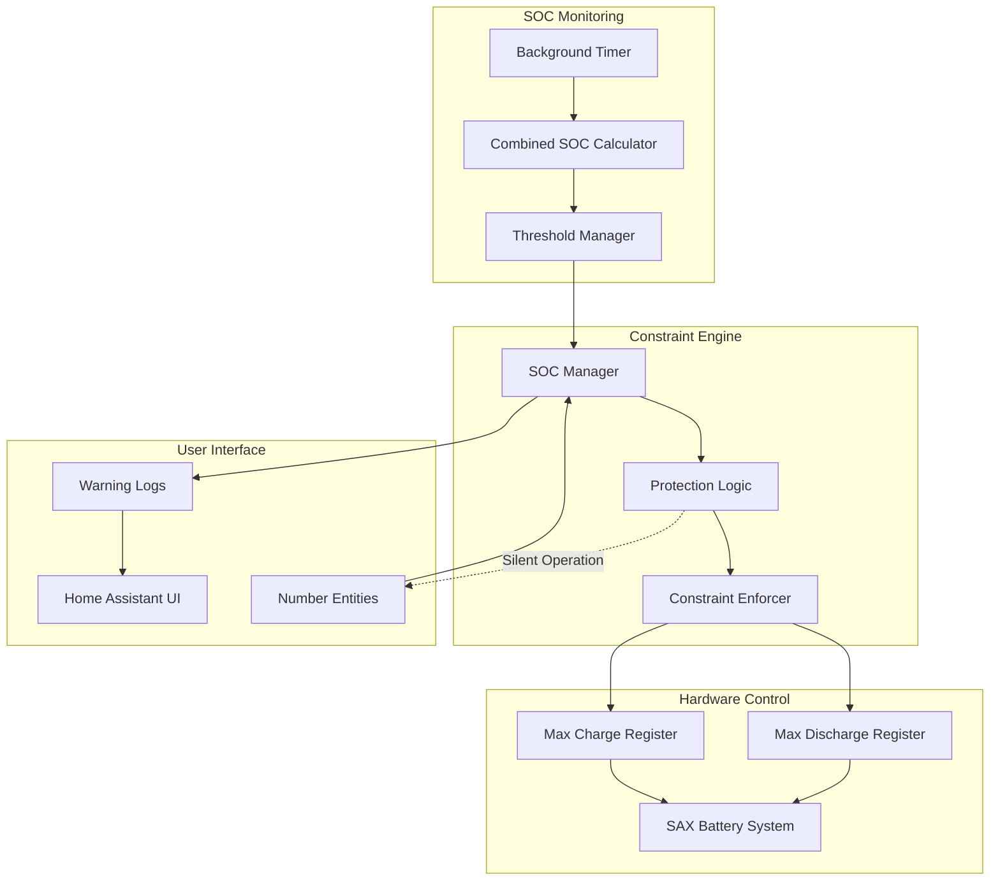
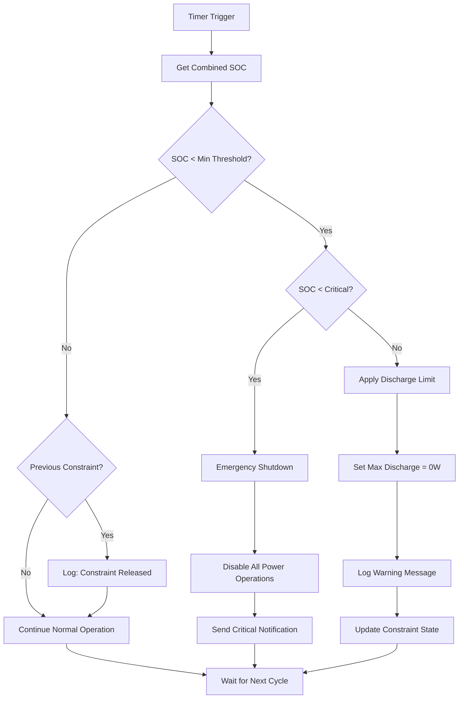

# ADR-004: SOC Protection System Design

**Date**: 2025-02-09  
**Status**: ✅ Adopted  
**Deciders**: SAX Battery Integration Team  

## Context

Lithium-ion batteries can be permanently damaged by over-discharge (driving SOC to 0%), which can reduce battery lifespan, capacity, and potentially create safety hazards. The SAX Battery integration must implement automatic protection to prevent users from accidentally damaging their battery systems through Home Assistant controls.

### Problem Statement

**Battery Protection Requirements**:

- Prevent SOC from dropping below safe thresholds (typically 5-10%)
- Automatic enforcement without requiring user intervention
- Multi-battery system protection using combined SOC
- Silent operation that doesn't interfere with normal usage
- Override capability for emergency situations

**User Experience Challenges**:

- Users may not understand battery chemistry limitations
- Manual monitoring is unreliable and prone to human error  
- Battery damage often not immediately apparent to users
- Integration must balance safety with user control autonomy
- Different battery configurations need different protection strategies

**Technical Constraints**:

- SOC data may be temporarily unavailable during communication issues
- Write-only registers prevent reading back current hardware limits
- Multi-battery systems need coordinated protection across all units
- Protection must work reliably across Home Assistant restarts

### Alternatives Considered

#### Option 1: Warning-Only Protection  

- **Approach**: Display warnings but allow all user actions
- **Pros**: Maximum user autonomy, simple implementation
- **Cons**: High risk of battery damage, warnings often ignored

#### Option 2: Hard Limits in Entity Configuration

- **Approach**: Set entity maximum values to prevent low-SOC usage
- **Pros**: Simple implementation, prevents UI from allowing dangerous values
- **Cons**: Static limits don't adapt to current SOC, poor user experience

#### Option 3: Manual SOC Monitoring

- **Approach**: Require users to manually monitor and adjust battery settings
- **Pros**: User education and awareness
- **Cons**: High cognitive load, unreliable, prone to human error

#### Option 4: Automatic Constraint Manager

- **Approach**: Background service that automatically applies discharge limits based on real-time SOC
- **Pros**: Automatic protection, adapts to current conditions, transparent operation
- **Cons**: More implementation complexity, requires careful testing

## Decision

**We adopt Option 4: Automatic SOC Constraint Manager** with the following design:

### System Architecture



### Protection Algorithm



## Implementation

### Core SOC Manager

```python
class SOCManager:
    """Automatic SOC constraint management system."""
    
    def __init__(
        self,
        coordinator: SAXBatteryCoordinator,
        min_soc: float,
        enabled: bool = True,
    ) -> None:
        """Initialize SOC protection manager."""
        
        # Only master coordinator can manage SOC constraints
        if not coordinator.is_master:
            raise ValueError("SOC Manager requires master coordinator")
            
        self.coordinator = coordinator
        self.min_soc = min_soc
        self.critical_soc = 5.0  # Emergency threshold (not user-configurable)
        self.enabled = enabled
        
        # State tracking
        self._constraint_active = False
        self._last_soc_check = None
        self._constraint_applied_time = None
        self._event_history = deque(maxlen=100)
        
        # Hysteresis to prevent oscillation
        self.hysteresis = 2.0  # SOC must rise 2% above threshold to release
        
        _LOGGER.info(
            "SOC Manager initialized: min_soc=%.1f%%, critical_soc=%.1f%%, enabled=%s",
            min_soc, self.critical_soc, enabled
        )
```

### Protection Logic

```python
async def check_and_enforce_discharge_limit(self) -> bool:
    """Main protection algorithm - runs on every coordinator update."""
    
    if not self.enabled:
        return False
        
    # Get current combined SOC from all batteries
    combined_soc = self.coordinator.data.get(SAX_COMBINED_SOC)
    if combined_soc is None:
        _LOGGER.debug("Combined SOC unavailable for constraint check")
        return False
        
    # Apply hysteresis to prevent oscillation
    if self._constraint_active:
        threshold = self.min_soc + self.hysteresis  # Higher threshold to release
        should_constrain = combined_soc < threshold
    else:
        threshold = self.min_soc                     # Normal threshold to apply
        should_constrain = combined_soc < threshold
    
    # Check for critical SOC emergency
    if combined_soc <= self.critical_soc:
        await self._handle_critical_soc(combined_soc)
        return True
    
    # Apply or release discharge constraints
    if should_constrain and not self._constraint_active:
        return await self._apply_discharge_constraint(combined_soc)
    elif not should_constrain and self._constraint_active:
        await self._release_discharge_constraint(combined_soc)
        return False
        
    return self._constraint_active

async def _apply_discharge_constraint(self, current_soc: float) -> bool:
    """Apply discharge constraint across all batteries."""
    
    _LOGGER.warning(
        "SOC protection activated: %.1f%% < %.1f%% - Limiting discharge power", 
        current_soc, self.min_soc
    )
    
    # Apply to all batteries in the system
    success_count = 0
    for battery_id, coordinator in self.coordinator.config_entry.runtime_data.items():
        if await self._set_battery_discharge_limit(coordinator, 0.0):
            success_count += 1
    
    if success_count > 0:
        self._constraint_active = True
        self._constraint_applied_time = datetime.now()
        self._log_protection_event("constraint_applied", {
            "soc": current_soc,
            "threshold": self.min_soc,
            "batteries_affected": success_count,
        })
        return True
    
    return False

async def _release_discharge_constraint(self, current_soc: float) -> None:
    """Release discharge constraint when SOC recovers."""
    
    _LOGGER.info(
        "SOC protection released: %.1f%% >= %.1f%% - User may manually restore discharge limits",
        current_soc, self.min_soc + self.hysteresis
    )
    
    self._constraint_active = False
    self._log_protection_event("constraint_released", {
        "soc": current_soc,
        "release_threshold": self.min_soc + self.hysteresis,
        "constraint_duration": (
            (datetime.now() - self._constraint_applied_time).total_seconds()
            if self._constraint_applied_time else None
        ),
    })
    
    # NOTE: We don't automatically restore user-configured limits
    # Users must manually re-enable discharge to prevent accidental abuse
```

### Multi-Battery Protection

```python
async def _set_battery_discharge_limit(self, coordinator: SAXBatteryCoordinator, limit: float) -> bool:
    """Set discharge limit for specific battery."""
    
    try:
        # Get entity unique ID for this battery's max discharge control
        unique_id = coordinator.sax_data.get_unique_id_for_item(
            SAX_MAX_DISCHARGE,
            battery_id=coordinator.battery_id,
        )
        
        if not unique_id:
            _LOGGER.error("Could not generate unique_id for %s max discharge", 
                         coordinator.battery_id)
            return False
        
        # Look up entity in entity registry
        ent_reg = er.async_get(coordinator.hass)
        entity_id = ent_reg.async_get_entity_id("number", DOMAIN, unique_id)
        
        if not entity_id:
            _LOGGER.error("Max discharge entity not found: %s", unique_id)
            return False
        
        # Set limit via service call (bypasses normal user validation)
        await coordinator.hass.services.async_call(
            "number",
            "set_value",
            {
                "entity_id": entity_id,
                "value": limit,
            },
            blocking=True,
        )
        
        _LOGGER.debug("Applied SOC constraint: %s = %.1fw", entity_id, limit)
        return True
        
    except Exception as err:
        _LOGGER.error("Failed to apply SOC constraint to %s: %s", 
                     coordinator.battery_id, err)
        return False
```

### User Interaction Protection

```python
async def check_discharge_allowed(self, requested_power: float) -> ConstraintResult:
    """Check user power requests against current SOC constraints."""
    
    if not self.enabled:
        return ConstraintResult(
            allowed=True, 
            constrained_value=requested_power, 
            reason="protection_disabled"
        )
    
    combined_soc = self.coordinator.data.get(SAX_COMBINED_SOC)
    if combined_soc is None:
        # No SOC data - allow request but log warning
        _LOGGER.warning("SOC data unavailable - allowing power request without protection")
        return ConstraintResult(
            allowed=True, 
            constrained_value=requested_power, 
            reason="no_soc_data"
        )
    
    # Check if discharge power is allowed 
    if combined_soc < self.min_soc and requested_power > 0:
        _LOGGER.warning(
            "User power request blocked by SOC protection: %.1fW -> 0W (SOC: %.1f%% < %.1f%%)",
            requested_power, combined_soc, self.min_soc
        )
        return ConstraintResult(
            allowed=False,
            constrained_value=0.0,
            reason=f"soc_too_low: {combined_soc:.1f}% < {self.min_soc:.1f}%"
        )
    
    return ConstraintResult(
        allowed=True, 
        constrained_value=requested_power, 
        reason="soc_acceptable"
    )

@dataclass  
class ConstraintResult:
    """Result of SOC constraint checking."""
    
    allowed: bool
    constrained_value: float
    reason: str
```

### Critical SOC Emergency Handling

```python
async def _handle_critical_soc(self, current_soc: float) -> None:
    """Handle critically low SOC emergency situations."""
    
    _LOGGER.critical(
        "CRITICAL SOC EMERGENCY: %.1f%% <= %.1f%% - Emergency battery protection activated",
        current_soc, self.critical_soc
    )
    
    # Emergency shutdown of ALL power operations
    tasks = []
    for battery_id, coordinator in self.coordinator.config_entry.runtime_data.items():
        # Stop discharge
        tasks.append(self._set_battery_discharge_limit(coordinator, 0.0))
        # Stop charge 
        tasks.append(self._set_battery_charge_limit(coordinator, 0.0))
        # Stop pilot control
        tasks.append(self._set_battery_pilot_power(coordinator, 0.0))
    
    # Execute all emergency actions
    results = await asyncio.gather(*tasks, return_exceptions=True)
    successful_actions = sum(1 for r in results if r is True)
    
    # Send persistent notification to user
    await self.coordinator.hass.services.async_call(
        "persistent_notification",
        "create",
        {
            "title": "🚨 Critical Battery Protection Activated",
            "message": (
                f"Battery SOC critically low: {current_soc:.1f}%\n"
                f"All power operations disabled to protect battery.\n"
                f"Do not continue using battery until SOC recovers above {self.min_soc:.1f}%.\n"
                f"Contact SAX-power support if this occurs frequently."
            ),
            "notification_id": "sax_critical_soc_protection",
        },
    )
    
    self._log_protection_event("critical_soc_emergency", {
        "soc": current_soc,
        "critical_threshold": self.critical_soc, 
        "emergency_actions": successful_actions,
        "total_actions": len(tasks),
    })
```

## Configuration and Tuning

### User-Configurable Parameters

```python
# Config flow integration for SOC protection settings
SOC_PROTECTION_CONFIG = vol.Schema({
    vol.Optional(CONF_MIN_SOC, default=DEFAULT_MIN_SOC): vol.All(
        vol.Coerce(float), vol.Range(min=5.0, max=50.0)
    ),
    vol.Optional("soc_protection_enabled", default=True): cv.boolean,
})

# Advanced configuration (not exposed in UI)
class SOCManagerConfig:
    """Advanced SOC protection configuration."""
    
    def __init__(self):
        # User-configurable via config flow
        self.min_soc: float = 10.0              # Minimum SOC threshold (%)
        self.enabled: bool = True               # Protection enabled/disabled
        
        # Advanced settings (not user-configurable)
        self.critical_soc: float = 5.0          # Emergency shutdown threshold
        self.hysteresis: float = 2.0            # Prevent oscillation (%)
        self.check_interval: float = 10.0       # Protection check interval (seconds)
        
        # Multi-battery settings
        self.combined_soc_method = "weighted_average"  # or "minimum", "average"
        self.individual_battery_fallback = True       # Use individual SOC if combined unavailable
```

### Environment-Specific Tuning

```python
def get_soc_protection_config(battery_chemistry: str, environment: str) -> SOCManagerConfig:
    """Get battery-specific SOC protection configuration."""
    
    config = SOCManagerConfig()
    
    # Adjust for battery chemistry
    if battery_chemistry == "LiFePO4":
        config.critical_soc = 5.0   # LiFePO4 more tolerant of deep discharge
        config.min_soc = 10.0
    elif battery_chemistry == "NMC":  
        config.critical_soc = 8.0   # NMC requires higher protection
        config.min_soc = 15.0
    
    # Adjust for environment
    if environment == "development":
        config.check_interval = 5.0    # Faster checks for testing
        config.hysteresis = 1.0        # Less hysteresis for testing
    elif environment == "production":
        config.check_interval = 10.0   # Standard monitoring
        config.hysteresis = 2.0        # Stable operation
    
    return config
```

## Consequences

### Positive

✅ **Battery Protection**: Prevents permanent damage from over-discharge  
✅ **Automatic Operation**: No user intervention required for protection  
✅ **Multi-Battery Support**: Coordinated protection across all batteries  
✅ **Silent Operation**: Doesn't interfere with normal usage above thresholds  
✅ **Emergency Handling**: Special procedures for critically low SOC situations  
✅ **User Transparency**: Clear logging and notifications explain protection actions  
✅ **Configurable Thresholds**: Users can adjust protection levels based on their risk tolerance  

### Negative

⚠️ **User Autonomy**: Automatically overrides user settings in some situations  
⚠️ **False Positives**: May activate due to temporary SOC reading errors  
⚠️ **Complexity**: Additional manager component to understand and maintain  
⚠️ **Manual Recovery**: Users must manually restore limits after constraint release  

### Mitigation Strategies

#### 1. User Education and Transparency

```python
@property
def protection_explanation(self) -> str:
    """Explain current protection status to users."""
    
    combined_soc = self.coordinator.data.get(SAX_COMBINED_SOC)
    if combined_soc is None:
        return "SOC protection: awaiting battery data"
    
    if self._constraint_active:
        return (
            f"SOC protection: ACTIVE - Battery at {combined_soc:.1f}% (below {self.min_soc:.1f}% threshold). "
            f"Discharge power limited to prevent battery damage. "
            f"Protection will release when SOC rises above {self.min_soc + self.hysteresis:.1f}%."
        )
    elif combined_soc < self.min_soc + 5:  # Warning zone
        return (
            f"SOC protection: WARNING - Battery at {combined_soc:.1f}% approaching {self.min_soc:.1f}% threshold. "
            f"Consider reducing discharge power to avoid protection activation."
        )
    else:
        return f"SOC protection: OK - Battery at {combined_soc:.1f}% (above {self.min_soc:.1f}% threshold)"
```

#### 2. Manual Override Capability

```python
async def force_disable_protection(self, duration_minutes: int = 60) -> bool:
    """Temporarily disable SOC protection (emergency use only)."""
    
    _LOGGER.warning(
        "SOC protection manually disabled for %d minutes - USE WITH EXTREME CAUTION",
        duration_minutes
    )
    
    self.enabled = False
    self._manual_override_until = datetime.now() + timedelta(minutes=duration_minutes)
    
    # Send warning notification
    await self.coordinator.hass.services.async_call(
        "persistent_notification",
        "create", 
        {
            "title": "⚠️ SOC Protection Disabled",
            "message": (
                f"SOC protection manually disabled for {duration_minutes} minutes.\n"
                f"Battery damage possible if SOC drops too low.\n"
                f"Monitor battery SOC carefully and re-enable protection."
            ),
            "notification_id": "sax_soc_protection_disabled",
        },
    )
    
    return True
```

#### 3. Diagnostic Monitoring

```python
async def get_protection_diagnostics(self) -> dict[str, Any]:
    """Get comprehensive protection system diagnostics."""
    
    combined_soc = self.coordinator.data.get(SAX_COMBINED_SOC)
    
    return {
        "protection_status": {
            "enabled": self.enabled,
            "constraint_active": self._constraint_active,
            "current_soc": combined_soc,
            "min_soc_threshold": self.min_soc,
            "critical_soc_threshold": self.critical_soc,
            "hysteresis": self.hysteresis,
        },
        "recent_events": [
            {
                "timestamp": event["timestamp"],
                "type": event["type"], 
                "details": event["details"],
            }
            for event in list(self._event_history)[-10:]
        ],
        "battery_soc_data": {
            battery_id: coordinator.data.get(SAX_SOC)
            for battery_id, coordinator in self.coordinator.config_entry.runtime_data.items()
            if coordinator.data
        },
        "constraint_history": {
            "last_applied": (
                self._constraint_applied_time.isoformat() 
                if self._constraint_applied_time 
                else None
            ),
            "total_activations": len([
                e for e in self._event_history 
                if e["type"] == "constraint_applied"
            ]),
        },
    }
```

## Testing Strategy

### Unit Tests

```python
async def test_soc_constraint_application():
    """Test constraint application when SOC drops below threshold."""
    
    # Set up SOC manager with 20% threshold
    soc_manager = SOCManager(mock_coordinator, min_soc=20.0)
    
    # Simulate low SOC
    mock_coordinator.data = {SAX_COMBINED_SOC: 15.0}
    
    # Should apply constraint
    result = await soc_manager.check_and_enforce_discharge_limit()
    assert result is True
    assert soc_manager._constraint_active is True

async def test_soc_constraint_hysteresis():
    """Test hysteresis prevents constraint oscillation."""
    
    soc_manager = SOCManager(mock_coordinator, min_soc=20.0)
    soc_manager._constraint_active = True  # Currently constrained 
    
    # SOC rises slightly above threshold - should remain constrained
    mock_coordinator.data = {SAX_COMBINED_SOC: 21.0}
    result = await soc_manager.check_and_enforce_discharge_limit()
    assert soc_manager._constraint_active is True  # Still constrained
    
    # SOC rises above hysteresis threshold - should release
    mock_coordinator.data = {SAX_COMBINED_SOC: 23.0}  # Above 20% + 2% hysteresis
    result = await soc_manager.check_and_enforce_discharge_limit()
    assert soc_manager._constraint_active is False  # Released

async def test_critical_soc_emergency():
    """Test emergency procedures for critical SOC."""
    
    soc_manager = SOCManager(mock_coordinator, min_soc=20.0)
    
    # Simulate critical SOC  
    mock_coordinator.data = {SAX_COMBINED_SOC: 3.0}
    
    with patch.object(soc_manager, '_handle_critical_soc') as mock_emergency:
        await soc_manager.check_and_enforce_discharge_limit()
        mock_emergency.assert_called_once_with(3.0)
```

### Integration Tests

```python
async def test_user_power_constraint_integration():
    """Test integration with user power controls."""
    
    # Set up number entity with SOC manager
    entity = SAXBatteryModbusNumber(coordinator_with_soc_manager, "battery_a", SAX_MAX_DISCHARGE)
    
    # Simulate low SOC
    coordinator_with_soc_manager.data = {SAX_COMBINED_SOC: 8.0}
    
    # User tries to set high discharge power - should be constrained
    await entity.async_set_native_value(5000.0)
    
    # Verify constraint was applied
    assert entity.native_value == 0.0  # Constrained to 0W
    assert "SOC protection" in caplog.text  # Warning logged
```

## References

- [Lithium Battery Protection Best Practices](https://batteryuniversity.com/learn/article/how_to_prolong_lithium_based_batteries)
- [SAX Battery Multi-Battery Architecture](../multi-battery-system.md)
- [Write-Only Register Handling](002-write-only-registers.md)
- [Coordinator Pattern Integration](001-coordinator-pattern.md)

---

**Status**: ✅ Adopted and Implemented  
**Last Review**: February 2026  
**Next Review**: After 6 months of production operation to evaluate threshold effectiveness
