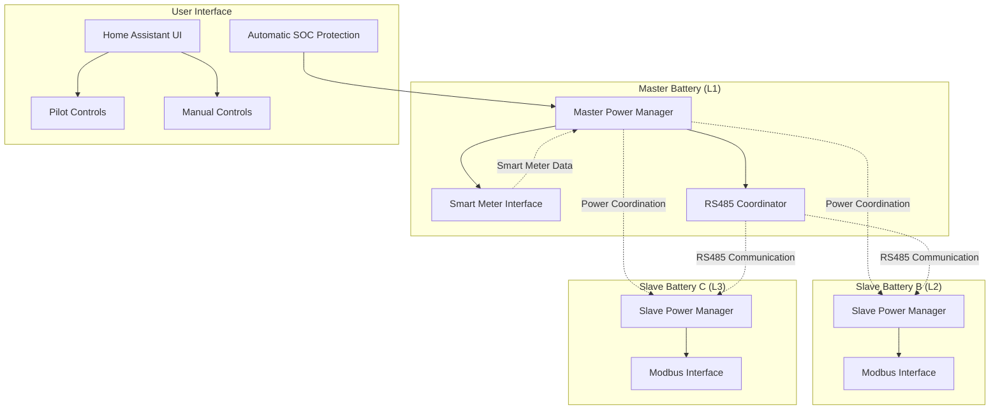
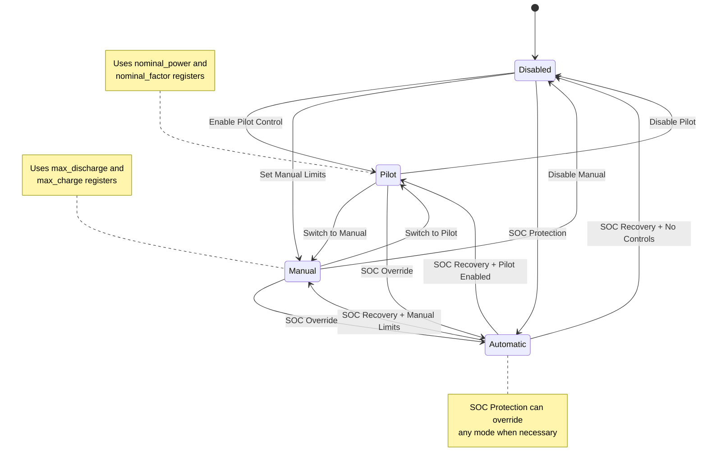

# ADR-005: Power Manager Architecture

**Date**: 2025-02-09  
**Status**: ✅ Adopted  
**Deciders**: SAX Battery Integration Team  

## Context

SAX Battery systems support multiple power control modes (pilot power, manual discharge/charge limits, nominal power control) and require sophisticated coordination between multiple batteries. The original implementation had overlapping responsibilities between power settings, SOC protection, and user controls, leading to inconsistent behavior and difficulty in understanding system state.

### Problem Statement

**Control Complexity**:
- Multiple overlapping power control methods (pilot, manual, nominal)
- User confusion about which controls affect battery behavior
- Inconsistent state representation in Home Assistant UI
- Complex interaction between SOC protection and power limits

**Multi-Battery Challenges**:
- Power distribution across multiple batteries (L1, L2, L3 phases)
- Master battery coordinates power limits for slave batteries
- RS485 communication requirements for smart meter data
- Individual battery protection while maintaining system coordination

**Hardware Limitations**:
- Write-only registers for power control (41-44)
- Cannot read back current hardware power settings
- SAX battery firmware bugs with Modbus transaction IDs

### Alternatives Considered

#### Option 1: Direct Hardware Control Only
- **Approach**: Direct Modbus register writes, minimal abstraction
- **Pros**: Simple, direct hardware mapping
- **Cons**: Duplicate code, no coordination, poor user experience

#### Option 2: Centralized Power Controller
- **Approach**: Single power manager controls all batteries
- **Pros**: Simple architecture, easier coordination
- **Cons**: Doesn't scale well, single point of failure

#### Option 3: Distributed Power Managers  
- **Approach**: Each battery has its own power manager
- **Pros**: Scalable, matches hardware architecture
- **Cons**: Requires inter-manager communication complexity

#### Option 4: Hierarchical Power Management
- **Approach**: Master power manager coordinates slave managers
- **Pros**: Matches SAX battery master/slave architecture, scalable
- **Cons**: More complex initial implementation

## Decision

**We adopt Option 4: Hierarchical Power Management** with the following design:

### System Architecture



### Power Control Modes



## Implementation

### Master Power Manager

```python
class MasterPowerManager:
    """Coordinates power management across all SAX batteries."""
    
    def __init__(
        self,
        coordinator: SAXBatteryCoordinator,
        slave_managers: list[SlavePowerManager],
    ) -> None:
        """Initialize master power manager."""
        
        if not coordinator.is_master:
            raise ValueError("Master Power Manager requires master coordinator")
            
        self.coordinator = coordinator
        self.slave_managers = slave_managers
        
        # Power control state
        self._current_mode = PowerControlMode.DISABLED
        self._pilot_enabled = False
        self._manual_limits_enabled = False
        
        # Smart meter integration
        self.smart_meter = SmartMeterInterface(coordinator)
        
        # Power distribution tracking
        self._phase_power_allocation = {
            "L1": 0.0,  # Master battery power
            "L2": 0.0,  # Slave B power  
            "L3": 0.0,  # Slave C power
        }
        
        _LOGGER.info("Master Power Manager initialized for %s", coordinator.battery_id)

    async def set_pilot_power(self, power: float, factor: float = 100.0) -> bool:
        """Set pilot power control across all batteries."""
        
        _LOGGER.info("Setting pilot power: %.1fW at %.1f%% factor", power, factor)
        
        try:
            # Distribute power across available phases
            power_distribution = self._calculate_power_distribution(power)
            
            # Apply to master battery
            await self._set_master_pilot_power(power_distribution["L1"], factor)
            
            # Coordinate with slave batteries
            for slave_manager in self.slave_managers:
                phase = slave_manager.get_phase()
                slave_power = power_distribution.get(phase, 0.0)
                await slave_manager.set_pilot_power(slave_power, factor)
            
            # Update control mode
            self._current_mode = PowerControlMode.PILOT
            self._pilot_enabled = True
            
            # Update power allocation tracking
            self._phase_power_allocation = power_distribution
            
            _LOGGER.info("Pilot power applied: %s", power_distribution)
            return True
            
        except Exception as err:
            _LOGGER.error("Failed to set pilot power: %s", err)
            return False

    def _calculate_power_distribution(self, total_power: float) -> dict[str, float]:
        """Calculate how to distribute power across available phases."""
        
        # Get available batteries/phases
        available_phases = ["L1"]  # Master is always available
        for slave_manager in self.slave_managers:
            if slave_manager.is_available():
                available_phases.append(slave_manager.get_phase())
        
        if not available_phases:
            return {"L1": 0.0, "L2": 0.0, "L3": 0.0}
        
        # Get smart meter data for optimal distribution
        phase_loads = self.smart_meter.get_phase_loads()
        
        if phase_loads:
            # Distribute based on current phase loading
            return self._distribute_by_phase_load(total_power, phase_loads)
        else:
            # Fallback: Equal distribution across available phases
            power_per_phase = total_power / len(available_phases)
            distribution = {"L1": 0.0, "L2": 0.0, "L3": 0.0}
            
            for phase in available_phases:
                distribution[phase] = power_per_phase
                
            return distribution

    def _distribute_by_phase_load(
        self, total_power: float, phase_loads: dict[str, float]
    ) -> dict[str, float]:
        """Distribute power based on current phase loading from smart meter."""
        
        # Calculate relative loading for each phase
        total_load = sum(phase_loads.values()) 
        if total_load <= 0:
            # Fallback to equal distribution
            available_count = len([p for p in phase_loads if p >= 0])
            equal_share = total_power / max(available_count, 1)
            return {phase: equal_share if load >= 0 else 0.0 
                   for phase, load in phase_loads.items()}
        
        # Proportional distribution based on current load
        distribution = {}
        for phase, load in phase_loads.items():
            if load >= 0:  # Phase is available
                proportion = load / total_load
                distribution[phase] = total_power * proportion
            else:
                distribution[phase] = 0.0
        
        return distribution

    async def set_manual_limits(
        self, max_discharge: float, max_charge: float
    ) -> bool:
        """Set manual discharge/charge limits across all batteries."""
        
        _LOGGER.info(
            "Setting manual limits: discharge=%.1fW, charge=%.1fW", 
            max_discharge, max_charge
        )
        
        try:
            # Apply to master battery
            await self._set_master_limits(max_discharge, max_charge)
            
            # Apply to slave batteries
            tasks = [
                slave_manager.set_manual_limits(max_discharge, max_charge)
                for slave_manager in self.slave_managers
            ]
            
            results = await asyncio.gather(*tasks, return_exceptions=True)
            success_count = sum(1 for r in results if r is True)
            
            if success_count > 0:
                self._current_mode = PowerControlMode.MANUAL
                self._manual_limits_enabled = True
                
                _LOGGER.info(
                    "Manual limits applied to %d/%d batteries",
                    success_count + 1,  # +1 for master
                    len(self.slave_managers) + 1,
                )
                return True
            
            return False
            
        except Exception as err:
            _LOGGER.error("Failed to set manual limits: %s", err)
            return False
```

### Slave Power Manager

```python
class SlavePowerManager:
    """Power management for slave SAX batteries."""
    
    def __init__(
        self, 
        coordinator: SAXBatteryCoordinator,
        phase: str,
        master_manager: MasterPowerManager,
    ) -> None:
        """Initialize slave power manager."""
        
        if coordinator.is_master:
            raise ValueError("Slave Power Manager cannot be used with master coordinator")
            
        self.coordinator = coordinator
        self.phase = phase  # L2 or L3
        self.master_manager = master_manager
        
        # Power control state  
        self._current_limits = {
            "max_discharge": 0.0,
            "max_charge": 0.0,
            "nominal_power": 0.0,
            "nominal_factor": 100.0,
        }
        
        _LOGGER.info(
            "Slave Power Manager initialized for %s (Phase %s)", 
            coordinator.battery_id, phase
        )

    async def set_pilot_power(self, power: float, factor: float = 100.0) -> bool:
        """Set pilot power for this slave battery."""
        
        try:
            await self.coordinator.modbus_api.write_holding_registers(
                41,  # nominal_power register
                [int(power)],
                device_id=self.coordinator.device_id,
            )
            
            await self.coordinator.modbus_api.write_holding_registers(
                42,  # nominal_factor register  
                [int(factor)],
                device_id=self.coordinator.device_id,
            )
            
            # Update local cache
            self._current_limits["nominal_power"] = power
            self._current_limits["nominal_factor"] = factor
            
            _LOGGER.debug(
                "%s pilot power set: %.1fW at %.1f%%",
                self.phase, power, factor
            )
            return True
            
        except (ModbusException, OSError, TimeoutError) as err:
            _LOGGER.error(
                "%s failed to set pilot power: %s", self.phase, err
            )
            return False

    async def set_manual_limits(
        self, max_discharge: float, max_charge: float
    ) -> bool:
        """Set manual limits for this slave battery."""
        
        try:
            # Write discharge limit
            await self.coordinator.modbus_api.write_holding_registers(
                41,  # max_discharge register
                [int(max_discharge)],
                device_id=self.coordinator.device_id,
            )
            
            # Write charge limit
            await self.coordinator.modbus_api.write_holding_registers(
                42,  # max_charge register
                [int(max_charge)], 
                device_id=self.coordinator.device_id,
            )
            
            # Update local cache
            self._current_limits["max_discharge"] = max_discharge
            self._current_limits["max_charge"] = max_charge
            
            _LOGGER.debug(
                "%s manual limits set: discharge=%.1fW, charge=%.1fW",
                self.phase, max_discharge, max_charge
            )
            return True
            
        except (ModbusException, OSError, TimeoutError) as err:
            _LOGGER.error(
                "%s failed to set manual limits: %s", self.phase, err
            )
            return False
            
    def is_available(self) -> bool:
        """Check if this slave battery is available for power management."""
        
        return (
            self.coordinator.last_update_success
            and self.coordinator.data is not None
        )
        
    def get_phase(self) -> str:
        """Get the grid phase this battery is connected to."""
        return self.phase
```

### Smart Meter Integration

```python
class SmartMeterInterface:
    """Interface to smart meter data via master battery."""
    
    def __init__(self, master_coordinator: SAXBatteryCoordinator) -> None:
        """Initialize smart meter interface."""
        
        if not master_coordinator.is_master:
            raise ValueError("Smart meter interface requires master coordinator")
            
        self.coordinator = master_coordinator
        self._last_phase_data = {}
        self._data_age_threshold = 60  # seconds
        
    def get_phase_loads(self) -> dict[str, float] | None:
        """Get current power load for each phase from smart meter."""
        
        try:
            # Get fresh smart meter data
            data = self.coordinator.data
            if not data:
                return None
                
            # Extract phase-specific loads
            phase_loads = {
                "L1": data.get("smart_meter_l1_power", 0.0),
                "L2": data.get("smart_meter_l2_power", 0.0), 
                "L3": data.get("smart_meter_l3_power", 0.0),
            }
            
            # Validate data age
            data_timestamp = data.get("last_update", datetime.min)
            age = (datetime.now() - data_timestamp).total_seconds()
            
            if age > self._data_age_threshold:
                _LOGGER.warning(
                    "Smart meter data is %.1f seconds old - using cached values",
                    age
                )
                return self._last_phase_data
            
            # Cache fresh data
            self._last_phase_data = phase_loads
            return phase_loads
            
        except Exception as err:
            _LOGGER.error("Failed to get phase loads: %s", err)
            return self._last_phase_data
            
    def get_total_grid_power(self) -> float | None:
        """Get total grid power consumption/production."""
        
        phase_loads = self.get_phase_loads()
        if phase_loads:
            return sum(phase_loads.values())
        return None
        
    def get_grid_frequency(self) -> float | None:
        """Get current grid frequency from smart meter."""
        
        data = self.coordinator.data
        return data.get("smart_meter_frequency") if data else None
```

### Power Control Mode Coordination

```python
class PowerControlMode(Enum):
    """Power control operating modes."""
    
    DISABLED = "disabled"       # No active power control
    PILOT = "pilot"            # Pilot power + factor control  
    MANUAL = "manual"          # Manual discharge/charge limits
    SOC_PROTECTED = "protected" # SOC protection override active

@dataclass
class PowerState:
    """Current power control state."""
    
    mode: PowerControlMode
    pilot_power: float | None = None
    pilot_factor: float | None = None
    max_discharge: float | None = None
    max_charge: float | None = None
    soc_protection_active: bool = False
    last_updated: datetime = field(default_factory=datetime.now)

class PowerCoordinator:
    """Coordinates between different power control mechanisms."""
    
    def __init__(
        self,
        master_manager: MasterPowerManager,
        soc_manager: SOCManager,
    ) -> None:
        """Initialize power coordinator."""
        
        self.master_manager = master_manager
        self.soc_manager = soc_manager
        self._current_state = PowerState(mode=PowerControlMode.DISABLED)
        
    async def handle_user_power_request(
        self, control_type: str, **kwargs
    ) -> PowerState:
        """Handle user power control requests with SOC protection."""
        
        # Check SOC constraints first
        if control_type == "pilot_power":
            power = kwargs.get("power", 0.0)
            constraint_result = await self.soc_manager.check_discharge_allowed(power)
            
            if not constraint_result.allowed:
                _LOGGER.warning(
                    "Pilot power request constrained: %.1fW -> %.1fW (%s)",
                    power, constraint_result.constrained_value, constraint_result.reason
                )
                kwargs["power"] = constraint_result.constrained_value
                
        elif control_type == "manual_limits":
            max_discharge = kwargs.get("max_discharge", 0.0)
            constraint_result = await self.soc_manager.check_discharge_allowed(max_discharge)
            
            if not constraint_result.allowed:
                _LOGGER.warning(
                    "Manual discharge limit constrained: %.1fW -> %.1fW (%s)",
                    max_discharge, constraint_result.constrained_value, constraint_result.reason
                )
                kwargs["max_discharge"] = constraint_result.constrained_value
        
        # Apply power control
        if control_type == "pilot_power":
            success = await self.master_manager.set_pilot_power(
                kwargs["power"], kwargs.get("factor", 100.0)
            )
            if success:
                self._current_state = PowerState(
                    mode=PowerControlMode.PILOT,
                    pilot_power=kwargs["power"],
                    pilot_factor=kwargs.get("factor", 100.0),
                )
                
        elif control_type == "manual_limits":
            success = await self.master_manager.set_manual_limits(
                kwargs["max_discharge"], kwargs["max_charge"]
            )
            if success:
                self._current_state = PowerState(
                    mode=PowerControlMode.MANUAL,
                    max_discharge=kwargs["max_discharge"],
                    max_charge=kwargs["max_charge"],
                )
                
        elif control_type == "disable":
            success = await self.master_manager.disable_all_controls()
            if success:
                self._current_state = PowerState(mode=PowerControlMode.DISABLED)
        
        # Mark SOC protection if constraints were applied
        if hasattr(constraint_result, 'allowed') and not constraint_result.allowed:
            self._current_state.soc_protection_active = True
            
        return self._current_state
        
    def get_current_state(self) -> PowerState:
        """Get current power control state."""
        return self._current_state
```

## Configuration and User Interface

### Power Manager Configuration

```python
POWER_MANAGER_CONFIG = vol.Schema({
    vol.Optional("power_distribution_mode", default="automatic"): vol.In([
        "automatic",      # Smart meter based distribution
        "equal",         # Equal power per phase  
        "manual",        # User-specified per phase
    ]),
    vol.Optional("phase_priority", default=["L1", "L2", "L3"]): [str],
    vol.Optional("smart_meter_timeout", default=60): vol.All(
        vol.Coerce(int), vol.Range(min=30, max=300)
    ),
})

class PowerManagerOptions:
    """Power manager configuration options."""
    
    def __init__(self, options: dict[str, Any]) -> None:
        self.power_distribution_mode = options.get("power_distribution_mode", "automatic")
        self.phase_priority = options.get("phase_priority", ["L1", "L2", "L3"])
        self.smart_meter_timeout = options.get("smart_meter_timeout", 60)
        
        # Advanced options (not exposed in config flow)
        self.coordination_timeout = 10.0  # seconds
        self.retry_attempts = 3
        self.phase_imbalance_threshold = 0.2  # 20% max imbalance
```

### Entity Integration

```python
class SAXBatteryPowerModeSelect(CoordinatorEntity, SelectEntity):
    """Select entity for power control mode."""
    
    _attr_has_entity_name = True
    _attr_options = [
        PowerControlMode.DISABLED.value,
        PowerControlMode.PILOT.value, 
        PowerControlMode.MANUAL.value,
    ]
    
    def __init__(
        self,
        coordinator: SAXBatteryCoordinator,
        power_coordinator: PowerCoordinator,
    ) -> None:
        super().__init__(coordinator)
        self.power_coordinator = power_coordinator
        self._attr_unique_id = "sax_power_control_mode"
        
    @property
    def current_option(self) -> str | None:
        """Return current power control mode."""
        state = self.power_coordinator.get_current_state()
        return state.mode.value
        
    async def async_select_option(self, option: str) -> None:
        """Change power control mode."""
        mode = PowerControlMode(option)
        
        if mode == PowerControlMode.DISABLED:
            await self.power_coordinator.handle_user_power_request("disable")
        elif mode == PowerControlMode.PILOT:
            # Enable pilot mode with default values
            await self.power_coordinator.handle_user_power_request(
                "pilot_power", power=0.0, factor=100.0
            )
        elif mode == PowerControlMode.MANUAL:
            # Enable manual mode with default values
            await self.power_coordinator.handle_user_power_request(
                "manual_limits", max_discharge=0.0, max_charge=0.0
            )
```

## Testing Strategy

### Unit Tests

```python
async def test_power_distribution_calculation():
    """Test power distribution across multiple phases."""
    
    master_manager = MasterPowerManager(mock_coordinator, [])
    
    # Mock smart meter data with phase loading
    master_manager.smart_meter.get_phase_loads = MagicMock(return_value={
        "L1": 2000.0,   # 40% of load
        "L2": 2000.0,   # 40% of load  
        "L3": 1000.0,   # 20% of load
    })
    
    # Test distribution of 3000W total power
    distribution = master_manager._calculate_power_distribution(3000.0)
    
    # Should distribute proportionally to current load
    assert distribution["L1"] == 1200.0  # 40% of 3000W
    assert distribution["L2"] == 1200.0  # 40% of 3000W
    assert distribution["L3"] == 600.0   # 20% of 3000W

async def test_soc_protection_integration():
    """Test SOC protection overrides power commands."""
    
    power_coordinator = PowerCoordinator(master_manager, soc_manager)
    
    # Mock low SOC condition
    soc_manager.check_discharge_allowed = AsyncMock(
        return_value=ConstraintResult(
            allowed=False,
            constrained_value=0.0,
            reason="soc_too_low"
        )
    )
    
    # Request high pilot power - should be constrained
    state = await power_coordinator.handle_user_power_request(
        "pilot_power", power=5000.0, factor=100.0
    )
    
    assert state.pilot_power == 0.0  # Constrained to 0W
    assert state.soc_protection_active is True

async def test_master_slave_coordination():
    """Test coordination between master and slave power managers."""
    
    slave_manager = SlavePowerManager(slave_coordinator, "L2", master_manager)
    master_manager.slave_managers = [slave_manager]
    
    # Set pilot power across system
    success = await master_manager.set_pilot_power(3000.0, 80.0)
    
    # Verify master battery was configured
    assert success is True
    master_manager.coordinator.modbus_api.write_holding_registers.assert_called()
    
    # Verify slave battery was configured
    slave_manager.coordinator.modbus_api.write_holding_registers.assert_called()
```

### Integration Tests

```python
async def test_end_to_end_power_control():
    """Test complete power control flow with real entities."""
    
    # Set up integrated test environment
    hass = HomeAssistant()
    config_entry = MockConfigEntry(domain=DOMAIN, data=TEST_CONFIG)
    
    # Initialize integration with power management
    await async_setup_entry(hass, config_entry)
    
    # Get power control entities
    pilot_power_entity = hass.states.get("number.sax_pilot_power")
    pilot_factor_entity = hass.states.get("number.sax_pilot_factor")
    power_mode_entity = hass.states.get("select.sax_power_control_mode")
    
    # Test switching to pilot mode
    await hass.services.async_call(
        "select", "select_option",
        {"entity_id": "select.sax_power_control_mode", "option": "pilot"},
        blocking=True
    )
    
    # Set pilot power values
    await hass.services.async_call(
        "number", "set_value", 
        {"entity_id": "number.sax_pilot_power", "value": 2000.0},
        blocking=True
    )
    
    # Verify state updates
    assert hass.states.get("select.sax_power_control_mode").state == "pilot"
    assert float(hass.states.get("number.sax_pilot_power").state) == 2000.0
```

## Consequences

### Positive

✅ **Hierarchical Architecture**: Matches SAX battery hardware master/slave design  
✅ **Smart Meter Integration**: Optimizes power distribution based on real grid data  
✅ **SOC Protection Integration**: Automatic safety overrides prevent battery damage  
✅ **Multi-Battery Coordination**: Efficient power distribution across all phases  
✅ **User Control Transparency**: Clear mode selection and state representation  
✅ **Hardware Abstraction**: Hides write-only register complexity from users  
✅ **Scalable Design**: Easy addition of new batteries or control methods  

### Negative

⚠️ **Implementation Complexity**: Advanced coordination logic requires careful testing  
⚠️ **Single Point of Failure**: Master battery failure affects entire system power coordination  
⚠️ **Smart Meter Dependency**: Optimal power distribution depends on reliable smart meter data  
⚠️ **Mode Switching Complexity**: Users may be confused by multiple power control methods  

### Mitigation Strategies

#### 1. Graceful Degradation
```python
async def handle_master_failure(self) -> None:
    """Handle master battery communication failures."""
    
    _LOGGER.warning("Master battery communication lost - switching to independent mode")
    
    # Switch slaves to independent operation
    for slave_manager in self.slave_managers:
        await slave_manager.enable_independent_mode()
        
    # Reduce power limits to safe defaults
    for slave_manager in self.slave_managers:
        await slave_manager.set_safe_defaults()
```

#### 2. Smart Meter Fallback  
```python
def get_phase_loads_with_fallback(self) -> dict[str, float]:
    """Get phase loads with multiple fallback strategies."""
    
    # Try fresh smart meter data
    loads = self.smart_meter.get_phase_loads()
    if loads:
        return loads
        
    # Try cached data
    if self._last_valid_loads:
        age = (datetime.now() - self._last_loads_timestamp).total_seconds()
        if age < 300:  # 5 minutes
            _LOGGER.info("Using cached smart meter data (%.1fs old)", age)
            return self._last_valid_loads
    
    # Fallback to equal distribution
    _LOGGER.warning("Smart meter data unavailable - using equal distribution")
    return {"L1": 1.0, "L2": 1.0, "L3": 1.0}  # Equal weights
```

## References

- [SAX Battery Multi-Battery System](../multi-battery-system.md)
- [SOC Protection System](004-soc-protection.md)  
- [Write-Only Register Handling](002-write-only-registers.md)
- [Coordinator Pattern](001-coordinator-pattern.md)

---

**Status**: ✅ Adopted and Implemented  
**Last Review**: February 2026  
**Next Review**: Quarterly to assess power distribution effectiveness