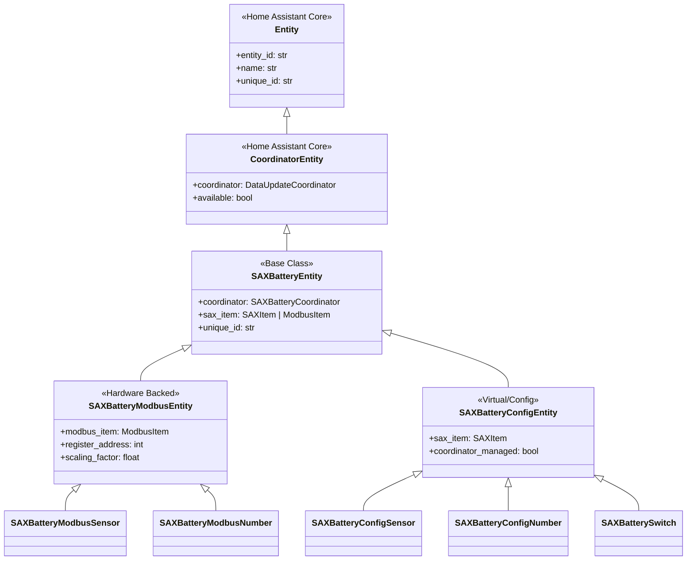

# Entity Architecture

This document describes the entity design patterns, inheritance hierarchy, and entity lifecycle management within the SAX Battery integration.

## 🏗️ Entity Hierarchy

The SAX Battery integration uses a structured entity hierarchy that separates hardware-backed entities from virtual/calculated entities:



## 📊 Entity Categories

### Hardware-Backed Entities (ModbusItem)

Entities that represent physical Modbus registers on SAX battery hardware.

**Characteristics**:

- Have physical register addresses (`ModbusItem.address`)
- Support read/write operations to hardware
- Availability depends on Modbus connection status
- Values cached locally for write-only registers
- Per-battery scope (battery_a, battery_b, battery_c)

**Examples**:

```python
# SOC sensor reading from register 40009
SAX_SOC = ModbusItem(
    name="sax_soc", 
    address=40009,
    data_type=ModbusClientMixin.DATATYPE.UINT16,
    factor=1.0,
    # ... other properties
)

# Max discharge power control writing to register 41
SAX_MAX_DISCHARGE = ModbusItem(
    name="sax_max_discharge",
    address=41, 
    data_type=ModbusClientMixin.DATATYPE.UINT16,
    factor=1.0,
    # ... other properties
)
```

### Virtual/Calculated Entities (SAXItem)

Entities that exist only in software for configuration, aggregation, or calculated values.

**Characteristics**:

- No physical hardware registers (`SAXItem` base class)
- Always available (independent of hardware state)
- Values stored in coordinator memory or config entries
- System-wide scope (single instance per integration)

**Examples**:

```python
# Combined SOC calculated from all batteries
SAX_COMBINED_SOC = SAXItem(
    name="sax_combined_soc",
    mtype=TypeConstants.SENSOR_CALC,
    device=DeviceConstants.SYS,
    # ... other properties  
)

# Virtual switch for solar charging mode
SOLAR_CHARGING_SWITCH = SAXItem(
    name="solar_charging_switch",
    mtype=TypeConstants.SWITCH,
    device=DeviceConstants.SYS,
    # ... other properties
)
```

## 📱 Platform-Specific Entity Implementations

### Sensor Entities

#### SAXBatterySensor (Hardware)

```python
class SAXBatterySensor(SAXBatteryEntity, SensorEntity):
    """SAX Battery sensor backed by Modbus hardware."""
    
    def __init__(self, coordinator, battery_id, modbus_item):
        self.coordinator = coordinator
        self._battery_id = battery_id  
        self._modbus_item = modbus_item
        
    @property
    def native_value(self) -> float | None:
        """Return sensor value from coordinator data."""
        return self.coordinator.data.get(self._modbus_item.name)
        
    @property  
    def available(self) -> bool:
        """Sensor available if coordinator has data."""
        return (
            super().available 
            and self.coordinator.data is not None
            and self._modbus_item.name in self.coordinator.data
        )
```

#### SAXBatteryCalculatedSensor (Virtual)

```python  
class SAXBatteryCalculatedSensor(SAXBatteryEntity, SensorEntity):
    """SAX Battery calculated/aggregated sensor."""
    
    def __init__(self, coordinator, sax_item, calculation_fn):
        self.coordinator = coordinator
        self._sax_item = sax_item
        self._calculation_fn = calculation_fn
        
    @property
    def native_value(self) -> float | None:
        """Return calculated value."""
        return self._calculation_fn(self.coordinator.data)
        
    @property
    def available(self) -> bool:
        """Calculated sensors always available."""
        return True
```

### Number Entities

#### SAXBatteryModbusNumber (Hardware)

```python
class SAXBatteryModbusNumber(SAXBatteryEntity, NumberEntity, RestoreNumber):
    """SAX Battery number entity backed by Modbus hardware."""
    
    def __init__(self, coordinator, battery_id, modbus_item):
        self.coordinator = coordinator  
        self._battery_id = battery_id
        self._modbus_item = modbus_item
        self._local_value = None  # Cache for write-only registers
        
    async def async_set_native_value(self, value: float) -> None:
        """Set new value with validation and SOC constraints."""
        # Input validation
        if self.native_min_value and value < self.native_min_value:
            raise HomeAssistantError(f"Value below minimum: {value}")
            
        # SOC constraint checking
        if hasattr(self.coordinator, "soc_manager"):
            result = await self.coordinator.soc_manager.check_discharge_allowed(value)
            if not result.allowed:
                value = result.constrained_value
                
        # Write to hardware  
        await self.coordinator.async_write_number_value(self._modbus_item, value)
        self._local_value = value  # Cache for write-only registers
        self.async_write_ha_state()
```

#### SAXBatteryConfigNumber (Virtual)

```python
class SAXBatteryConfigNumber(SAXBatteryEntity, NumberEntity):
    """SAX Battery configuration number (no hardware backing)."""
    
    def __init__(self, coordinator, sax_item):
        self.coordinator = coordinator
        self._sax_item = sax_item
        self._value = self._sax_item.default_value
        
    async def async_set_native_value(self, value: float) -> None:
        """Set configuration value in coordinator memory."""
        self._value = value
        # Store in coordinator for other components to access
        self.coordinator.config_values[self._sax_item.name] = value
        self.async_write_ha_state()
        
    @property
    def available(self) -> bool:
        """Config numbers always available."""
        return True
```

### Switch Entities

#### SAXBatterySwitch (Virtual)

```python
class SAXBatterySwitch(SAXBatteryEntity, SwitchEntity):
    """SAX Battery virtual switch for mode control."""
    
    def __init__(self, coordinator, sax_item):
        self.coordinator = coordinator
        self._sax_item = sax_item
        self._is_on = False
        
    async def async_turn_on(self, **kwargs) -> None:
        """Turn on switch (enable mode)."""
        if hasattr(self.coordinator, "power_manager"):
            success = await self.coordinator.power_manager.enable_mode(self._sax_item.name) 
            if success:
                self._is_on = True
                self.async_write_ha_state()
                
    async def async_turn_off(self, **kwargs) -> None:
        """Turn off switch (disable mode)."""
        if hasattr(self.coordinator, "power_manager"):
            success = await self.coordinator.power_manager.disable_mode(self._sax_item.name)
            if success:
                self._is_on = False  
                self.async_write_ha_state()
```

## 🔑 Unique ID Management

### Critical Design Rule

**Always use `SAXBatteryData.get_unique_id_for_item()` function** for entity unique ID generation. Never hardcode unique IDs.

```python
# ✅ CORRECT: Use utility function
unique_id = self.coordinator.sax_data.get_unique_id_for_item(
    item=modbus_item,
    battery_id=self._battery_id,
)

# ❌ WRONG: Hardcoded unique_id  
# unique_id = "sax_max_discharge"  # Never do this
```

### Unique ID Patterns

**Cluster Entities** (system-wide, `battery_id=None`):

- Format: `sax_{item_name}`
- Examples: `sax_combined_soc`, `sax_solar_charging_switch`

**Per-Battery Entities** (specific `battery_id`):

- Format: `{battery_id}_{item_name}`
- Examples: `battery_a_soc`, `battery_b_temperature`

### Entity Registry Lookups

```python
# Type-safe entity lookup with validation
unique_id = coordinator.sax_data.get_unique_id_for_item(item_name)
if not unique_id:
    _LOGGER.warning("Could not generate unique_id for %s", item_name)
    return
    
entity_id = ent_reg.async_get_entity_id("number", DOMAIN, unique_id)
```

## 🔄 Entity Lifecycle

### 1. Entity Creation (Setup)

```python
async def async_setup_entry(hass, config_entry):
    # 1. Create coordinator
    coordinator = SAXBatteryCoordinator(hass, modbus_api, config_entry)
    
    # 2. First data fetch
    await coordinator.async_config_entry_first_refresh()
    
    # 3. Create entities
    entities = []
    for item in modbus_items:
        entities.append(SAXBatterySensor(coordinator, battery_id, item))
        
    # 4. Add entities to Home Assistant
    async_add_entities(entities)
```

### 2. Entity Initialization

```python
class SAXBatteryEntity:
    def __init__(self, coordinator, ...):
        super().__init__(coordinator)
        
        # Generate unique ID using utility function
        self._attr_unique_id = coordinator.sax_data.get_unique_id_for_item(...)
        
        # Set entity description from item definition
        if item.entitydescription:
            self.entity_description = item.entitydescription
```

### 3. State Updates (Runtime)

```python
# Coordinator polls data
async def _async_update_data(self):
    new_data = await self.modbus_api.read_all_registers()
    return new_data

# Entities automatically updated via coordinator
@property  
def native_value(self):
    return self.coordinator.data.get(self.item_name)
```

### 4. User Actions

```python
# User changes number entity value
async def async_set_native_value(self, value):
    # 1. Validate input
    self._validate_value(value)
    
    # 2. Check constraints (SOC Manager)
    constrained_value = await self._apply_constraints(value)
    
    # 3. Write to hardware
    await self.coordinator.async_write_number_value(self.item, constrained_value)
    
    # 4. Update local state
    self._attr_native_value = constrained_value
    self.async_write_ha_state()
```

### 5. State Restoration (Restart)

```python
# Write-only registers restored from entity registry
class SAXBatteryModbusNumber(RestoreNumber):
    async def async_added_to_hass(self):
        await super().async_added_to_hass()
        
        # Restore last known value for write-only registers
        if (restored := await self.async_get_last_number_data()):
            self._local_value = restored.native_value
```

## 🛡️ Availability Management

### Hardware Entity Availability

```python
@property
def available(self) -> bool:
    """Hardware entities depend on coordinator state."""
    return (
        super().available  # CoordinatorEntity availability
        and self.coordinator.last_update_success
        and self.coordinator.data is not None
        and self.item_name in self.coordinator.data
    )
```

### Virtual Entity Availability

```python
@property  
def available(self) -> bool:
    """Virtual entities are always available."""
    return True  # Independent of hardware state
```

## ⚡ Performance Optimizations

### Entity Creation Efficiency

```python
# ✅ GOOD: Use list comprehension with extend
entities.extend([
    SAXBatterySensor(coordinator, battery_id, item)
    for item in sensor_items
    if item.enabled_by_default
])

# ❌ BAD: Individual append calls in loop
# for item in sensor_items:
#     entities.append(SAXBatterySensor(coordinator, battery_id, item))
```

### State Update Optimization

```python
# Batch state updates when possible
async def _handle_coordinator_update(self):
    """Update multiple entity attributes efficiently."""
    if self.coordinator.data:
        self._attr_native_value = self.coordinator.data.get(self.item_name)
        self._attr_extra_state_attributes = self._build_attributes() 
        self.async_write_ha_state()  # Single state write
```

## 🧪 Testing Patterns

### Entity Testing Template

```python
@pytest.fixture
def mock_coordinator():
    """Create mock coordinator for entity testing."""
    coordinator = MagicMock(spec=SAXBatteryCoordinator)
    coordinator.data = {"sax_soc": 50.0}
    coordinator.last_update_success = True
    return coordinator

async def test_sensor_value(mock_coordinator):
    """Test sensor returns correct value."""
    sensor = SAXBatterySensor(mock_coordinator, "battery_a", SAX_SOC)
    assert sensor.native_value == 50.0
    assert sensor.available is True
```

## 📊 Entity States and Attributes

### State Management

- **Primary State**: Entity's main value (SOC percentage, power watts, etc.)
- **Attributes**: Additional metadata (last updated, battery phase, constraints, etc.)
- **Availability**: Whether entity is currently reachable and functional

### Attribute Patterns

```python
@property
def extra_state_attributes(self) -> dict[str, Any]:
    """Return additional entity attributes."""
    attributes = {
        "battery_id": self._battery_id,
        "register_address": self._modbus_item.address,
        "scaling_factor": self._modbus_item.factor,
        "last_updated": self.coordinator.last_update_success_time,
    }
    
    # Add constraint information for power controls
    if hasattr(self.coordinator, "soc_manager"):
        attributes["soc_protection_active"] = self.coordinator.soc_manager.enabled
        
    return attributes
```

---

**Next**: [Coordinator Pattern](coordinator-pattern.md)  
**See Also**: [Components](components.md), [Multi-Battery System](multi-battery-system.md)
