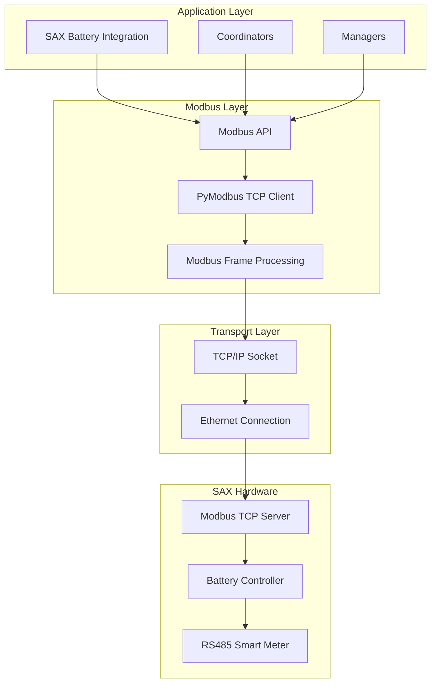
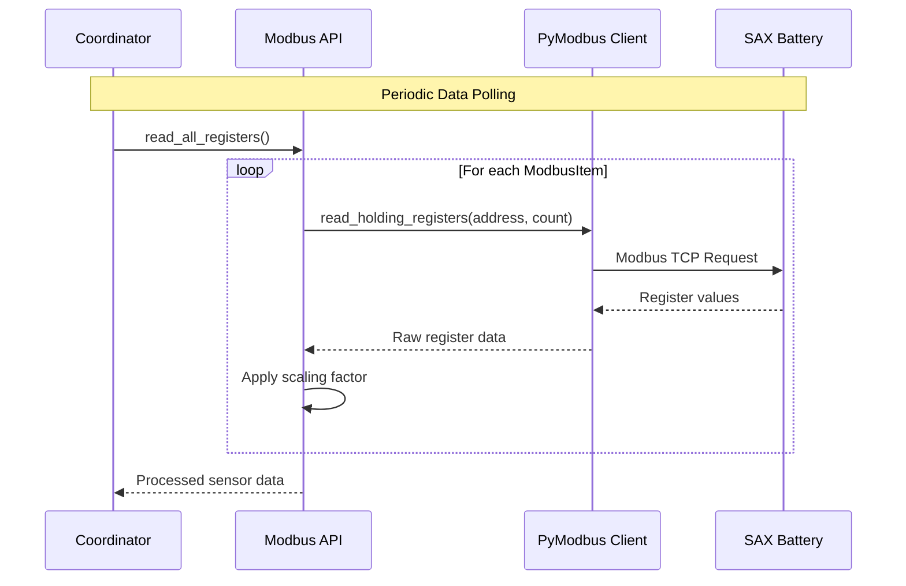
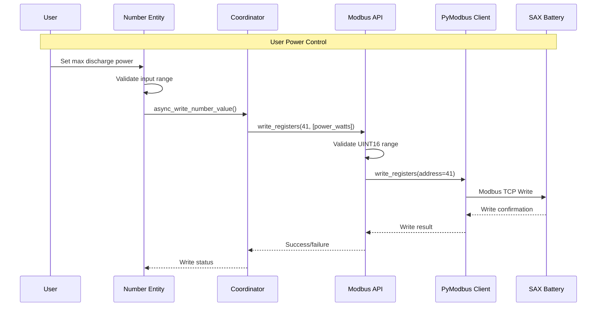
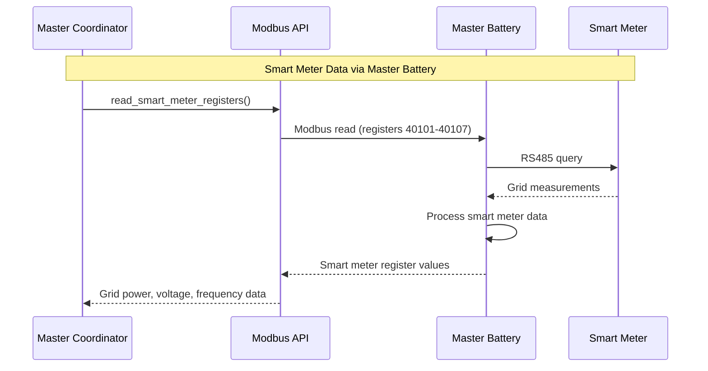

# Modbus Communication Architecture

This document describes the Modbus TCP/IP communication layer used to interface with SAX Battery hardware, including protocol details, register mapping, and communication patterns.

## 🔌 Communication Overview

The SAX Battery integration uses **Modbus TCP/IP** as the primary communication protocol to interface with SAX battery systems. Each battery exposes a Modbus server on its Ethernet port, allowing remote monitoring and control.

### Protocol Stack



## 📊 Register Map

### Control Registers (Write-Only)

| Register | Internal | Name | Type | Range | Factor | Description |
|----------|----------|------|------|-------|---------|-------------|
| 40042 | 41 | `sax_nominal_power` | INT16 | -32768-32767 | 1.0 | Pilot Power Setpoint (W) |
| 40043 | 42 | `sax_nominal_factor` | UINT16 | 0-100 | 1.0 | Pilot Power Factor (%) |
| 40044 | 43 | `sax_max_discharge` | UINT16 | 0-65535 | 1.0 | Max Discharge Power (W) |
| 40045 | 44 | `sax_max_charge` | UINT16 | 0-65535 | 1.0 | Max Charge Power (W) |

### Battery Management System (BMS) Registers

| Register | Internal | Name | Type | Range | Factor | Description |
|----------|----------|------|------|-------|---------|-------------|
| 40046 | 45 | `sax_status` | UINT16 | 0-65535 | 1.0 | Status Flags |
| 40047 | 46 | `sax_soc` | UINT16 | 0-100 | 1.0 | State of Charge (%) |
| 40048 | 47 | `sax_power` | INT16 | -32768-32767 | 1.0 | Power (W) |
| 40049 | 48 | `sax_power_sm` | INT16 | -32768-32767 | 1.0 | Power (W) |
| 40074 | 73 | `sax_current_l1` | INT16 | -32768-32767 | 0.1 | Current (A) |
| 40075 | 74 | `sax_current_l2` | INT16 | -32768-32767 | 0.1 | Current (A) |
| 40075 | 75 | `sax_current_l3` | INT16 | -32768-32767 | 0.1 | Current (A) |
| 40081 | 80 | `sax_voltage_l1` | UINT16 | 0-65535 | 0.1 | Voltage (V) |
| 40082 | 81 | `sax_voltage_l2` | UINT16 | 0-65535 | 0.1 | Voltage (V) |
| 40083 | 82 | `sax_voltage_l2` | UINT16 | 0-65535 | 0.1 | Voltage (V) |
| 40087 | 86 | `sax_grid_frequency` | UINT16 | 0-65535 | 0.01 | Grid Frequency (Hz) |
| 40085 | 84 | `sax_ac_total_power` | INT16 | -32768-32767 | 1.0 | Grid Power L1 (W) |
| 40089 | 88 | `apparent_power` | INT16 | -32768-32767 | 1.0 | Power AC (apparent) (VA) |
| 40091 | 90 | `reactive_power` | INT16 | -32768-32767 | 1.0 | Power AC (reactive) (VAr) |
| 40093 | 92 | `power_factor` | INT16 | -32768-32767 | 0.1 | Power factor (%) |
| 40117 | 116 |`sax_cycle_count` | UINT16 | 0-65535 | 1.0 | Charge Cycles |
| 40118 | 117 |`sax_temperature` | INT16 | -32768-32767 | 0.1 | Temperature (°C) |
| 40116 | 115 |`sax_capacity` | UINT16 | 0-65535 | 10.0 | Energy (Wh) |

### Smart Meter Registers (Master Battery Only)

| Register | Internal | Name | Type | Range | Factor | Description |
|----------|----------|------|------|-------|---------|-------------|
| 40100 | 99 | `current_l1_sm` | INT16 | -32768-32767 | 0.1 | Current (A) |
| 40101 | 100 | `current_l2_sm` | INT16 | -32768-32767 | 0.1 | Current (A) |
| 40102 | 101 | `current_l3_sm` | INT16 | -32768-32767 | 0.1 | Current (A) |
| 40103 | 102 | `power_l1_sm` | INT16 | -32768-32767 | 1.0 | Grid Power L3 (W) |
| 40104 | 103 | `power_l2_sm` | INT16 | -32768-32767 | 1.0 | Grid Power L3 (W) |
| 40105 | 104 | `power_l3_sm` | INT16 | -32768-32767 | 1.0 | Grid Power L3 (W) |
| 40107 | 106 | `voltage_l1_sm` | UINT16 | 0-65535 | 0.1 | Grid Voltage L1 (V) |
| 40108 | 107 | `voltage_l2_sm` | UINT16 | 0-65535 | 0.1 | Grid Voltage L2 (V) |
| 40109 | 108 | `voltage_l3_sm` | UINT16 | 0-65535 | 0.1 | Grid Voltage L3 (V) |
| 40110 | 109 | `total_power_sm` | INT16 | -32768-32767 | 1.0 | Total power (active) (W) |

## 🔧 Modbus API Implementation

### ModbusAPI Class Structure

```python
class ModbusAPI:
    """Modbus TCP/IP communication for SAX Battery."""
    
    def __init__(self, host: str, port: int = 502, timeout: int = 10):
        """Initialize Modbus client."""
        self._host = host
        self._port = port  
        self._timeout = timeout
        self._client: AsyncModbusTcpClient | None = None
        self._connected = False
        
    async def connect(self) -> bool:
        """Establish Modbus TCP connection."""
        
    async def disconnect(self) -> None:
        """Close Modbus TCP connection."""
        
    async def read_value(self, modbus_item: ModbusItem) -> float | None:
        """Read single register value."""
        
    async def read_holding_registers(self, count: int = 1, modbus_item: ModbusItem | None = None) -> list[int] | None:
        """Read multiple holding registers."""
        
    async def write_registers(self, address: int, values: list[int], device_id: int = 1) -> bool:
        """Write multiple registers."""
```

### Connection Management

```python
async def connect(self) -> bool:
    """Establish connection with timeout and error handling."""
    try:
        if self._client is None:
            self._client = AsyncModbusTcpClient(
                host=self._host,
                port=self._port,
                timeout=self._timeout,
            )
        
        # Test connection
        if not self._client.connected:
            await self._client.connect()
            
        # Verify with test read
        result = await self._client.read_holding_registers(
            address=40001,  # SOC register
            count=1,
            device_id=1
        )
        
        if result.isError():
            _LOGGER.error("Modbus test read failed: %s", result)
            self._connected = False
            return False
            
        self._connected = True
        _LOGGER.debug("Modbus connection established to %s:%s", self._host, self._port)
        return True
        
    except Exception as err:
        _LOGGER.error("Modbus connection failed: %s", err)
        self._connected = False
        return False
```

### Read Operations

```python
async def read_value(self, modbus_item: ModbusItem) -> float | None:
    """Read single register with error handling and conversion."""
    
    if not await self._ensure_connected():
        return None
        
    try:
        result = await self._client.read_holding_registers(
            address=modbus_item.address,
            count=1,
            device_id=modbus_item.battery_device_id,
        )
        
        if result.isError():
            raise ModbusException(f"Read error for register {modbus_item.address}: {result}")
            
        # Convert based on data type
        if modbus_item.data_type == ModbusClientMixin.DATATYPE.UINT16:
            raw_value = result.registers[0]
        elif modbus_item.data_type == ModbusClientMixin.DATATYPE.INT16:
            # Convert unsigned to signed
            raw_value = result.registers[0]
            if raw_value > 32767:
                raw_value = raw_value - 65536
        else:
            raise ValueError(f"Unsupported data type: {modbus_item.data_type}")
            
        # Apply scaling factor
        scaled_value = raw_value * modbus_item.factor
        
        _LOGGER.debug("Read %s: raw=%s scaled=%s", modbus_item.name, raw_value, scaled_value)
        return scaled_value
        
    except Exception as err:
        _LOGGER.error("Failed to read %s: %s", modbus_item.name, err)
        raise ModbusException(f"Read failed for {modbus_item.name}") from err
```

### Write Operations  

```python
async def write_registers(self, address: int, values: list[int], device_id: int = 1) -> bool:
    """Write multiple registers with validation."""
    
    if not await self._ensure_connected():
        return False
        
    try:
        # Validate write values
        for value in values:
            if not 0 <= value <= 65535:
                raise ValueError(f"Register value {value} out of UINT16 range")
                
        result = await self._client.write_registers(
            address=address,
            values=values,
            device_id=device_id,
        )
        
        if result.isError():
            raise ModbusException(f"Write error for register {address}: {result}")
            
        _LOGGER.debug("Write success: address=%s, values=%s", address, values)
        return True
        
    except Exception as err:
        _LOGGER.error("Write failed: address=%s, values=%s, error=%s", address, values, err)
        return False
```

## 🔄 Communication Patterns

### 1. Polling Pattern (Read Operations)



### 2. Control Pattern (Write Operations)



### 3. Master Battery Smart Meter Pattern



## 🛡️ Error Handling

### Exception Hierarchy

```python
# PyModbus exceptions
from pymodbus import ModbusException

# Communication errors
class SAXModbusError(Exception):
    """Base exception for SAX Modbus communication."""
    
class SAXConnectionError(SAXModbusError):
    """Connection establishment failed."""
    
class SAXRegisterError(SAXModbusError):
    """Register read/write operation failed."""
```

### Error Recovery Strategies

```python
async def _ensure_connected(self) -> bool:
    """Ensure connection is established with retry logic."""
    
    if self._connected and self._client and self._client.connected:
        return True
        
    # Attempt reconnection
    max_retries = 3
    for attempt in range(max_retries):
        try:
            if await self.connect():
                return True
        except Exception as err:
            _LOGGER.warning("Connection attempt %d failed: %s", attempt + 1, err)
            await asyncio.sleep(1)  # Brief delay between retries
            
    return False
```

### Circuit Breaker Integration

```python
async def read_value_with_circuit_breaker(self, modbus_item: ModbusItem) -> float | None:
    """Read value with circuit breaker protection."""
    
    async def _read_operation():
        return await self.read_value(modbus_item)
    
    try:
        return await self.circuit_breaker.call(_read_operation)
    except CircuitBreakerError as err:
        _LOGGER.warning("Circuit breaker blocked Modbus read: %s", err)
        return None
    except ModbusException as err:
        _LOGGER.error("Modbus read failed: %s", err)
        return None
```

## 🔧 Write-Only Register Challenges

### Problem: SAX Battery Bug

SAX battery hardware has a known issue with write-only registers where:

1. Registers 41-44 cannot be read back
2. Write operations may return incorrect transaction IDs
3. No way to verify written values via Modbus

### Solution: Local Caching

```python
class SAXBatteryModbusNumber(NumberEntity, RestoreNumber):
    """Number entity with write-only register support."""
    
    def __init__(self, coordinator, battery_id, modbus_item):
        super().__init__(coordinator)
        self._modbus_item = modbus_item
        self._local_value: float | None = None  # Cache for write-only registers
        
    async def async_set_native_value(self, value: float) -> None:
        """Set value with local caching."""
        # Write to hardware
        success = await self.coordinator.async_write_number_value(self._modbus_item, value)
        
        if success:
            # Cache locally since we can't read back
            self._local_value = value
            self.async_write_ha_state()  # Persist to entity registry
            
    @property
    def native_value(self) -> float | None:
        """Return cached value for write-only registers."""
        if self._is_write_only_register():
            return self._local_value
        else:
            return self.coordinator.data.get(self._modbus_item.name)
            
    async def async_added_to_hass(self) -> None:
        """Restore write-only register values on startup."""
        await super().async_added_to_hass()
        
        # Restore from entity registry
        if (restored := await self.async_get_last_number_data()):
            self._local_value = restored.native_value
```

## ⚡ Performance Optimizations

### 1. Connection Pooling

```python
class ModbusConnectionPool:
    """Manage reusable Modbus connections."""
    
    def __init__(self):
        self._connections: dict[str, AsyncModbusTcpClient] = {}
        
    async def get_connection(self, host: str, port: int) -> AsyncModbusTcpClient:
        """Get or create connection."""
        key = f"{host}:{port}"
        if key not in self._connections:
            self._connections[key] = AsyncModbusTcpClient(host=host, port=port)
        return self._connections[key]
```

### 2. Batch Reading

```python
async def read_register_batch(self, items: list[ModbusItem]) -> dict[str, float]:
    """Read multiple registers efficiently."""
    
    # Group by device ID for batch reads
    by_device = {}
    for item in items:
        device_id = item.battery_device_id
        if device_id not in by_device:
            by_device[device_id] = []
        by_device[device_id].append(item)
        
    # Batch read per device
    results = {}
    for device_id, device_items in by_device.items():
        device_results = await self._read_device_batch(device_id, device_items)
        results.update(device_results)
        
    return results
```

## 📊 Communication Monitoring

### Statistics Collection

```python
@dataclass
class ModbusStatistics:
    """Track Modbus communication performance."""
    
    total_reads: int = 0
    total_writes: int = 0
    failed_reads: int = 0
    failed_writes: int = 0
    avg_read_time: float = 0.0
    avg_write_time: float = 0.0
    connection_drops: int = 0
    
    @property
    def read_success_rate(self) -> float:
        """Calculate read success rate."""
        if self.total_reads == 0:
            return 0.0
        return (self.total_reads - self.failed_reads) / self.total_reads
```

### Diagnostic Information

```python
async def get_diagnostic_info(self) -> dict[str, Any]:
    """Return diagnostic information for troubleshooting."""
    return {
        "connection_status": self._connected,
        "host": self._host,
        "port": self._port,
        "statistics": {
            "total_reads": self.stats.total_reads,
            "total_writes": self.stats.total_writes,
            "success_rate": self.stats.read_success_rate,
            "avg_response_time": self.stats.avg_read_time,
        },
        "last_error": str(self._last_error) if self._last_error else None,
    }
```

---

**Next**: [Multi-Battery System](multi-battery-system.md)  
**See Also**: [Components](components.md), [Circuit Breaker ADR](decisions/003-circuit-breaker.md)
