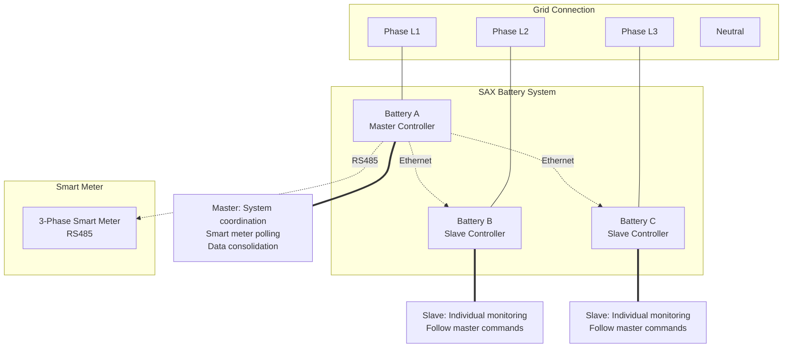
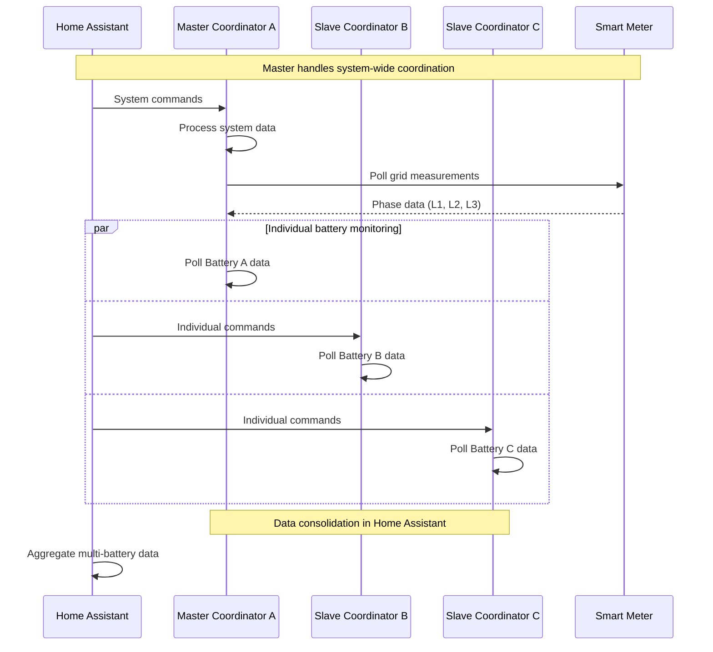

# Multi-Battery System Architecture

This document describes how the SAX Battery integration handles multiple batteries in a three-phase system configuration, including master/slave coordination, phase mapping, and data synchronization.

## 🔌 System Overview

The SAX Battery integration supports 1-3 batteries connected to different grid phases (L1, L2, L3) with a hierarchical coordination model where one battery acts as the master for system-wide coordination.

### Phase Mapping Strategy



## 🏗️ Master/Slave Architecture

### Role Definitions

| Role | Battery | Phase | Responsibilities |
|------|---------|-------|------------------|
| **Master** | Battery A | L1 | Smart meter polling, system coordination, data consolidation |
| **Slave** | Battery B | L2 | Individual monitoring, command execution |
| **Slave** | Battery C | L3 | Individual monitoring, command execution |

### Communication Hierarchy



## 🔧 Configuration Structure

### Battery Configuration Data

```python
@dataclass
class BatteryConfig:
    """Configuration for individual battery."""
    
    battery_id: str  # "battery_a", "battery_b", "battery_c"
    host: str        # IP address
    port: int        # Modbus TCP port (usually 502)
    phase: str       # "L1", "L2", "L3"
    is_master: bool  # True for master battery
    enabled: bool    # Battery enabled/disabled
    
# Config entry data structure
{
    "battery_count": 3,
    "master_battery": "battery_a", 
    "batteries": {
        "battery_a": {
            "host": "192.168.1.100",
            "port": 502,
            "phase": "L1", 
            "is_master": True,
            "enabled": True
        },
        "battery_b": {
            "host": "192.168.1.101", 
            "port": 502,
            "phase": "L2",
            "is_master": False,
            "enabled": True  
        },
        "battery_c": {
            "host": "192.168.1.102",
            "port": 502, 
            "phase": "L3",
            "is_master": False,
            "enabled": True
        }
    }
}
```

### Coordinator Creation Pattern

```python
async def async_setup_entry(hass: HomeAssistant, entry: SAXBatteryConfigEntry) -> bool:
    """Set up coordinators for each configured battery."""
    
    coordinators = {}
    
    # Create coordinator for each enabled battery
    for battery_id in BATTERY_IDS:
        if entry.data.get(CONF_BATTERIES, {}).get(battery_id, {}).get("enabled", False):
            
            # Create Modbus client
            battery_config = entry.data[CONF_BATTERIES][battery_id]
            modbus_api = ModbusAPI(
                host=battery_config["host"],
                port=battery_config["port"]
            )
            
            # Create coordinator with role-specific configuration
            coordinator = SAXBatteryCoordinator(
                hass=hass,
                modbus_api=modbus_api,
                config_entry=entry,
                battery_id=battery_id,
                is_master=battery_config.get("is_master", False)
            )
            
            coordinators[battery_id] = coordinator
            
    # Store coordinators in runtime data
    entry.runtime_data = coordinators
    
    # Perform initial data refresh
    for coordinator in coordinators.values():
        await coordinator.async_config_entry_first_refresh()
        
    # Set up platform entities
    await hass.config_entries.async_forward_entry_setups(entry, PLATFORMS)
    
    return True
```

## 📊 Data Synchronization

### Polling Strategy

Different coordinators have different polling intervals and responsibilities:

```python
class SAXBatteryCoordinator(DataUpdateCoordinator):
    """Battery coordinator with role-specific behavior."""
    
    def __init__(self, hass, modbus_api, config_entry, battery_id, is_master=False):
        # Role-specific update intervals
        if is_master:
            update_interval = timedelta(seconds=BATTERY_POLL_INTERVAL)  # 15 seconds
        else:
            update_interval = timedelta(seconds=BATTERY_POLL_SLAVE_INTERVAL)  # 30 seconds
            
        super().__init__(
            hass,
            logger=_LOGGER,
            name=f"{DOMAIN}_{battery_id}",
            update_interval=update_interval,
            config_entry=config_entry,
        )
        
        self.battery_id = battery_id
        self.is_master = is_master
        self.modbus_api = modbus_api
```

### Master Coordinator Responsibilities

```python
async def _async_update_data(self) -> dict[str, Any]:
    """Master coordinator polls both battery and smart meter data."""
    
    data = {}
    
    # 1. Poll battery-specific data
    battery_data = await self._poll_battery_data()
    data.update(battery_data)
    
    # 2. Poll smart meter data (master only)
    if self.is_master:
        smart_meter_data = await self._poll_smart_meter_data()
        data.update(smart_meter_data)
        
        # 3. Calculate system-wide aggregations
        data.update(await self._calculate_system_aggregates())
    
    return data

async def _poll_smart_meter_data(self) -> dict[str, Any]:
    """Poll smart meter data via RS485."""
    smart_meter_data = {}
    
    for item in MODBUS_BATTERY_SMARTMETER_ITEMS:
        try:
            value = await self.modbus_api.read_value(item)
            if value is not None:
                smart_meter_data[item.name] = value
        except ModbusException as err:
            _LOGGER.warning("Failed to read smart meter %s: %s", item.name, err)
            
    return smart_meter_data
```

### Slave Coordinator Behavior

```python
async def _async_update_data(self) -> dict[str, Any]:
    """Slave coordinator polls only battery-specific data."""
    
    # Only poll individual battery data (no smart meter access)
    return await self._poll_battery_data()

async def _poll_battery_data(self) -> dict[str, Any]:
    """Poll individual battery registers."""
    battery_data = {}
    
    for item in MODBUS_BATTERY_BMS_ITEMS:
        try:
            value = await self.modbus_api.read_value(item)
            if value is not None:
                battery_data[item.name] = value
        except ModbusException as err:
            _LOGGER.warning("Failed to read battery %s: %s", item.name, err)
            
    return battery_data
```

## 🏷️ Entity Scoping

### Per-Battery Entities

Each battery gets its own set of entities for monitoring and control:

```python
# Entity creation per battery
for battery_id, coordinator in entry.runtime_data.items():
    # Individual battery sensors
    entities.extend([
        SAXBatterySensor(coordinator, battery_id, SAX_SOC),
        SAXBatterySensor(coordinator, battery_id, SAX_TEMPERATURE),
        SAXBatterySensor(coordinator, battery_id, SAX_AC_POWER),
        # ... other battery-specific entities
    ])
    
    # Individual battery controls (if enabled)
    if entry.data.get(CONF_LIMIT_POWER):
        entities.extend([
            SAXBatteryModbusNumber(coordinator, battery_id, SAX_MAX_DISCHARGE),
            SAXBatteryModbusNumber(coordinator, battery_id, SAX_MAX_CHARGE),
        ])
```

### System-Wide Entities

Some entities exist once per integration for system-wide data:

```python
# Get master coordinator for system-wide entities
master_coordinator = None
for battery_id, coordinator in entry.runtime_data.items():
    if coordinator.is_master:
        master_coordinator = coordinator
        break

if master_coordinator:
    # System-wide calculated entities
    entities.extend([
        SAXBatteryCalculatedSensor(master_coordinator, SAX_COMBINED_SOC),
        SAXBatteryCalculatedSensor(master_coordinator, SAX_TOTAL_POWER),
        SAXBatteryCalculatedSensor(master_coordinator, SAX_TOTAL_ENERGY), 
    ])
    
    # System-wide control entities (if pilot enabled)
    if entry.data.get(CONF_PILOT_FROM_HA):
        entities.extend([
            SAXBatteryConfigNumber(master_coordinator, SAX_PILOT_POWER),
            SAXBatteryConfigNumber(master_coordinator, SAX_MIN_SOC),
            SAXBatterySwitch(master_coordinator, SOLAR_CHARGING_SWITCH),
            SAXBatterySwitch(master_coordinator, MANUAL_CONTROL_SWITCH),
        ])
```

### Unique ID Generation

```python
def get_unique_id_for_item(
    self,
    item: ModbusItem | SAXItem,
    battery_id: str | None = None,
) -> str | None:
    """Generate unique IDs based on scope."""
    
    if battery_id is not None:
        # Per-battery entity: battery_a_soc
        return f"{battery_id}_{item.name.removeprefix('sax_')}"
    else:
        # System-wide entity: sax_combined_soc
        if item.name.startswith("sax_"):
            return item.name
        else:
            return f"sax_{item.name}"
```

## 🔄 Data Aggregation

### Combined SOC Calculation

```python
async def _calculate_combined_soc(self) -> float | None:
    """Calculate weighted average SOC across all batteries."""
    
    total_weight = 0.0
    weighted_soc = 0.0
    
    # Get SOC from all coordinators
    for battery_id, coordinator in self.entry.runtime_data.items():
        if coordinator.data and SAX_SOC in coordinator.data:
            battery_soc = coordinator.data[SAX_SOC]
            battery_capacity = self._get_battery_capacity(battery_id)  # kWh
            
            weighted_soc += battery_soc * battery_capacity
            total_weight += battery_capacity
    
    if total_weight > 0:
        return weighted_soc / total_weight
    else:
        return None

@property 
def combined_soc(self) -> float | None:
    """System-wide SOC for protection logic."""
    return self.data.get(SAX_COMBINED_SOC)
```

### Total Power Calculation

```python
async def _calculate_total_power(self) -> float:
    """Sum power across all batteries."""
    
    total_power = 0.0
    
    for battery_id, coordinator in self.entry.runtime_data.items():
        if coordinator.data and SAX_AC_POWER in coordinator.data:
            battery_power = coordinator.data[SAX_AC_POWER]
            total_power += battery_power
            
    return total_power
```

## 🛡️ Protection Coordination

### SOC Constraint Management

The SOC Manager operates on the master coordinator and enforces system-wide constraints:

```python
class SOCManager:
    """System-wide SOC protection using master coordinator."""
    
    def __init__(self, coordinator: SAXBatteryCoordinator, min_soc: float):
        if not coordinator.is_master:
            raise ValueError("SOC Manager requires master coordinator")
            
        self.coordinator = coordinator
        self.min_soc = min_soc
        
    async def check_and_enforce_discharge_limit(self) -> bool:
        """Check system SOC and enforce discharge limits on ALL batteries."""
        
        # Use combined SOC for system-wide protection
        combined_soc = self.coordinator.data.get(SAX_COMBINED_SOC)
        if combined_soc is None:
            return False
            
        if combined_soc < self.min_soc:
            # Enforce discharge limit on ALL batteries
            for battery_id, coordinator in self.coordinator.entry.runtime_data.items():
                await self._enforce_battery_discharge_limit(coordinator, 0.0)
            return True
            
        return False
        
    async def _enforce_battery_discharge_limit(self, coordinator, limit_value):
        """Apply discharge limit to specific battery."""
        unique_id = coordinator.sax_data.get_unique_id_for_item(
            SAX_MAX_DISCHARGE,
            battery_id=coordinator.battery_id,
        )
        
        if unique_id:
            ent_reg = er.async_get(coordinator.hass)
            entity_id = ent_reg.async_get_entity_id("number", DOMAIN, unique_id)
            
            if entity_id:
                await coordinator.hass.services.async_call(
                    "number",
                    "set_value",
                    {"entity_id": entity_id, "value": limit_value},
                    blocking=True,
                )
```

### Power Manager Coordination

Power management operates through the master coordinator but affects all batteries:

```python
class PowerManager:
    """System-wide power management via master coordinator."""
    
    def __init__(self, coordinator: SAXBatteryCoordinator):
        if not coordinator.is_master:
            raise ValueError("Power Manager requires master coordinator") 
            
        self.master_coordinator = coordinator
        
    async def update_solar_charging(self) -> None:
        """Update solar charging based on grid sensor."""
        
        # Get grid power from smart meter (master only)
        grid_power = self.master_coordinator.data.get(SAX_GRID_POWER_TOTAL)
        if grid_power is None:
            return
            
        # Calculate desired battery power
        if grid_power > 0:  # Importing from grid
            battery_power = min(grid_power, self._max_charge_power)
        elif grid_power < 0:  # Exporting to grid  
            battery_power = max(grid_power, -self._max_discharge_power)
        else:
            battery_power = 0.0
            
        # Apply power setpoint to master battery
        await self._set_pilot_power(battery_power)
        
    async def _set_pilot_power(self, power: float) -> bool:
        """Set pilot power on master battery."""
        # Master battery coordinates with slaves via SAX internal communication
        unique_id = self.master_coordinator.sax_data.get_unique_id_for_item(SAX_NOMINAL_POWER)
        
        if unique_id:
            ent_reg = er.async_get(self.master_coordinator.hass)
            entity_id = ent_reg.async_get_entity_id("number", DOMAIN, unique_id)
            
            if entity_id:
                await self.master_coordinator.hass.services.async_call(
                    "number",
                    "set_value", 
                    {"entity_id": entity_id, "value": power},
                    blocking=True,
                )
                return True
                
        return False
```

## 📈 Performance Considerations

### Polling Optimization

```python
# Master coordinator polls more frequently
BATTERY_POLL_INTERVAL = 15  # Master: includes smart meter data
BATTERY_POLL_SLAVE_INTERVAL = 30  # Slaves: battery data only
```

### Connection Management

Each coordinator maintains its own Modbus connection to avoid interference:

```python
# Each battery gets independent connection
for battery_id in enabled_batteries:
    modbus_api = ModbusAPI(
        host=battery_config["host"], 
        port=battery_config["port"]
    )
    
    # Independent circuit breaker per battery
    circuit_breaker = CircuitBreaker(
        failure_threshold=5,
        cooldown_seconds=60
    )
```

### Error Isolation

Failures in one battery don't affect others:

```python
async def _async_update_data(self) -> dict[str, Any]:
    """Isolated error handling per coordinator."""
    
    try:
        return await self._poll_device_data()
    except ModbusException as err:
        # This coordinator fails independently
        raise UpdateFailed(f"Battery {self.battery_id} communication failed: {err}") from err
```

## 🔧 Configuration Templates

### Single Battery Configuration

```yaml
# Minimal configuration for single battery  
battery_count: 1
master_battery: "battery_a"
batteries:
  battery_a:
    host: "192.168.1.100"
    port: 502
    phase: "L1"
    is_master: true
    enabled: true
```

### Three-Battery Configuration  

```yaml
# Full three-phase configuration
battery_count: 3
master_battery: "battery_a"  
batteries:
  battery_a:
    host: "192.168.1.100"
    port: 502
    phase: "L1"  
    is_master: true
    enabled: true
  battery_b:
    host: "192.168.1.101"
    port: 502
    phase: "L2"
    is_master: false
    enabled: true
  battery_c:
    host: "192.168.1.102"
    port: 502 
    phase: "L3"
    is_master: false
    enabled: true
```

---

**Next**: [SOC Constraints](soc-constraints.md)  
**See Also**: [Components](components.md), [Power Management](power-management.md)
