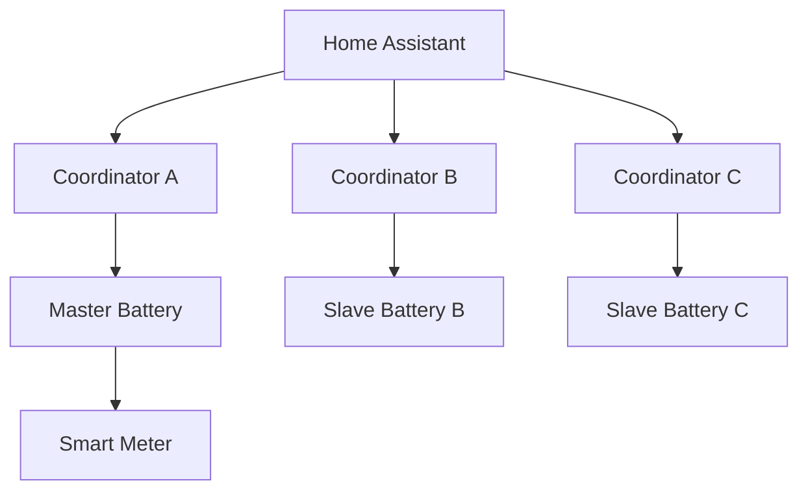

# Multi-Battery System

This integration supports one to three SAX batteries with master/slave topology.

## Topology

- Master battery: coordination anchor
- Slave batteries: per-battery telemetry/control coordinators
- Typical phase mapping: A->L1 (master), B->L2, C->L3

## Coordinator Model

- One coordinator per configured battery.
- Role-specific update interval:
  - master: 15s
  - slave: 30s

## SunSpec Scope Rules

- SunSpec data acquisition follows documented master-centric model.
- Smart meter data is modeled as optional block data in provider diagnostics.

## Aggregation and Cluster State

- Shared cluster entities are derived from coordinator/model utilities.
- SOC protection logic consumes combined SOC context and uses master coordinator enforcement path.

## Failure Isolation

- Circuit breaker and per-coordinator error tracking isolate failures.
- One battery communication issue does not require full integration shutdown.

## Setup Lifecycle

- Setup creates coordinators for enabled batteries.
- Runtime data stores coordinator map for cross-battery operations.
- Power manager starts on master coordinator when configured.

Last updated: 2026-08-08
