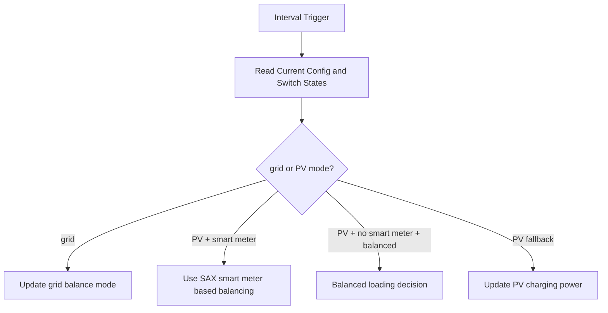

# Power Management

The current power management implementation is coordinator-centric and master-driven.

## Core Responsibilities

- Maintain runtime power mode state.
- Use coordinator writes for nominal power and control values.
- Integrate with smart meter availability and balanced loading options.
- Respect SOC protection constraints through surrounding number/control flows.

## Current Modes

- PV charging mode
- Grid charging mode

Mode state is tracked in `PowerManagerState` in [custom_components/sax_battery/power_manager.py](../../custom_components/sax_battery/power_manager.py).

## Runtime Update Loop

## Coordinator Integration

- Power manager uses the master coordinator.
- Update cadence follows coordinator interval by default.
- Writes are routed through coordinator methods to preserve queue ordering and Modbus safety.

## Operational Safeguards

- Mutual exclusion behavior between PV and grid charging flags.
- Configuration and entity state validation before control actions.
- Structured logging for mode transitions and control updates.

## Diagnostics

Power manager diagnostics are surfaced via integration diagnostics when the manager is enabled and running.

Last updated: 2026-08-08
