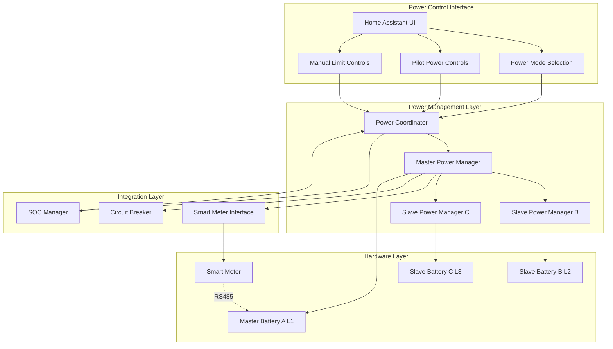
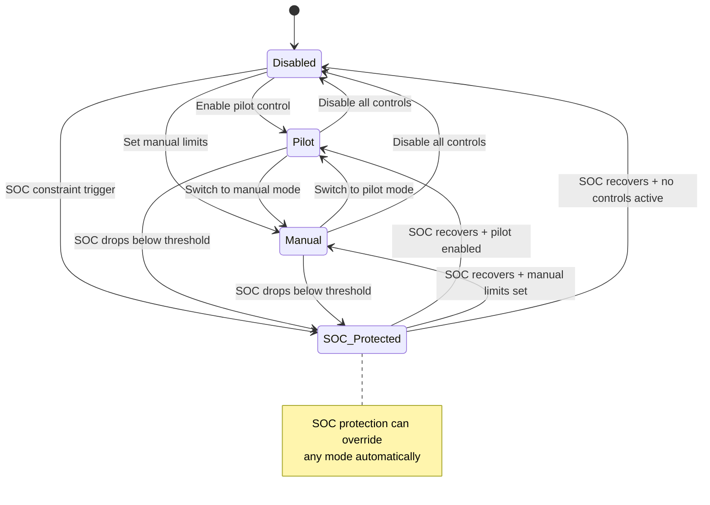

# ⚡ Power Management System

The SAX Battery Power Management system coordinates power control across multiple batteries, integrates with smart meter data, and enforces SOC protection constraints. It provides a unified interface for controlling battery charge/discharge operations while maintaining system safety and efficiency.

## 🏗️ Architecture Overview



## 🔧 Core Components

### Power Coordinator

The **Power Coordinator** acts as the central orchestrator for all power control operations, handling user requests and coordinating between SOC protection, power managers, and hardware constraints.

**Key Responsibilities:**

- Validate user power control requests
- Apply SOC protection constraints automatically
- Coordinate mode switching between pilot, manual, and protection modes
- Maintain system-wide power control state
- Provide unified status reporting

**Implementation Pattern:**

```python
class PowerCoordinator:
    def __init__(
        self,
        master_manager: MasterPowerManager,
        soc_manager: SOCManager,
    ) -> None:
        self.master_manager = master_manager
        self.soc_manager = soc_manager
        self._current_state = PowerState(mode=PowerControlMode.DISABLED)
        
    async def handle_user_power_request(
        self, control_type: str, **kwargs
    ) -> PowerState:
        """Process user power requests with automatic SOC protection."""
        
        # Apply SOC constraints before hardware operations
        if power_value := kwargs.get("power", kwargs.get("max_discharge")):
            constraint_result = await self.soc_manager.check_discharge_allowed(power_value)
            if not constraint_result.allowed:
                kwargs[constraint_field] = constraint_result.constrained_value
                
        # Execute power control operation
        return await self._execute_power_command(control_type, **kwargs)
```

### Master Power Manager

The **Master Power Manager** handles power control for the master battery (Phase L1) and coordinates power distribution across slave batteries (Phase L2/L3).

**Key Features:**

- **Smart meter integration** for optimal power distribution
- **Multi-battery coordination** with slave power managers
- **Phase load balancing** based on real-time grid data
- **Priority-based power allocation** when total capacity is limited
- **Automatic fallback** to equal distribution when smart meter data is unavailable

**Power Distribution Algorithm:**

```python
def _calculate_power_distribution(self, total_power: float) -> dict[str, float]:
    """Distribute power optimally across available phases."""
    
    # Get current phase loading from smart meter
    phase_loads = self.smart_meter.get_phase_loads()
    
    if phase_loads and sum(phase_loads.values()) > 0:
        # Intelligent distribution based on current grid load
        total_load = sum(phase_loads.values())
        return {
            phase: total_power * (load / total_load) 
            for phase, load in phase_loads.items()
            if load >= 0  # Phase is available
        }
    else:
        # Fallback: Equal distribution across available phases
        available_phases = self._get_available_phases()
        power_per_phase = total_power / len(available_phases)
        return {phase: power_per_phase if phase in available_phases else 0.0 
                for phase in ["L1", "L2", "L3"]}
```

### Slave Power Managers

**Slave Power Managers** handle power control for individual slave batteries while maintaining coordination with the master.

**Key Features:**

- **Independent operation capability** during master communication failures
- **Phase-specific power limits** based on hardware capabilities
- **Coordinated mode switching** with master battery
- **Local safety limits** as backup to system-wide protection

**Coordination Pattern:**

```python
class SlavePowerManager:
    async def set_pilot_power(self, power: float, factor: float = 100.0) -> bool:
        """Set pilot power for this specific battery."""
        
        try:
            # Apply local safety checks
            safe_power = self._apply_local_limits(power)
            
            # Write to hardware registers
            await self._write_pilot_registers(safe_power, factor)
            
            # Update local state cache
            self._current_limits.update({
                "nominal_power": safe_power,
                "nominal_factor": factor,
            })
            
            return True
            
        except (ModbusException, OSError, TimeoutError) as err:
            _LOGGER.error("%s failed to set pilot power: %s", self.phase, err)
            return False
```

### Smart Meter Integration

The **Smart Meter Interface** provides real-time grid data to optimize power distribution and prevent grid imbalance.

**Data Sources:**

- **Phase-specific power consumption** (L1, L2, L3)
- **Grid frequency** for synchronization
- **Total grid power** for system-wide optimization
- **Historical load patterns** for predictive distribution

**Integration Benefits:**

- **Optimal load balancing** across phases
- **Grid-aware power control** to prevent imbalance
- **Intelligent power distribution** based on real consumption
- **Graceful degradation** when smart meter data is unavailable

## ⚙️ Power Control Modes

### 1. Pilot Power Mode

**Purpose**: Centralized power control using nominal power settings with percentage factors.

**Use Cases:**

- **Solar excess charging**: Set positive power to charge batteries from solar surplus
- **Grid support discharge**: Set negative power to discharge batteries to grid
- **Load following**: Dynamic power adjustment based on consumption patterns

**Control Registers:**

- **Register 43**: `nominal_power` (W) - Base power setting
- **Register 44**: `nominal_factor` (%) - Scaling factor 0-100%

**Implementation Example:**

```python
# Set 2000W charging at 80% factor = 1600W effective charging
await power_coordinator.handle_user_power_request(
    "pilot_power",
    power=2000.0,
    factor=80.0
)

# Multi-battery distribution (3 batteries, smart meter based):
# L1 (Master): 640W (40% load share)
# L2 (Slave B): 640W (40% load share)  
# L3 (Slave C): 320W (20% load share)
```

### 2. Manual Limits Mode

**Purpose**: Direct specification of maximum charge/discharge power limits.

**Use Cases:**

- **Conservative operation**: Set specific power limits for extended battery life
- **Grid capacity constraints**: Limit power to stay within grid connection limits
- **Emergency operation**: Set minimal limits during system maintenance

**Control Registers:**

- **Register 41**: `max_discharge` (W) - Maximum discharge power limit
- **Register 42**: `max_charge` (W) - Maximum charge power limit

**Implementation Example:**

```python
# Set conservative limits for overnight operation
await power_coordinator.handle_user_power_request(
    "manual_limits",
    max_discharge=1000.0,  # Max 1kW discharge
    max_charge=2000.0,     # Max 2kW charge
)
```

### 3. SOC Protection Mode

**Purpose**: Automatic power constraint application when SOC drops below safe thresholds.

**Activation Triggers:**

- **SOC below user threshold** (default 10%)
- **Critical SOC emergency** (5% - not user configurable)
- **Combined SOC calculation** across all batteries in system

**Protection Actions:**

```python
# Automatic constraint application when SOC < 10%
if combined_soc < self.min_soc:
    # Automatically apply discharge constraints
    await self._apply_discharge_constraint(combined_soc)
    
    # Log protection activation
    _LOGGER.warning(
        "SOC protection activated: %.1f%% < %.1f%% - Limiting discharge", 
        combined_soc, self.min_soc
    )
    
    # Update user interface to show protection status
    self._current_state.soc_protection_active = True
```

## 🔄 Mode Switching and State Management

### Power Control State Machine



### State Persistence and Recovery

**State Storage:**

- **Current mode** retained across Home Assistant restarts
- **Write-only register values** cached locally for UI display
- **SOC protection status** tracked with event history
- **Power allocation history** for diagnostics

**Restart Recovery:**

```python
async def restore_power_state(self) -> None:
    """Restore power manager state after Home Assistant restart."""
    
    # Restore write-only register values from entity states
    await self._restore_cached_values()
    
    # Check current SOC and apply protection if necessary
    combined_soc = self.coordinator.data.get(SAX_COMBINED_SOC)
    if combined_soc and combined_soc < self.min_soc:
        await self._apply_discharge_constraint(combined_soc)
        
    # Update UI state to match hardware reality
    await self._synchronize_ui_state()
```

## 📊 Monitoring and Diagnostics

### Power System Health Metrics

**Key Performance Indicators:**

- **Power distribution efficiency**: How well power is balanced across phases
- **SOC protection activation frequency**: Number of automatic interventions
- **Smart meter data availability**: Percentage of time grid data is valid
- **Mode switching stability**: Frequency of unintended mode changes

**Diagnostic Data Collection:**

```python
class PowerManagerDiagnostics:
    def get_system_status(self) -> dict[str, Any]:
        return {
            "current_mode": self.coordinator.get_current_state().mode.value,
            "power_distribution": self.master_manager.get_power_allocation(),
            "smart_meter_status": {
                "data_age": self.smart_meter.get_data_age(),
                "phase_loads": self.smart_meter.get_phase_loads(),
                "grid_frequency": self.smart_meter.get_grid_frequency(),
            },
            "soc_protection": {
                "enabled": self.soc_manager.enabled,
                "constraint_active": self.soc_manager.is_constrained(),
                "recent_events": self.soc_manager.get_recent_events(),
            },
            "battery_status": {
                battery_id: {
                    "available": manager.is_available(),
                    "last_power_update": manager.get_last_update(),
                    "cached_values": manager.get_cached_values(),
                }
                for battery_id, manager in self.get_all_managers().items()
            }
        }
```

### Common Troubleshooting Scenarios

**Scenario 1: Power Distribution Imbalance**

```python
# Symptoms: Uneven power across batteries despite equal configuration
# Diagnosis: Check smart meter data availability
phase_loads = smart_meter.get_phase_loads()
if not phase_loads:
    _LOGGER.warning("Smart meter data unavailable - using equal distribution")
    
# Solution: Verify RS485 connection to smart meter, check data age
data_age = smart_meter.get_data_age()
if data_age > 300:  # 5 minutes
    _LOGGER.error("Smart meter data stale: %.1f seconds", data_age)
```

**Scenario 2: SOC Protection False Positives**

```python
# Symptoms: Unexpected power constraints when SOC appears adequate
# Diagnosis: Check individual battery SOC vs combined SOC
individual_socs = [
    coordinator.data.get(SAX_SOC)
    for coordinator in self.all_coordinators
    if coordinator.data
]
combined_soc = self.soc_manager.calculate_combined_soc(individual_socs)

# Solution: Identify battery with critically low SOC
for i, soc in enumerate(individual_socs):
    if soc and soc < self.soc_manager.critical_soc:
        _LOGGER.warning("Battery %d critically low: %.1f%%", i, soc)
```

**Scenario 3: Mode Switching Failures**

```python
# Symptoms: UI shows different mode than actual hardware state
# Diagnosis: Check write-only register cache synchronization
cached_values = self.power_manager.get_cached_values()
ui_state = self.get_ui_display_values()

if cached_values != ui_state:
    _LOGGER.error("UI state mismatch detected - resynchronizing")
    await self._synchronize_ui_state()
```

## 🛠️ Configuration and Tuning

### Power Manager Configuration Options

**User-Configurable Settings (Config Flow):**

```python
POWER_MANAGER_CONFIG = vol.Schema({
    vol.Optional("power_distribution_mode", default="automatic"): vol.In([
        "automatic",      # Smart meter based distribution
        "equal",         # Equal power per phase
        "manual",        # User-specified per phase
    ]),
    vol.Optional("smart_meter_timeout", default=60): vol.All(
        vol.Coerce(int), vol.Range(min=30, max=300)
    ),
    vol.Optional("phase_priority", default=["L1", "L2", "L3"]): [str],
})
```

**Advanced Configuration (options.json):**

```python
{
    "power_management": {
        "coordination_timeout": 10.0,        # seconds
        "retry_attempts": 3,
        "phase_imbalance_threshold": 0.2,    # 20% max imbalance
        "smart_meter_fallback_duration": 300, # 5 minutes
        "power_change_debounce": 2.0         # seconds
    }
}
```

### Performance Tuning

**Polling Optimization:**

- **Master battery**: 5-10 seconds (smart meter data)
- **Slave batteries**: 30 seconds (individual monitoring)
- **Power command execution**: Immediate (no batching)

**Memory Management:**

- **Power allocation cache**: Last 100 calculations
- **Smart meter data cache**: Last 24 hours (configurable)
- **Event history**: 1000 events (circular buffer)

**Network Optimization:**

```python
# Batch power commands for efficiency
async def apply_multi_battery_power(
    self, power_distribution: dict[str, float]
) -> dict[str, bool]:
    """Apply power settings to multiple batteries in parallel."""
    
    tasks = [
        self._apply_battery_power(battery_id, power)
        for battery_id, power in power_distribution.items()
    ]
    
    # Execute all commands in parallel for best performance
    results = await asyncio.gather(*tasks, return_exceptions=True)
    return {
        battery_id: isinstance(result, bool) and result
        for battery_id, result in zip(power_distribution.keys(), results)
    }
```

## 🔗 Integration with Other Components

### SOC Manager Integration

**Automatic Protection Application:**

```python
# Power Manager automatically consults SOC Manager before any power operation
constraint_result = await self.soc_manager.check_discharge_allowed(requested_power)

if not constraint_result.allowed:
    # Apply constraint automatically - user sees constrained value
    actual_power = constraint_result.constrained_value
    
    # Log the protection action for transparency
    _LOGGER.warning(
        "Power request constrained by SOC protection: %.1fW -> %.1fW (%s)",
        requested_power, actual_power, constraint_result.reason
    )
```

### Circuit Breaker Integration

**Fault Tolerance:**

```python
@circuit_breaker
async def set_battery_power(self, battery_id: str, power: float) -> bool:
    """Set battery power with circuit breaker protection."""
    try:
        return await self._direct_battery_power_write(battery_id, power)
    except (ModbusException, OSError, TimeoutError) as err:
        # Circuit breaker tracks failures and manages recovery
        raise PowerControlException(f"Battery {battery_id} power control failed: {err}") from err
```

### Entity Platform Integration

**Number Entity Coordination:**

```python
class SAXBatteryPowerNumber(CoordinatorEntity, NumberEntity):
    async def async_set_native_value(self, value: float) -> None:
        """Set power value through Power Manager coordination."""
        
        # Route through Power Coordinator for automatic protection
        result = await self.coordinator.power_coordinator.handle_user_power_request(
            self._control_type,
            **{self._value_key: value}
        )
        
        # Update entity state to reflect actual applied value (may be constrained)
        self._attr_native_value = getattr(result, self._value_key, value)
        self.async_write_ha_state()
```

## 🧪 Testing Strategies

### Unit Testing

**Power Distribution Logic:**

```python
async def test_smart_meter_power_distribution():
    """Test intelligent power distribution based on phase loads."""
    
    # Mock smart meter data with realistic phase loading
    mock_smart_meter.get_phase_loads.return_value = {
        "L1": 3000.0,  # 50% of total load
        "L2": 2000.0,  # 33% of total load
        "L3": 1000.0,  # 17% of total load
    }
    
    # Test 6000W distribution
    power_manager = MasterPowerManager(mock_coordinator, [])
    distribution = power_manager._calculate_power_distribution(6000.0)
    
    # Should distribute proportionally to load
    assert distribution["L1"] == 3000.0  # 50% of 6000W
    assert distribution["L2"] == 2000.0  # 33% of 6000W
    assert distribution["L3"] == 1000.0  # 17% of 6000W

async def test_soc_constraint_integration():
    """Test Power Manager respects SOC constraints."""
    
    power_coordinator = PowerCoordinator(power_manager, soc_manager)
    
    # Mock low SOC condition
    soc_manager.check_discharge_allowed.return_value = ConstraintResult(
        allowed=False, constrained_value=0.0, reason="soc_too_low"
    )
    
    # Request should be automatically constrained
    state = await power_coordinator.handle_user_power_request(
        "pilot_power", power=5000.0
    )
    
    assert state.pilot_power == 0.0  # Constrained to safe value
    assert state.soc_protection_active is True
```

### Integration Testing

**End-to-End Power Control:**

```python
async def test_complete_power_control_flow():
    """Test complete power control from UI to hardware."""
    
    # Set up multi-battery system
    hass = HomeAssistant()
    await setup_sax_battery_integration(hass, battery_count=3)
    
    # Test pilot power control
    await hass.services.async_call(
        "number", "set_value",
        {
            "entity_id": "number.sax_pilot_power",
            "value": 3000.0
        },
        blocking=True
    )
    
    # Verify power distribution across all batteries
    for battery_id in ["battery_a", "battery_b", "battery_c"]:
        power_entity = hass.states.get(f"number.{battery_id}_pilot_power")
        assert power_entity.state is not None
        assert float(power_entity.state) > 0  # Received some power allocation
        
    # Verify total power equals requested (minus any SOC constraints)
    total_allocated = sum(
        float(hass.states.get(f"number.{bid}_pilot_power").state)
        for bid in ["battery_a", "battery_b", "battery_c"]
    )
    assert abs(total_allocated - 3000.0) < 100.0  # Within tolerance
```

## 📈 Performance Considerations

### Scalability

**Multi-Battery Performance:**

- **Linear scaling**: Each additional battery adds minimal overhead
- **Parallel operations**: All battery commands executed concurrently
- **Efficient caching**: Shared smart meter data, per-battery power state

**Resource Usage:**

```python
# Memory usage per battery (typical)
MEMORY_PER_BATTERY = {
    "power_manager": "~2KB",      # State and cache
    "smart_meter_data": "~1KB",   # Shared across all batteries
    "event_history": "~5KB",      # Per 1000 events
    "diagnostic_data": "~3KB",    # Current status
}

# CPU usage (per operation)
CPU_USAGE = {
    "power_distribution_calc": "~1ms",     # Smart meter based
    "soc_constraint_check": "~0.5ms",     # Combined SOC calculation
    "modbus_write_operation": "~10ms",    # Network dependent
    "state_synchronization": "~2ms",      # UI update
}
```

### Optimization Opportunities

**Batch Operations:**

```python
# Instead of sequential writes
for battery_id, power in power_distribution.items():
    await set_battery_power(battery_id, power)  # ❌ Sequential

# Use parallel execution
await asyncio.gather(*[
    set_battery_power(battery_id, power)
    for battery_id, power in power_distribution.items()
])  # ✅ Parallel
```

**Smart Caching:**

```python
class SmartMeterCache:
    def __init__(self, cache_duration: int = 10):
        self._cache_duration = cache_duration
        self._cached_data = None
        self._cache_timestamp = None
    
    def get_phase_loads(self) -> dict[str, float] | None:
        # Return cached data if fresh enough
        if self._cached_data and self._is_cache_fresh():
            return self._cached_data
            
        # Fetch fresh data and cache it
        self._cached_data = self._fetch_fresh_data()
        self._cache_timestamp = datetime.now()
        return self._cached_data
```

## ➡️ Related Documentation

- [SOC Constraints](soc-constraints.md) - Battery protection integration
- [Multi-Battery System](multi-battery-system.md) - Master/slave coordination
- [Modbus Communication](modbus-communication.md) - Hardware interface layer
- [ADR-005: Power Management Architecture](decisions/005-power-management.md) - Architectural decisions

---

**Last Updated**: February 2026  
**Component Version**: v0.3.0+  
**Status**: ✅ Active and Maintained
