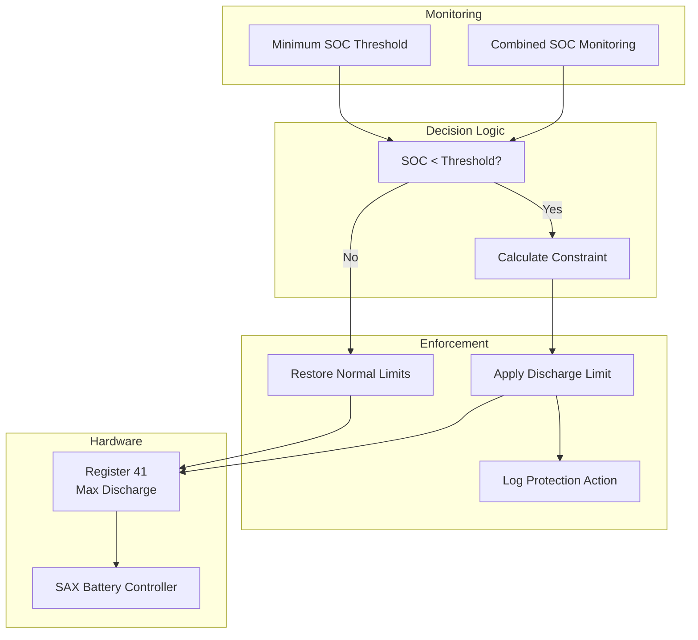
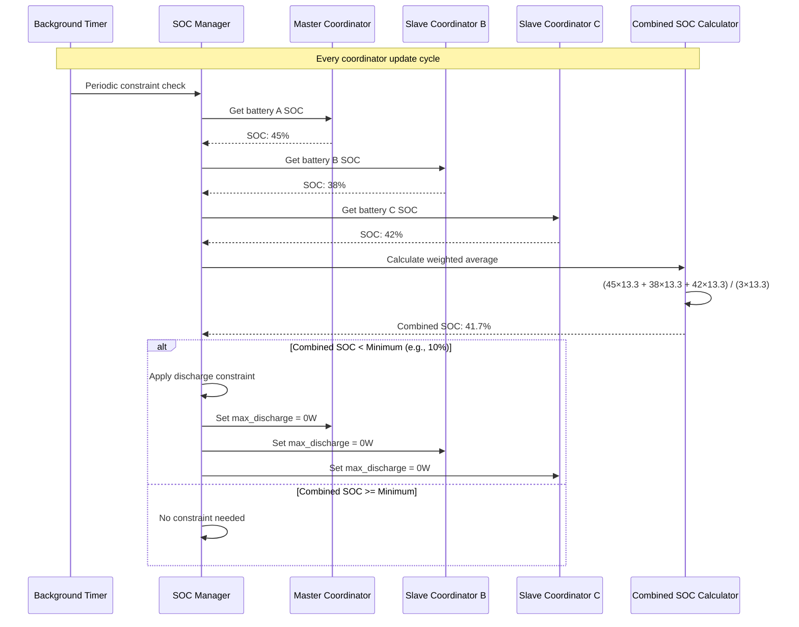

# SOC Constraints Architecture

This document describes the State of Charge (SOC) protection system that prevents battery damage by automatically limiting discharge power when battery levels are critically low.

## 🛡️ Overview

The SOC constraint system is a critical safety feature that protects SAX batteries from over-discharge, which can permanently damage lithium-ion battery cells. It operates automatically in the background, monitoring combined SOC levels and enforcing discharge limits when necessary.

### Protection Principle



## 🏗️ SOC Manager Architecture

### Core Components

```python
class SOCManager:
    """Manager for SOC-based battery protection constraints."""
    
    def __init__(
        self,
        coordinator: SAXBatteryCoordinator,
        min_soc: float,
        enabled: bool = True,
    ) -> None:
        """Initialize SOC manager with protection parameters."""
        
        # Validation: Only master coordinator can have SOC manager
        if not coordinator.is_master:
            raise ValueError("SOC Manager requires master coordinator")
            
        self.coordinator = coordinator
        self.min_soc = min_soc  # Minimum SOC threshold (%)
        self.enabled = enabled
        self._last_constraint_state = False
        self._constraint_applied_time = None
        
        _LOGGER.info("SOC Manager initialized: min_soc=%.1f%%, enabled=%s", 
                    min_soc, enabled)
```

### Protection Algorithm

```python
async def check_and_enforce_discharge_limit(self) -> bool:
    """Main protection algorithm - runs periodically."""
    
    if not self.enabled:
        return False
        
    # Step 1: Get current combined SOC
    combined_soc = self.coordinator.data.get(SAX_COMBINED_SOC)
    if combined_soc is None:
        _LOGGER.debug("Combined SOC not available for constraint check")
        return False
        
    # Step 2: Check if constraint should be applied
    should_constrain = combined_soc < self.min_soc
    
    if should_constrain and not self._last_constraint_state:
        # SOC dropped below threshold - apply constraint
        _LOGGER.warning(
            "SOC constraint triggered: %.1f%% < %.1f%% - Limiting discharge power",
            combined_soc, self.min_soc
        )
        
        success = await self._enforce_discharge_limit(0.0)  # Disable discharge
        if success:
            self._last_constraint_state = True
            self._constraint_applied_time = datetime.now()
            
        return success
        
    elif not should_constrain and self._last_constraint_state:
        # SOC recovered above threshold - remove constraint
        _LOGGER.info(
            "SOC constraint released: %.1f%% >= %.1f%% - Restoring normal limits",
            combined_soc, self.min_soc
        )
        
        # NOTE: We don't automatically restore user limits here
        # User must manually re-enable discharge power to prevent accidental battery abuse
        self._last_constraint_state = False
        
    return False  # No constraint enforcement needed
```

## 🔧 Constraint Enforcement

### Direct Hardware Control

The SOC Manager bypasses normal user controls and writes directly to the hardware register:

```python
async def _enforce_discharge_limit(self, limit_value: float) -> bool:
    """Directly enforce discharge limit on hardware."""
    
    try:
        # Get unique ID for master battery's max discharge entity
        unique_id = self.coordinator.sax_data.get_unique_id_for_item(
            SAX_MAX_DISCHARGE,
            battery_id=self.coordinator.battery_id,
        )
        
        if not unique_id:
            _LOGGER.error("Could not generate unique_id for SAX_MAX_DISCHARGE")
            return False
        
        # Look up entity ID in entity registry
        ent_reg = er.async_get(self.coordinator.hass)
        entity_id = ent_reg.async_get_entity_id("number", DOMAIN, unique_id)
        
        if not entity_id:
            _LOGGER.error("Max discharge entity not found: unique_id=%s", unique_id)
            return False
        
        # Set value via Home Assistant service call
        await self.coordinator.hass.services.async_call(
            "number",
            "set_value",
            {
                "entity_id": entity_id,
                "value": limit_value,
            },
            blocking=True,
        )
        
        _LOGGER.debug("SOC constraint applied: %s = %.1fW", entity_id, limit_value)
        return True
        
    except Exception as err:
        _LOGGER.error("Failed to enforce SOC constraint: %s", err)
        return False
```

### Multi-Battery Protection

For multi-battery systems, SOC protection applies to ALL batteries:

```python
async def _enforce_system_wide_constraint(self, limit_value: float) -> bool:
    """Apply discharge constraints to all batteries in the system."""
    
    success_count = 0
    total_batteries = 0
    
    # Apply constraint to all configured batteries
    for battery_id, coordinator in self.coordinator.config_entry.runtime_data.items():
        total_batteries += 1
        
        try:
            unique_id = coordinator.sax_data.get_unique_id_for_item(
                SAX_MAX_DISCHARGE,
                battery_id=coordinator.battery_id,
            )
            
            if unique_id:
                ent_reg = er.async_get(coordinator.hass)
                entity_id = ent_reg.async_get_entity_id("number", DOMAIN, unique_id)
                
                if entity_id:
                    await coordinator.hass.services.async_call(
                        "number",
                        "set_value",
                        {"entity_id": entity_id, "value": limit_value},
                        blocking=True,
                    )
                    success_count += 1
                    _LOGGER.debug("Applied SOC constraint to %s: %.1fW", 
                                entity_id, limit_value)
                    
        except Exception as err:
            _LOGGER.error("Failed to apply constraint to battery %s: %s", 
                        battery_id, err)
    
    if success_count == total_batteries:
        _LOGGER.info("SOC constraint applied to all %d batteries", total_batteries)
        return True
    else:
        _LOGGER.warning("SOC constraint applied to %d/%d batteries", 
                       success_count, total_batteries)
        return success_count > 0  # Partial success
```

## 📊 Combined SOC Calculation

### Weighted Average Algorithm

The combined SOC uses a capacity-weighted average for accurate system protection:

```python
async def _calculate_combined_soc(self) -> float | None:
    """Calculate combined SOC across all batteries."""
    
    total_capacity = 0.0
    weighted_soc_sum = 0.0
    
    for battery_id, coordinator in self.coordinator.config_entry.runtime_data.items():
        if not coordinator.data or SAX_SOC not in coordinator.data:
            continue
            
        battery_soc = coordinator.data[SAX_SOC]
        battery_capacity = self._get_battery_capacity(battery_id)
        
        if battery_soc is not None and battery_capacity > 0:
            weighted_soc_sum += battery_soc * battery_capacity
            total_capacity += battery_capacity
    
    if total_capacity > 0:
        combined_soc = weighted_soc_sum / total_capacity
        _LOGGER.debug("Combined SOC calculated: %.1f%%", combined_soc)
        return combined_soc
    else:
        _LOGGER.warning("Cannot calculate combined SOC: no valid battery data")
        return None

def _get_battery_capacity(self, battery_id: str) -> float:
    """Get battery capacity for weighted SOC calculation."""
    
    # SAX batteries come in different capacity configurations
    capacity_map = {
        "battery_a": 13.3,  # kWh - example values
        "battery_b": 13.3,  # kWh
        "battery_c": 13.3,  # kWh
    }
    
    return capacity_map.get(battery_id, 13.3)  # Default capacity
```

### SOC Data Flow



## ⚠️ User Interaction Patterns

### Constraint Validation During User Actions

When users change power settings, constraints are checked in real-time:

```python
class SAXBatteryModbusNumber(NumberEntity):
    """Number entity with SOC constraint integration."""
    
    async def async_set_native_value(self, value: float) -> None:
        """Set value with SOC constraint checking."""
        
        # Input validation first
        if not self._validate_input_range(value):
            raise HomeAssistantError(f"Value {value} out of valid range")
        
        # SOC constraint checking (discharge-related registers only)
        if (
            hasattr(self.coordinator, "soc_manager")
            and self.coordinator.soc_manager is not None
            and self._modbus_item.name in [SAX_NOMINAL_POWER, SAX_MAX_DISCHARGE]
        ):
            constraint_result = await self.coordinator.soc_manager.check_discharge_allowed(value)
            
            if not constraint_result.allowed:
                # Apply constraint silently
                _LOGGER.warning(
                    "%s: Power constrained by SOC: %.1fW -> %.1fW (%s)",
                    self.entity_id,
                    value,
                    constraint_result.constrained_value,
                    constraint_result.reason,
                )
                value = constraint_result.constrained_value
        
        # Write constrained value to hardware
        await self.coordinator.async_write_number_value(self._modbus_item, value)
        self._local_value = value
        self.async_write_ha_state()

@dataclass
class ConstraintResult:
    """Result of constraint checking."""
    
    allowed: bool
    constrained_value: float
    reason: str
    
async def check_discharge_allowed(self, requested_power: float) -> ConstraintResult:
    """Check if discharge power is allowed given current SOC."""
    
    if not self.enabled:
        return ConstraintResult(allowed=True, constrained_value=requested_power, reason="disabled")
    
    combined_soc = self.coordinator.data.get(SAX_COMBINED_SOC)
    if combined_soc is None:
        return ConstraintResult(allowed=True, constrained_value=requested_power, reason="no_soc_data")
    
    if combined_soc < self.min_soc and requested_power > 0:
        # Discharge power not allowed when SOC is too low
        return ConstraintResult(
            allowed=False,
            constrained_value=0.0,
            reason=f"SOC too low: {combined_soc:.1f}% < {self.min_soc:.1f}%"
        )
    
    return ConstraintResult(allowed=True, constrained_value=requested_power, reason="ok")
```

## 🔧 Configuration and Tuning

### SOC Thresholds

Different SOC thresholds for different protection levels:

```python
class SOCManager:
    """SOC Manager with configurable thresholds."""
    
    def __init__(self, coordinator, config):
        # User-configurable minimum SOC
        self.min_soc = config.get("min_soc", DEFAULT_MIN_SOC)  # Default: 10%
        
        # Hard safety limits (not user-configurable)
        self.critical_soc = 5.0     # Emergency shutdown level
        self.warning_soc = 15.0     # Warning threshold
        
        # Hysteresis to prevent oscillation
        self.hysteresis = 2.0       # SOC must rise 2% above threshold to release
        
    async def _check_constraint_with_hysteresis(self, current_soc: float) -> bool:
        """Apply constraint with hysteresis to prevent oscillation."""
        
        if self._last_constraint_state:
            # Currently constrained - use higher threshold to release
            release_threshold = self.min_soc + self.hysteresis
            return current_soc < release_threshold
        else:
            # Not constrained - use normal threshold to apply
            return current_soc < self.min_soc
```

### Configuration Options

```python
# Config entry options for SOC protection
SOC_CONFIG_SCHEMA = vol.Schema({
    vol.Optional(CONF_MIN_SOC, default=DEFAULT_MIN_SOC): vol.All(
        vol.Coerce(float), vol.Range(min=5.0, max=50.0)
    ),
    vol.Optional("soc_protection_enabled", default=True): cv.boolean,
    vol.Optional("soc_hysteresis", default=2.0): vol.All(
        vol.Coerce(float), vol.Range(min=0.5, max=10.0)
    ),
})
```

## 📈 Monitoring and Diagnostics

### SOC Protection Status

```python
@property
def protection_status(self) -> dict[str, Any]:
    """Get current protection status for diagnostics."""
    
    combined_soc = self.coordinator.data.get(SAX_COMBINED_SOC)
    
    return {
        "enabled": self.enabled,
        "min_soc_threshold": self.min_soc,
        "current_combined_soc": combined_soc,
        "constraint_active": self._last_constraint_state,
        "constraint_applied_time": (
            self._constraint_applied_time.isoformat() 
            if self._constraint_applied_time 
            else None
        ),
        "soc_above_threshold": (
            combined_soc >= self.min_soc 
            if combined_soc is not None 
            else None
        ),
        "protection_margin": (
            combined_soc - self.min_soc 
            if combined_soc is not None 
            else None
        ),
    }
```

### Event Logging

```python
class SOCManager:
    """SOC Manager with comprehensive event logging."""
    
    def __init__(self, coordinator, min_soc, enabled=True):
        # ... initialization ...
        self._event_history = deque(maxlen=100)  # Keep last 100 events
        
    def _log_protection_event(self, event_type: str, details: dict[str, Any]) -> None:
        """Log protection events for diagnostics."""
        
        event = {
            "timestamp": datetime.now().isoformat(),
            "type": event_type,
            "combined_soc": self.coordinator.data.get(SAX_COMBINED_SOC),
            "min_soc_threshold": self.min_soc,
            "details": details,
        }
        
        self._event_history.append(event)
        
        # Log to Home Assistant based on severity
        if event_type == "constraint_applied":
            _LOGGER.warning("SOC protection activated: %s", details)
        elif event_type == "constraint_released":
            _LOGGER.info("SOC protection released: %s", details)
        else:  
            _LOGGER.debug("SOC protection event: %s - %s", event_type, details)
```

## 🚨 Emergency Protection

### Critical SOC Handling

```python
async def _check_critical_soc(self, combined_soc: float) -> None:
    """Handle critically low SOC situations."""
    
    if combined_soc <= self.critical_soc:
        # Emergency situation - disable ALL power operations
        _LOGGER.critical(
            "CRITICAL SOC: %.1f%% <= %.1f%% - Emergency battery protection activated",
            combined_soc, self.critical_soc
        )
        
        # Disable both charge AND discharge to protect battery
        await self._emergency_power_shutdown()
        
        # Send persistent notification to user
        await self._send_critical_soc_notification(combined_soc)

async def _emergency_power_shutdown(self) -> None:
    """Emergency shutdown of all power operations."""
    
    tasks = []
    for battery_id, coordinator in self.coordinator.config_entry.runtime_data.items():
        # Disable discharge
        tasks.append(self._set_battery_limit(coordinator, SAX_MAX_DISCHARGE, 0.0))
        # Disable charge  
        tasks.append(self._set_battery_limit(coordinator, SAX_MAX_CHARGE, 0.0))
        # Stop pilot control
        tasks.append(self._set_battery_limit(coordinator, SAX_NOMINAL_POWER, 0.0))
    
    await asyncio.gather(*tasks, return_exceptions=True)
```

---

**Next**: [Power Management](power-management.md)  
**See Also**: [Multi-Battery System](multi-battery-system.md), [SOC Manager ADR](decisions/004-soc-protection.md)
