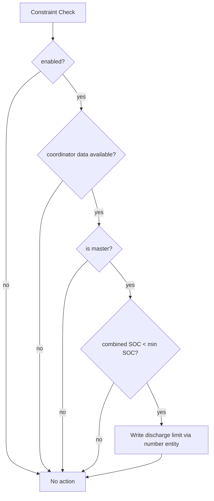

# SOC Constraints

SOC protection prevents unsafe discharge behavior when combined SOC drops below configured minimum.

## Current Enforcement Model

- Managed by `SOCManager` on the coordinator side.
- Enforced through master coordinator context.
- Uses entity-registry lookup for max discharge control target.
- Triggered by runtime checks in coordinator update flow and write validation paths.

## Guarded Enforcement Flow

## Behavior Notes

- Enforcement is designed to be safety-first.
- Constraint checks run without requiring user interaction.
- Detailed outcomes are logged and available in diagnostics paths.

## Integration Points

- [custom_components/sax_battery/coordinator.py](../../custom_components/sax_battery/coordinator.py)
- [custom_components/sax_battery/soc_manager.py](../../custom_components/sax_battery/soc_manager.py)
- [custom_components/sax_battery/number.py](../../custom_components/sax_battery/number.py)

Last updated: 2026-08-08
