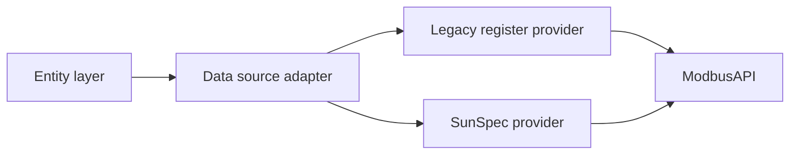

# SAX SunSpec firmware support plan

## Goal

Add support for new SAX firmware that exposes SunSpec mode while keeping compatibility with the current Modbus implementation.

This plan covers:

1. SunSpec integration architecture (modbus -> sunspec -> entities)
2. Real environment verification
3. Startup firmware/protocol detection
4. Latest SunSpec firmware functionality for client-id 100

## Source documents

- documentation/sax-power-manuals/Modbus_current_implementation.pdf
- documentation/sax-power-manuals/Modbus_SunSpec_Dokumentation.pdf
- documentation/SAX-modbus-protocol.md
- documentation/pymodbus-sunspec-example.md (historical pattern reference only)

## Current baseline in this repository

- Current implementation is direct Modbus register access through ModbusAPI and ModbusItem.
- Coordinator and entities are designed around fixed register maps.
- No dedicated SunSpec model parser layer is currently present.

## Protocol facts to use in implementation

- Legacy/basic mode control path used by current integration is Unit-ID 64.
- Older extended mode documentation exposes SunSpec-related values on Unit-ID 40.
- New SunSpec mode documentation defines Slave-ID 100 and a SunSpec map starting at 40000.
- New SunSpec mode availability starts at firmware combination Master V61 and Gateway V54.
- New SunSpec document states a recommended query rate of max every 500 ms.
- New SunSpec document warns about temporary interface unavailability (1-3 s) during E-Paper refresh cycles.
- New SunSpec document recommends reading only the master storage (A) in multi-storage systems.

### SunSpec map highlights from new firmware manual

- 40000..40001: SunSpec ID (Well-Known values 21365 / 28243)
- 40002..40003: Model 1 (Common), length 15
- 40015..40016: Model 103 (3-phase inverter), length 32
- 40047..40048: Model 123 (Immediate Controls), length 7
- 40054..40055: Model 203 (3-phase meter), length 41

### Model 123 behavior to preserve

- 40049: Percent power setpoint (int16, R/W)
- 40050: Setpoint timeout (seconds, R/W, capped at 300)
- 40051: Control mode (0 = Smart Meter, 1 = Setpoint)
- 40052: Setpoint scaling factor (sunssf, documented as -2)
- 40053: Reference value for 100% power

## Target architecture

Introduce an adapter layer so entities are not coupled directly to one protocol map.

### New components

- custom_components/sax_battery/protocol_mode.py
  - ProtocolMode enum: LEGACY, SUNSPEC
- custom_components/sax_battery/protocol_detector.py
  - Startup detection logic for protocol and firmware capabilities
- custom_components/sax_battery/sunspec_client.py
  - SunSpec read helpers, block scanning, scaling conversion
- custom_components/sax_battery/sunspec_map.py
  - Mapping SunSpec model points to integration keys
- custom_components/sax_battery/data_provider.py
  - Unified provider interface used by coordinator

### Existing files to update

- custom_components/sax_battery/coordinator.py
  - Replace direct register assumptions with provider calls
- custom_components/sax_battery/modbusobject.py
  - Keep transport and generic read/write responsibility only
- custom_components/sax_battery/models.py
  - Store per-battery runtime protocol capability
- custom_components/sax_battery/const.py
  - Add protocol and capability constants
- tests/
  - Add detection/provider/mapping tests and compatibility tests

## Milestone 1: Introduce SunSpec for current firmware line

### Scope

- Add SunSpec provider without removing existing legacy register path.
- Keep all existing entity IDs and user-facing behavior stable.

### Tasks

1. Define a provider interface for coordinator reads:
   - get_realtime_values
   - get_smart_meter_values
   - set_power_limits
   - set_nominal_power
2. Implement LegacyProvider as thin wrapper around existing item/register reads.
3. Implement SunSpecProvider:
   - Read SunSpec points
   - Apply sunssf scaling centrally
   - Convert results into existing entity keys
4. Add capability flags:
   - supports_sunspec
   - supports_immediate_controls
   - supports_client_id_100
5. Add feature flag for staged rollout:
   - enable_sunspec_auto_detect (default: true)
   - force_protocol_mode optional override for debugging

### Acceptance criteria

- Existing installations on legacy firmware continue to work without config changes.
- New firmware installations can read mapped SunSpec values.
- No entity ID churn.

## Milestone 2: Verify in real environment

### Test matrix

- Firmware without SunSpec support
- Firmware with SunSpec support
- Single battery setup
- Multi-battery setup (master/slave)
- Smart meter connected and disconnected

### Validation checklist

1. Setup and startup detection completes without manual intervention.
2. SOC and power sensors update with expected refresh intervals.
3. Write operations (charge/discharge limits, nominal power/factor) behave correctly.
4. Constraint logic from soc_manager remains effective in both modes.
5. Recovery behavior after reboot/network loss remains stable.

### Data collection during field validation

- Enable debug logs only for sax_battery and pymodbus.
- Capture raw register snapshots and mapped entity states.
- Compare legacy and SunSpec values over identical intervals.
- Record anomalies in a dedicated field-test markdown log.

## Milestone 3: Startup detection for firmware/protocol mode

### Detection algorithm

1. Connect using existing Modbus transport.
2. Probe SunSpec mode first on Unit-ID 100:

- Read 40000..40003
- Validate SunSpec ID and expected Common model metadata

3. If Unit-ID 100 probe is valid:
   - Select ProtocolMode.SUNSPEC
   - Load SunSpec provider
2. If Unit-ID 100 probe fails, probe legacy-compatible extended map on Unit-ID 40:

- Read 40071..40072 (or internal 70..71)
- Validate SunSpec marker/length values

5. If Unit-ID 40 probe is valid:

- Select ProtocolMode.SUNSPEC
- Load SunSpec provider in compatibility map mode

6. If SunSpec probes fail:

- Select ProtocolMode.LEGACY
- Load legacy provider (Unit-ID 64 path)

7. Persist detected mode and detected_slave_id in runtime data and diagnostics.

### Failure policy

- Never hard-fail setup only because SunSpec probing fails.
- Fall back to legacy mode and log one structured warning.
- Re-probe only on restart or explicit reload to avoid unnecessary startup latency.
- Use bounded probe timeouts and retry with jitter because SunSpec mode can be briefly unavailable during display refresh windows.

### Implementation detail

- Keep detector isolated from entity platform code.
- Unit-test detector with mocked Modbus responses for:
  - valid SunSpec
  - invalid signature
  - timeout/network error
  - partial responses

## Milestone 4: Add latest SunSpec firmware functionality (client-id 100)

### Scope policy

Implement only what is explicitly documented for the new firmware and guarded by capability checks.

### Work packages

1. Implement client-id 100 as Unit-ID 100 protocol mode (per new manual) with model-based parsing:

- Model 1: common device metadata and firmware versions
- Model 103: storage-electronics values
- Model 123: immediate controls
- Model 203: smart meter values (ADW200 dependent)

2. Add a dedicated capability flag in detector/provider.
2. Implement mapped entities/services for client-id 100 functionality.
3. Add integration tests with representative mock payloads.
4. Add diagnostics output to show capability active/inactive state.

### Compatibility rule

- If client-id 100 capability is unavailable, entities depending on it must remain unavailable or disabled, without breaking setup.
- If Model 203 is unavailable (no ADW200), smart meter entities sourced from Model 203 must remain unavailable without degrading core battery entities.

## Testing strategy

### Unit tests

- protocol_detector: mode selection and fallback behavior
- sunspec_client: parsing and scaling behavior
- data_provider: mode-independent contract for coordinator

### Integration tests

- Coordinator update loop in legacy mode
- Coordinator update loop in SunSpec mode
- Write path behavior with SOC constraints in both modes
- Startup detection path and diagnostics exposure

### Regression protection

- Keep existing test suite green
- Add new fixtures in tests/conftest.py for SunSpec payloads
- Add snapshots for diagnostics and selected entity state sets

## Rollout plan

1. Phase A: Merge architecture scaffolding + detector + no-op SunSpec provider.
2. Phase B: Enable SunSpec read mapping for core sensors.
3. Phase C: Enable write/control parity where supported.
4. Phase D: Enable client-id 100 functionality.
5. Phase E: Real-site validation signoff and release.

## Risks and mitigations

- Risk: Divergent behavior across firmware revisions
  - Mitigation: Capability-based behavior, not version-string assumptions
- Risk: Scaling mistakes on sunssf values
  - Mitigation: Centralized scaling conversion with focused unit tests
- Risk: Startup delays from probing
  - Mitigation: Bounded probe timeout and single probe path
- Risk: Breaking existing users
  - Mitigation: Legacy fallback and stable entity IDs

## Definition of done

- All four milestones implemented and validated.
- Legacy firmware users unaffected.
- New SunSpec firmware users receive full supported functionality.
- Client-id 100 feature set is capability-gated and tested.
- Documentation and diagnostics clearly indicate active protocol mode and capabilities.
