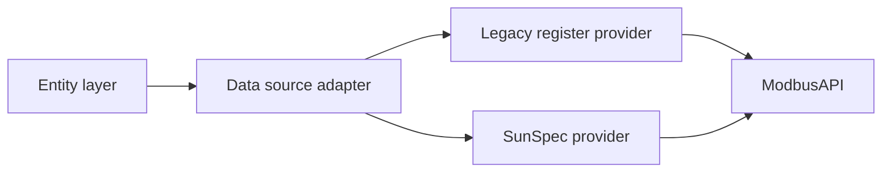

# SAX SunSpec firmware support plan

## Goal

Add support for new SAX firmware that exposes SunSpec mode while keeping compatibility with the current Modbus implementation.

This plan covers:

1. SunSpec integration architecture (modbus -> sunspec -> entities)
2. Real environment verification
3. Startup firmware/protocol detection
4. Latest SunSpec firmware functionality for client-id 100

## Source documents

- documentation/sax-power-manuals/Modbus_current_implementation.pdf
- documentation/sax-power-manuals/Modbus_SunSpec_Dokumentation.pdf
- documentation/SAX-modbus-protocol.md
- documentation/pymodbus-sunspec-example.md (historical pattern reference only)

## Current baseline in this repository

- Current implementation is direct Modbus register access through ModbusAPI and ModbusItem.
- Coordinator and entities are designed around fixed register maps.
- No dedicated SunSpec model parser layer is currently present.

## Protocol facts to use in implementation

- Legacy/basic mode control path used by current integration is Unit-ID 64.
- Older extended mode documentation exposes SunSpec-related values on Unit-ID 40.
- New SunSpec mode documentation defines Slave-ID 100 and a SunSpec map starting at 40000.
- New SunSpec mode availability starts at firmware combination Master V61 and Gateway V54.
- New SunSpec document states a recommended query rate of max every 500 ms.
- New SunSpec document warns about temporary interface unavailability (1-3 s) during E-Paper refresh cycles.
- New SunSpec document recommends reading only the master storage (A) in multi-storage systems.

### SunSpec map highlights from new firmware manual

- 40000..40001: SunSpec ID (Well-Known values 21365 / 28243)
- 40002..40003: Model 1 (Common), length 15
- 40015..40016: Model 103 (3-phase inverter), length 32
- 40047..40048: Model 123 (Immediate Controls), length 7
- 40054..40055: Model 203 (3-phase meter), length 41

### Register block access policy for SunSpec mode

SunSpec mode should prefer block reads over per-entity register reads. The coordinator reads defined register blocks and then populates entities from the in-memory block payload. This reduces Modbus traffic, avoids fragmented reads across refresh cycles, and improves stability during temporary interface stalls.

| Register block | Name | Usage | Frequency |
| --- | --- | --- | --- |
| 40000-40014 | Device metadata | Populate device info and protocol metadata | On startup and reload |
| 40015-40046 | Battery sensor data | Populate battery sensor entities with actual values | `BATTERY_POLL_INTERVAL` |
| 40047-40053 | Battery controls | Populate writable setpoints and control-state entities | On demand after write, otherwise `LIMIT_REFRESH_INTERVAL`; may also be read with `BATTERY_POLL_INTERVAL` for UI refresh |
| 40054-40094 | Smart meter data | Populate smart meter entities with actual values | `BATTERY_POLL_SLAVE_INTERVAL` |
| 40095-40114 | Battery states | Populate battery state and status entities | `BATTERY_POLL_INTERVAL` |

#### Behavioral rules

- This block-read policy applies only to `ProtocolMode.SUNSPEC`.
- Entities must not trigger direct per-register reads in SunSpec mode.
- Coordinator caches the most recent block payload and exposes entity values from that cached data.
- Writable registers are updated on demand. The write path must refresh block `40047-40053` immediately after a successful write so the UI reflects the confirmed setpoint state.
- Periodic refresh of block `40047-40053` remains necessary even without writes so cached setpoints stay synchronized after restarts, external changes, or device-side constraint handling.
- Multi-battery systems still read SunSpec data only from the master storage documented for SunSpec mode.

#### Implementation steps proposal

1. Define block metadata in `sunspec_map.py`

- Create one canonical definition per documented block with start address, end address, semantic name, polling cadence, and optional/required status.
- Keep this as the single source of truth so provider code, diagnostics, and tests all reference the same block inventory.

1. Add block-read primitives in `sunspec_client.py`

- Implement a helper that reads a contiguous register range for Unit-ID 100 and returns the raw register list plus read timestamp.
- Add bounded retry handling for temporary SunSpec stalls and keep failures scoped to the block being read.

1. Add block decoders in `sunspec_client.py`

- Decode each documented block into a structured payload rather than directly into Home Assistant entity state.
- Resolve `sunssf` scaling during decoding so later layers consume normalized engineering values.
- Keep `40047-40053` decoding aware of writable control semantics and Model 123 constraints.

1. Introduce a SunSpec block cache in `data_provider.py`

- Store the most recent successful payload and timestamp per block.
- Expose read access by logical block name, not by individual register.
- Mark optional blocks such as `40054-40094` unavailable without invalidating the required battery blocks.

1. Refactor the SunSpec provider contract around block groups

- `get_startup_metadata()` should source only `40000-40014`.
- `get_battery_sensor_values()` should source `40015-40046`.
- `get_control_values()` should source `40047-40053`.
- `get_smart_meter_values()` should source `40054-40094`.
- `get_battery_state_values()` should source `40095-40114`.
- Each method should map decoded block payloads into the existing stable entity keys.

1. Update coordinator scheduling for SunSpec mode

- Read `40000-40014` during setup, reload, and protocol reinitialization only.
- Read `40015-40046` and `40095-40114` on `BATTERY_POLL_INTERVAL`.
- Read `40054-40094` on `BATTERY_POLL_SLAVE_INTERVAL`.
- Read `40047-40053` on `LIMIT_REFRESH_INTERVAL`, and also allow a targeted refresh path immediately after successful writes.
- Keep legacy coordinator flow unchanged when protocol mode is not SunSpec.

1. Change entity population to provider-backed cached values

- Ensure entities in SunSpec mode only consume normalized values from the provider result assembled from cached block payloads.
- Remove or bypass any remaining per-entity SunSpec register access path in coordinator or entity classes.

1. Implement on-demand write and immediate control-block refresh

- Keep write operations targeted to the writable Model 123 registers only.
- After each successful write, synchronously refresh `40047-40053` and update the cache before returning control to the entity service path.
- If the write succeeds but the refresh fails, keep the last known value and surface the refresh failure in logs/diagnostics rather than inventing a confirmed state.

1. Add diagnostics for block health

- Report last successful refresh timestamp, last error, and availability state per SunSpec block.
- Make it obvious when the smart meter block is missing versus when the whole SunSpec session is degraded.

 1. Add tests in implementation order

- Unit-test block definitions and address ranges.
- Unit-test block reads and decode/scaling behavior for each documented block.
- Unit-test provider cache behavior, especially partial failures and optional block absence.
- Integration-test coordinator cadence, cache-backed entity updates, and on-demand refresh of `40047-40053` after writes.

 1. Roll out behind the existing SunSpec mode path first

- Keep legacy mode untouched.
- Land the block reader and cache before removing any residual per-entity SunSpec reads so behavior remains easy to compare during review.

### Model 123 behavior to preserve

- 40049: Percent power setpoint (int16, R/W)
- 40050: Setpoint timeout (seconds, R/W, capped at 300)
- 40051: Control mode (0 = Smart Meter, 1 = Setpoint)
- 40052: Setpoint scaling factor (sunssf, documented as -2)
- 40053: Reference value for 100% power

## Target architecture

Introduce an adapter layer so entities are not coupled directly to one protocol map.

### New components

- custom_components/sax_battery/protocol_mode.py
  - ProtocolMode enum: LEGACY, SUNSPEC
- custom_components/sax_battery/protocol_detector.py
  - Startup detection logic for protocol and firmware capabilities
- custom_components/sax_battery/sunspec_client.py
  - SunSpec block read helpers, model parsing, scaling conversion
- custom_components/sax_battery/sunspec_map.py
  - Mapping SunSpec block payload fields to integration keys
- custom_components/sax_battery/data_provider.py
  - Unified provider interface used by coordinator

### Coordinator responsibilities in SunSpec mode

- Read and cache the startup metadata block `40000-40014` during setup and reload.
- Read the operational blocks on their own cadence instead of treating every entity as an independent register access.
- Merge block payloads into one normalized provider result keyed by the existing integration entity keys.
- Refresh the writable controls block after write operations and on periodic limit refresh.
- Keep legacy mode behavior unchanged.

### SunSpec provider design constraint

The SunSpec provider should be block-oriented, not entity-oriented.

- One provider method may internally read one or more complete blocks.
- Entity code should consume normalized values from the provider result only.
- Scaling (`sunssf`) should be resolved while decoding the block payload, before values reach coordinator entity state updates.
- Missing optional blocks, especially `40054-40094`, must degrade gracefully by leaving only the affected entities unavailable.

### Existing files to update

- custom_components/sax_battery/coordinator.py
  - Replace direct register assumptions with provider calls
- custom_components/sax_battery/modbusobject.py
  - Keep transport and generic read/write responsibility only
- custom_components/sax_battery/models.py
  - Store per-battery runtime protocol capability
- custom_components/sax_battery/const.py
  - Add protocol and capability constants
- tests/
  - Add detection/provider/mapping tests and compatibility tests

## Milestone 1: Introduce SunSpec for current firmware line

### Scope

- Add SunSpec provider without removing existing legacy register path.
- Keep all existing entity IDs and user-facing behavior stable.

### Tasks

1. Define a provider interface for coordinator reads:

- `get_startup_metadata`
- `get_battery_sensor_values`
- `get_control_values`
- `get_smart_meter_values`
- `get_battery_state_values`
- write methods for on-demand setpoint updates

1. Implement LegacyProvider as thin wrapper around existing item/register reads.
2. Implement SunSpecProvider:

- Read SunSpec register blocks
- Apply sunssf scaling centrally
- Convert block payloads into existing entity keys
- Cache block payloads for entity population
- Refresh `40047-40053` immediately after successful writes

1. Add capability flags:
   - supports_sunspec
   - supports_immediate_controls
   - supports_client_id_100
2. Add feature flag for staged rollout:
   - enable_sunspec_auto_detect (default: true)
   - force_protocol_mode optional override for debugging

### Acceptance criteria

- Existing installations on legacy firmware continue to work without config changes.
- New firmware installations can read mapped SunSpec values.
- No entity ID churn.
- SunSpec mode no longer performs entity-by-entity reads for documented blocks.
- Control writes update the device on demand and refresh the control block cache for UI consistency.

## Milestone 2: Verify in real environment

### Test matrix

- Firmware without SunSpec support
- Firmware with SunSpec support
- Single battery setup
- Multi-battery setup (master/slave)
- Smart meter connected and disconnected

### Validation checklist

1. Setup and startup detection completes without manual intervention.
2. SOC and power sensors update with expected refresh intervals.
3. Write operations (charge/discharge limits, nominal power/factor) behave correctly and trigger a control-block refresh.
4. Constraint logic from soc_manager remains effective in both modes.
5. Recovery behavior after reboot/network loss remains stable.
6. Temporary SunSpec interface stalls do not cause inconsistent partial entity updates inside one block.

### Data collection during field validation

- Enable debug logs only for sax_battery and pymodbus.
- Capture raw register snapshots and mapped entity states.
- Compare legacy and SunSpec values over identical intervals.
- Record anomalies in a dedicated field-test markdown log.

## Milestone 3: Startup detection for firmware/protocol mode

### Detection algorithm

1. Connect using existing Modbus transport.
2. Probe SunSpec mode first on Unit-ID 100:

- Read 40000..40003
- Validate SunSpec ID and expected Common model metadata

1. If Unit-ID 100 probe is valid:
   - Select ProtocolMode.SUNSPEC
   - Load SunSpec provider
2. If Unit-ID 100 probe fails, probe legacy-compatible extended map on Unit-ID 40:

- Read 40071..40072 (or internal 70..71)
- Validate SunSpec marker/length values

1. If Unit-ID 40 probe is valid:

- Select ProtocolMode.SUNSPEC
- Load SunSpec provider in compatibility map mode

1. If SunSpec probes fail:

- Select ProtocolMode.LEGACY
- Load legacy provider (Unit-ID 64 path)

1. Persist detected mode and detected_slave_id in runtime data and diagnostics.

### Failure policy

- Never hard-fail setup only because SunSpec probing fails.
- Fall back to legacy mode and log one structured warning.
- Re-probe only on restart or explicit reload to avoid unnecessary startup latency.
- Use bounded probe timeouts and retry with jitter because SunSpec mode can be briefly unavailable during display refresh windows.

### Implementation detail

- Keep detector isolated from entity platform code.
- Unit-test detector with mocked Modbus responses for:
  - valid SunSpec
  - invalid signature
  - timeout/network error
  - partial responses

## Milestone 4: Add latest SunSpec firmware functionality (client-id 100)

### Scope policy

Implement only what is explicitly documented for the new firmware and guarded by capability checks.

### Work packages

1. Implement client-id 100 as Unit-ID 100 protocol mode (per new manual) with model-based parsing:

- Model 1: common device metadata and firmware versions
- Model 103: storage-electronics values
- Model 123: immediate controls
- Model 203: smart meter values (ADW200 dependent)

1. Implement the documented register-block schedule for client-id 100:

- `40000-40014`: startup/reload metadata read
- `40015-40046`: `BATTERY_POLL_INTERVAL`
- `40047-40053`: on-demand after writes and periodic refresh for UI/state synchronization
- `40054-40094`: `BATTERY_POLL_SLAVE_INTERVAL`
- `40095-40114`: `BATTERY_POLL_INTERVAL`

1. Add a dedicated capability flag in detector/provider.
2. Implement mapped entities/services for client-id 100 functionality.
3. Add integration tests with representative mock block payloads.
4. Add diagnostics output to show capability active/inactive state and last successful block refresh times.

### Compatibility rule

- If client-id 100 capability is unavailable, entities depending on it must remain unavailable or disabled, without breaking setup.
- If Model 203 is unavailable (no ADW200), smart meter entities sourced from Model 203 must remain unavailable without degrading core battery entities.

## Testing strategy

### Unit tests

- protocol_detector: mode selection and fallback behavior
- sunspec_client: parsing and scaling behavior
- sunspec_client: block slicing and decode behavior for `40000-40014`, `40015-40046`, `40047-40053`, `40054-40094`, and `40095-40114`
- data_provider: mode-independent contract for coordinator

### Integration tests

- Coordinator update loop in legacy mode
- Coordinator update loop in SunSpec mode
- SunSpec coordinator block cache populates entities without per-entity reads
- Control writes in SunSpec mode refresh block `40047-40053` on demand
- Write path behavior with SOC constraints in both modes
- Startup detection path and diagnostics exposure

### Regression protection

- Keep existing test suite green
- Add new fixtures in tests/conftest.py for SunSpec payloads
- Add snapshots for diagnostics and selected entity state sets

## Rollout plan

1. Phase A: Merge architecture scaffolding + detector + no-op SunSpec provider.
2. Phase B: Enable SunSpec read mapping for core sensors.
3. Phase C: Enable write/control parity where supported.
4. Phase D: Enable client-id 100 functionality.
5. Phase E: Real-site validation signoff and release.

## Risks and mitigations

- Risk: Divergent behavior across firmware revisions
  - Mitigation: Capability-based behavior, not version-string assumptions
- Risk: Scaling mistakes on sunssf values
  - Mitigation: Centralized scaling conversion with focused unit tests
- Risk: Startup delays from probing
  - Mitigation: Bounded probe timeout and single probe path
- Risk: Breaking existing users
  - Mitigation: Legacy fallback and stable entity IDs

## Definition of done

- All four milestones implemented and validated.
- Legacy firmware users unaffected.
- New SunSpec firmware users receive full supported functionality.
- Client-id 100 feature set is capability-gated and tested.
- Documentation and diagnostics clearly indicate active protocol mode and capabilities.
